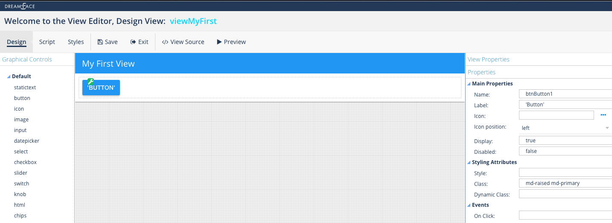

Button
======

.. image:: ../images/icons/icon_web.png
   :class: pull-right

A button is component used to perform an action. The action is performed when some event occurs, for example when the button
is clicked on. There is usually a label, and sometimes an icon on the button which indicates which event will trigger
the action. For instance, a button might have SAVE, CANCEL, SUBMIT, OK, UPDATE or labels like PREVIOUS (with an icon <<) or NEXT
(or the icon >>).  The Event will be a function in the Script of the View, inside the view Controller.

|

|

Properties
^^^^^^^^^^

|

+------------------------+-------------------+--------------------------------------------------------------------------------------------+
| **Main Properties**    | Possible Values   | Description                                                                                |
+========================+===================+============================================================================================+
| Name                   | btnButton#        | Name is a reference to the component's DOM element. It can be used to dynamically access   |
|                        |                   | and set component properties. DreamFace gives a default name of *btnButton#* where #       |
|                        |                   | corresponds to the order in which it was created. If it's the second accordion created it  |
|                        |                   | will have a default Name of *fldhtml2*. Name is not required and can be removed if not     |
|                        |                   | needed.                                                                                    |
+------------------------+-------------------+--------------------------------------------------------------------------------------------+
| label                  | Any text          | This is the text that will appear on the button, for example *Ok* or *Cancel*              |
|                        |                   |                                                                                            |
+------------------------+-------------------+--------------------------------------------------------------------------------------------+
| icon                   | favicon           | Click on the **...** to the right of the field to select one of the favicons from the list.|
|                        |                   |                                                                                            |
|                        |                   |        .. image:: ../images/gcs/dfx-icons.png                                              |
+------------------------+-------------------+--------------------------------------------------------------------------------------------+
| icon position          | *left* or *right* | *left* to display on the left and *right* to display on the right side of the button.      |
|                        |                   |                                                                                            |
+------------------------+-------------------+--------------------------------------------------------------------------------------------+
| Display                | *true* or *false* | *true* to display the field or *false* to hide it.                                         |
|                        |                   |                                                                                            |
+------------------------+-------------------+--------------------------------------------------------------------------------------------+
| Disabled               | *true* or *false* | *true* to disable the field or *false* to make it active.                                  |
|                        |                   |                                                                                            |
+------------------------+-------------------+--------------------------------------------------------------------------------------------+

|

+------------------------+-------------------+--------------------------------------------------------------------------------------------+
| **Styling Attributes** | Possible Values   | Description                                                                                |
+========================+===================+============================================================================================+
| Size                   | size in dp        | Choose the size of the icon from the dropdown list by clicking on the drop arrow on the    |
|                        |                   | right of the size field.                                                                   |
+------------------------+-------------------+--------------------------------------------------------------------------------------------+
| Color                  | CSS color         | #hexcode for color| CSS colors are defined using a hexadecimal (HEX) notation (see :term:`Hexadecimal Colors`) |
|                        | Predefined Cross- | or enter one of the Pre-defined cross browser colors.                                      |
|                        | Browser Colors    | `140 cross browser colors <http://www.w3schools.com/cssref/css_colornames.asp>`_           |
+------------------------+-------------------+--------------------------------------------------------------------------------------------+
| Style                  | CSS syles         | By clicking on the **...** on the right h               |
+------------------------+-------------------+--------------------------------------------------------------------------------------------+
| Classes                | CSS class         | Name of CSS class to use for the HTMLcomponent.                                            |
+------------------------+-------------------+--------------------------------------------------------------------------------------------+
| Dynamic Classes        | CSS Class         | The Dynamic Class is a CSS class that will be added to the HTML control if an Angular      |
|                        |                   | Expression is verified. It is rendered as a ng-class attribute.                            |
+------------------------+-------------------+--------------------------------------------------------------------------------------------+

|

+------------------------+-------------------+--------------------------------------------------------------------------------------------+
| **Events**             | Possible Values   | Description                                                                                |
+========================+===================+============================================================================================+
| On Click               | function name     | Enter the name of the function that will be executed when the user clicks on the HTML      |
|                        |                   | control. The function should be defined in the controller in the script tab of the View    |
|                        |                   | Editor. Clicking on the ... opens a window to to select a function defined in the          |
|                        |                   | Controller.                                                                                |
+------------------------+-------------------+--------------------------------------------------------------------------------------------+

|
|

