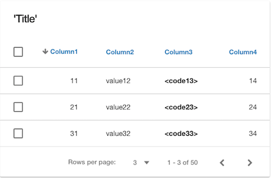

Datatable
=========

The datatable is used to present data coming from a static array or an API call. Each set of data corresponds to an iteration
of the array (or API call) and is presented in a row of the table.

Data tables help users visualize and manipulate large sets of data with sorting and filtering mechanisms and selection and
multi-selection on rows for treatment as a single row or a group of rows. Table columns have a value and can be rendered
as one of the following pre-defined graphical controls:

* **Statictext**
* **Button**
* **HTML**
* **Image**
* **Rating**

|

|

Properties
^^^^^^^^^^

|

+------------------------+-------------------+--------------------------------------------------------------------------------------------+
| **Main Properties**    | Possible Values   | Description                                                                                |
+========================+===================+============================================================================================+
| Name                   | dtblDatatable#    | Name is a reference to the component's DOM element. It can be used to dynamically access   |
|                        |                   | and set component properties. DreamFace gives a default name of *dtblDatatable#* where #   |
|                        |                   | corresponds to the order in which it was created. If it's the second datatable created it  |
|                        |                   | will have a default Name of *dtblDatatable2*. Name is not required and can be removed if   |
|                        |                   | not needed.                                                                                |
|                        |                   |                                                                                            |
+------------------------+-------------------+--------------------------------------------------------------------------------------------+
| Binding                | $scope variable   | The data table can be bound to a value contained in a $scope variable.                     |
|                        |                   |                                                                                            |
+------------------------+-------------------+--------------------------------------------------------------------------------------------+
|Title                   | Any text          | Title of the table, this can either be text in quotes or an                                |
|                        | Angular Expression| :ref:`angular-expression-label`.                                                           |
|                        |                   |                                                                                            |
+------------------------+-------------------+--------------------------------------------------------------------------------------------+
| Title Visible          | checked           | If checked the Title will be visible, unchecked means Title is not visible.                |
|                        | unchecked         |                                                                                            |
+------------------------+-------------------+--------------------------------------------------------------------------------------------+
| Paging                 | checked           | If checked the Title will be visible, unchecked means Title is not visible.                |
|                        | unchecked         |                                                                                            |
|                        |                   |                                                                                            |
+------------------------+-------------------+--------------------------------------------------------------------------------------------+
| Display                | *true* or *false* | The value can be a literal **true** to display the component or **false** to hide it. This |
|                        | Angular Expression| value can also be the result of an :ref:`angular-expression-label` that returns a boolean  |
|                        |                   | value of the true or false, *true* meaning it will be visible, *false* meaning it will not |
|                        |                   | be displayed.                                                                              |
+------------------------+-------------------+--------------------------------------------------------------------------------------------+
| Disabled               | *true* or *false* | Disabled takes a *true* or *false* value. *true means that the component is *Disabled* and |
|                        | Angular Expression| the user cannot interact with it. *false* means the the component is not Disabled but      |
|                        |                   | active and the user can interact with it. This value can also be the result of an          |
|                        |                   | :ref:`angular-expression-label` that returns a boolean value of the true or false, *true*  |
|                        |                   | meaning Disabled and *false* meaning it will be active and available.                      |
|                        |                   |                                                                                            |
+------------------------+-------------------+--------------------------------------------------------------------------------------------+

|

+------------------------+-------------------+--------------------------------------------------------------------------------------------+
| **Columns**            | Possible Values   | Description                                                                                |
+========================+===================+============================================================================================+
| Selection Mode         | none              | Selection Mode allows the user to select one or more rows to receive some treatment.       |
|                        | single            | Values for Selection Mode can be *none*, *single* or *multi*; none means no selection box  |
|                        | multi             | will be available for checking, single means only one row can be selected at a time and    |
|                        |                   | multi means that multiple rows can be selected for manipulation.                           |
|                        |                   |                                                                                            |
+------------------------+-------------------+--------------------------------------------------------------------------------------------+
| Column                 | column to define  | Click on the down arrow to choose the column for which you would like to define properties.|
|                        |                   |                                                                                            |
|                        |                   |        .. image:: ../images/gcs/dfx-dt-gcrenderer-col.png                                  |
|                        |                   |                                                                                            |
+------------------------+-------------------+--------------------------------------------------------------------------------------------+
|   Header               | text              | The header of the column. This is a text defining the column header like *ID*, *Name*, etc.|
+------------------------+-------------------+--------------------------------------------------------------------------------------------+
|   Value                |                   | This is the value. It can be the variable that contains the data returned from an API call.|
+------------------------+-------------------+--------------------------------------------------------------------------------------------+
|   Renderer             | Statictext,       | The column can be rendered as a graphical control. A list of possible controls is provided.|
|                        | Button,           | The default is Statictext.                                                                 |
|                        | HTML,             | After selecting the Renderer you can click on the the three **...** as seen in the image   |
|                        | Image,            | below:                                                                                     |
|                        | Rating            |                                                                                            |
|                        |                   |        .. image:: ../images/gcs/dfx-dt-gcrenderer2.png                                     |
|                        |                   |                                                                                            |
|                        |                   | This will bring open the Properities window that corresponds to the graphical control      |
|                        |                   | selected for this column of the table. For example, if you selected a Statictext, you would|
|                        |                   | see this at the top of the properties window, indicating that you are defining properties  |
|                        |                   | for a Statictext component for the datatable dtblDatatable1 column called ID.              |
|                        |                   |                                                                                            |
|                        |                   |        .. image:: ../images/gcs/dfx-dt-gcrendererID.png                                    |
|                        |                   |                                                                                            |
|                        |                   | Define the properties of the column. When finished, to return to the definition of the     |
|                        |                   | just click on the name of the Datatable, in the example above, you would click on          |
|                        |                   | *dtblDatatable1*.                                                                          |
+------------------------+-------------------+--------------------------------------------------------------------------------------------+
|   Ascending            | *true* or *false* | The value can be a literal **true** to order the column in ascending order or **false** to |
|                        | Angular Expression| or in descending order. The value can also be the result of an                             |
|                        |                   | :ref:`angular-expression-label` that returns a boolean value of the true or false.         |
|                        |                   |                                                                                            |
|                        |                   | Clicking on the arrow icon next to the column header will toggle the the value between     |
|                        |                   | *true* and *false* and change the icon accordingly.                                        |
|                        |                   |                                                                                            |
|                        |                   |        .. image:: ../images/gcs/dfx-dt-ascending.png                                       |
|                        |                   |                                                                                            |
|                        |                   |        .. image:: ../images/gcs/dfx-dt-descending.png                                      |
+------------------------+-------------------+--------------------------------------------------------------------------------------------+

|

+------------------------+-------------------+--------------------------------------------------------------------------------------------+
| **Styling Attributes** | Possible Values   | Description                                                                                |
+========================+===================+============================================================================================+
| Style                  | CSS syles         | CSS style attribure(s) to use for this component, separated by semi-colons, for example:   |
|                        |                   | *color:red; background-color:lightgray*. The Datatable has a default size of 100%,         |
|                        |                   | width:100%                                                                                           |
+------------------------+-------------------+--------------------------------------------------------------------------------------------+
| Classes                | CSS class         | Name of CSS class to use for the component.                                                |
+------------------------+-------------------+--------------------------------------------------------------------------------------------+
| Dynamic Classes        | CSS Class         | The Dynamic Class is a CSS class that will be added to the graphical control if an Angular |
|                        |                   | Expression is verified. It is rendered as a ng-class attribute.                            |
+------------------------+-------------------+--------------------------------------------------------------------------------------------+

|
|
