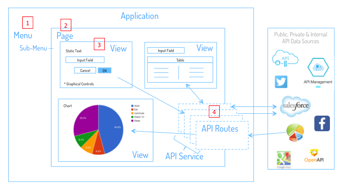
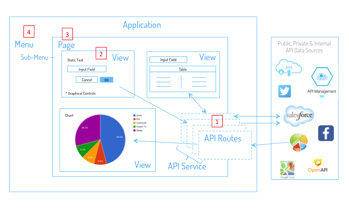

Development Process
-------------------

Incremental Development with DreamFace
^^^^^^^^^^^^^^^^^^^^^^^^^^^^^^^^^^^^^

DreamFace uses an incremental development process. It can either be Top-Down or Bottom up Development and includes the
following steps. The order changes with top down or bottom up.

* **Creating an Application**
* **Creating Application Components**
* **Create View Components**
* **Create API Routes**
* **Bind an API Route to a View**
* **Create a Page**
* **Add Views to a Page**
* **Create the Navigation Menu**
* **Add Page to Navigation Menu**
* **Build and Deploy the Application**
* **Dockerize the Application**

|

Top Down Development
^^^^^^^^^^^^^^^^^^^^

DreamFace supports both top-down and bottom-up development.

**Top-Down** development in DreamFace starts by defining the User Interface of the application. Top-Down development can be
used for quick prototyping, by first defining application navigation with the Navigation Menu and linking the corresponding
application Pages to each menu item, then progressively creating application View components and binding (or linking) them to
either pre-defined or newly defined API Routes to access and visualize the data in the Views. These Views are then added to
the Pages in a composition to define the User Interface of the application. An example would be taking the the Client Name
as input and calling an api route to get the corresponding client data and display it.

Bottom Up Development
^^^^^^^^^^^^^^^^^^^^^

Most developers prefer the **Bottom-Up** approach to applcation development. In DreamFace, bottom-up development means starting
with the data, then create the :term::`ÙI` to display the data, the layout and the application navigation.

The bottom-up development process with DreamFace would look like this:

* Create the *Application* and specify whether it's a desktop or mobile application. The process described below is for desktop applications.
* Create the *API Services and API Routes* that access the data and test that they work by looking at the metadata and data returned.
* Create *Views* which consume, display and interact (create, update, delete) with the data coming from the API Routes. Views can be previewed directly in the View Editor to make sure they work.
* Add a Menu Item to the *Navigation Menu* and associate that item with a Page of the application to define the application flow.
* Add Views in a layout composition of rows and columns on the *Page* to create the :term:`UI` of the app.
* *Build and Deploy* the Application.
* *Modify Application Configuration and Settings* properties to reflect desired behavior of the app.
* *Dockerize* the application.

Once you have a Menu Item that displays a Page containing a composition of Views that may or may not be bound to API Routes,
you can deploy and test the application.

The DreamFace Compiler will indicate 'success' or 'failed' when the Build is complete. In the case of a 'failed' build you will
be notified of which Views failed to compile and supplied with a log file that helps to identify where the build broke down. In
the case of 'success' you will want to test the application page flow and data access.

DreamFace development is an **iteration process**, starting after the creation of the application, adding components, testing
and ending when the final version of application is deployed.

Once you have a working application and you are satisfied with its behavior, as a final step you can dockerize the application.

|
|

