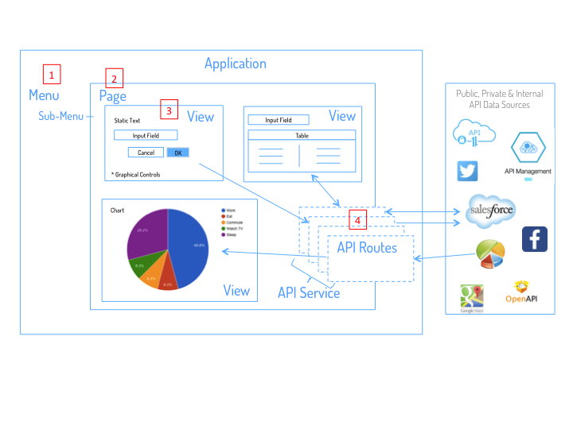
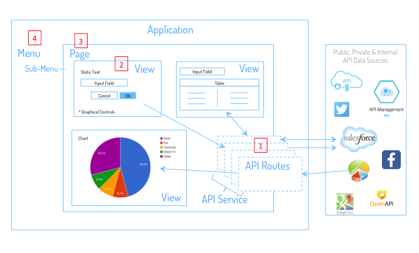

Development Process
===================

DreamFace development is an **iteration process**, starting after the creation of the application, adding components, testing
and ending when the final version of application is deployed.

Once your application is created, you can start developing application components right away. Development consists of an
iteration of creating and testing application components (menus, Views, Pages and API Services), setting application
configuration parameters and building, deploying and testing your application as it is being created.

Even though the development process is straight forward, many developers want to know What is the best way to deveop with
DreamFace? Should I develop the Views or the data access components first? These are very common questions that
usually come up right after creating your application and building a few samples Views. The answer may not be that
satisying for those who are looking for a strict methodology, with DreamFace, it's up to the developer. DreamFace offers
a lot of flexibility in the development process. We'll present two approaches here.

DreamFace supports both top-down and bottom-up development.

Top-down development focuses on creating the user interface first (Navigation Menu, Pages, Views) and then adding the data
access once the interface is in place. This approach can be used for prototyping or building demo applications quickly but
can also be a valid way to build applications. It allows the developer to verify the user interface with the application
stakeholders more quickly.

Bottom-up development is usually preferred by developers. In the bottom-up approach the data access components
are created and tested first, followed by the user interface components which are then linked to the data access components.

Team development can combine the two approaches with one team developing the data access and another team focuing on the
:term:`UI` design and development. Data can be bound to the Views when the needed data access component is ready.

|

Top Down Development
^^^^^^^^^^^^^^^^^^^^

**Top-Down** development in DreamFace starts by defining the User Interface of the application. Top-Down development can be
used for quick prototyping.

The top-down development process with DreamFace would look like this:

* Create the *Application* and specify whether it's a desktop or mobile application. The process described below is for desktop applications.
* Add a Menu Items to the *Navigation Menu* and associate them with Pages of the application to define the application flow.
* Create *Views* that reflect the desired look and feel. Views can be previewed directly in the View Editor to make sure they work as desired.
* Use the script editor to create some sample data stored in scope variables to use to test the View.* Add a Menu Item to the *Navigation Menu* and associate that item with a Page of the application to define the application flow.
* *Add Views in a layout composition of rows and columns on the *Page* to create the :term:`UI` of the app.
* *Build and Deploy* the Application Prototype.
* *Create the *API Services and API Routes* that access the data and test that they work by looking at the metadata and data returned.
* *Link *Views* and API Routes which consume, display and interact with the data coming from the API Routes.
* *Build and Deploy* the Fully functioning Application.
* *Modify Application Configuration and Settings* properties to reflect desired behavior of the app.
* Dockerize* the application.

|

Bottom Up Development
^^^^^^^^^^^^^^^^^^^^^

Most developers prefer the **Bottom-Up** approach to applcation development. In DreamFace, bottom-up development means
starting by developing the data access, then creating the user interface to display the data.

The bottom-up development process with DreamFace would look like this:

* Create the *Application* and specify whether it's a desktop or mobile application. The process described below is for desktop applications.
* Create the *API Services and API Routes* that access the data and test that they work by looking at the metadata and data returned.
* Create *Views* which consume, display and interact (create, update, delete) with the data coming from the API Routes. Views can be previewed directly in the View Editor to make sure they work.
* Add a Menu Item to the *Navigation Menu* and associate that item with a Page of the application to define the application flow.
* Add Views in a layout composition of rows and columns on the *Page* to create the :term:`UI` of the app.
* *Build and Deploy* the Application.
* *Modify Application Configuration and Settings* properties to reflect desired behavior of the app.
* *Dockerize* the application.

|
|

