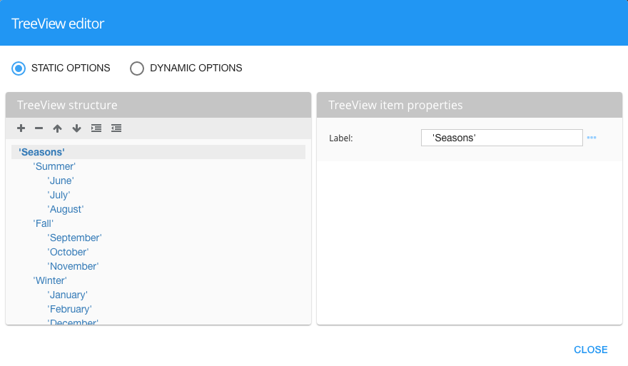

TreeViw Editor
==============

The Treeview Editor provides an easy way to create Treeview hierarchies.

The TreeView Graphical Control can be bound to a JSON.  The JSON can have a repetitive child property:

::

   Example: a directory structure

   [{
       "name": "’default’",
       "children": [{
          "name": "’products’",
          "children": [
             { "name": "’Printers’",
                "children": [
                   { “name”: “‘Canon’” },
                   { “name”: “‘HP’” },
                   { “name”: “‘Samsung’” }
             ] },
             { "name": "’Scanners’",
               "children": [] }
          ]
       }]
   }]

A TreeView can be static or dynamic. Dynamic representation has higher priority then static.

Static representation
'''''''''''''''''''''
Static representation can be build with popup dialog window like GC Iconbar/Fab/Treemenu. In popup window we can set
labels for each item. Labels are expressions. see :ref:`dfx-editor-treeview-label`

Dynamic representation
''''''''''''''''''''''
It can work with json object of different structure. Need to put three parameters into TreeView items section fields of Property Panel:
Dynamic - it is name of scope array;
Repeatable Property - name of repeatable scope array property;
Label - name of property that will be TreeView item label.

Example:

$scope.treeview = [{
    "asd": "'default ' + symbol",
    "quantity": "'045'",
    "url": "http://google.com.ua",
    "qwe": [
      {
        "asd": "'products'",
        "qwe": [
          {
            "asd": "'Printers'",
            "qwe": []
          }
        ]
      }
    ]
  }]

To bind it to GC TreeView we need set in Property Panel:
Dynamic - treeview;
Repeatable Property - qwe;
Label - asd.

GC TreeView has special 3 styling properties:
Icon if Opened ( expression, default: ‘fa-minus’ ) - it is icon for item which is “opened/expanded” (when children are displayed);
Icon if Closed ( expression, default: ‘fa-plus’ ) - it is icon for item which is “closed/collapsed” (when children are hided);
Icon color ( css color value ) - it is icons color.
Icons can be changed in popup window or as a scope variable.
For example, for “opened” in popup window select ‘fa-folder-open’ and for “closed” - ‘fa-folder’, Icon color - green.

Those icons are clickable and can only expande/collapse item children.

To Each GC TreeView item we can connect events from Property Panel.

For example we have simple function in scope:

$scope.clickedItem = function(item) {
	console.log(item);
};
And we put into ‘On Double click’ field: selectNode($dfx_item).
As a result in console we will see our doubleClicked item ( an object with all his properties  ).

|

Return to the `Documentation Home <http://localhost:63342/dfd/build/index.html>`_.

