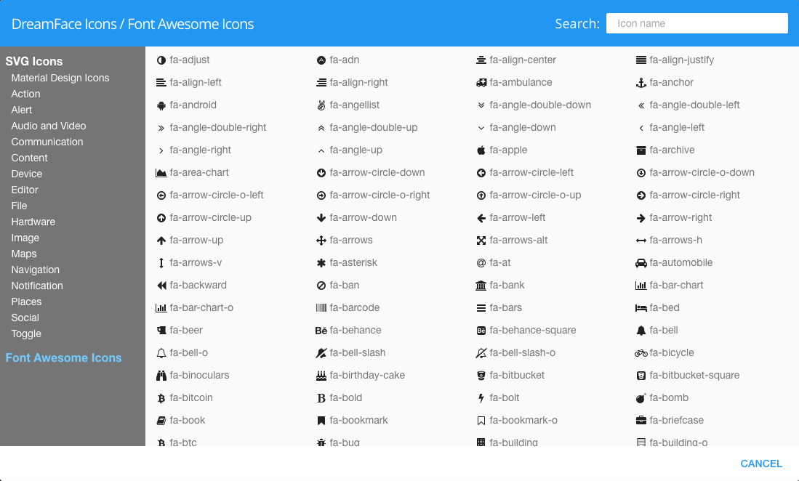

.. _dfx-icons-label:

DreamFace Icons
===============

When you click on the help for the Icon properties the following icon help view is displayed allowing the user to select
from a full list of Material Design Icons of Font Awesome Icons.

In the left nav is a menu list of the the SVG Material Icons and Font Awesome Icons for selection. Clicking on one of
the icon categories displays all the icons for that category and clicking on an individual icons allows selection of
the that icon which will automatically close the help view and populate the icon property field with the name of the
icon selected.

Its also possible to search for an icon on a keyword. Just enter the keyword and the icons from both Material and Font
Awesome containing the name will be filtered and shown for selection.

 .. image:: ../images/gcs/dfx-icons.png

|

Click on the Font Awesome Icons label to get a list of Font Awesome Icons to choose from:

|

Return to the `Documentation Home <http://localhost:63342/dfd/build/index.html>`_.

