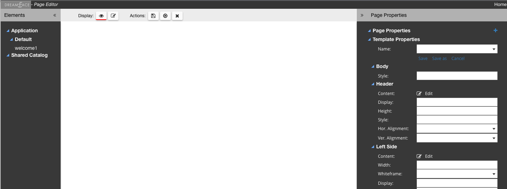

Understanding the DreamFace Platform
====================================

You may be wondering why we call DreamFace a platform. In this section we'll breakdown the DreamFace Platform and explain
why it's more than a framework. In Anatomy of an Application, we'll go into detail to describe the components that make up
a DreamFace application. We'll finish with some important concepts that make DreamFace unique and add value for developers,
like templates, reusability and full support of angularjs built into DreamFace.

|

Platform vs Framework
---------------------

DreamFace is a Platform-as-a-Service (PaaS) which helps developers create and deploy Software-as-a-Service (SaaS) applications.
That already qualifies DreamFace as a platform. In addition, DreamFace goes beyond a framework (code libraries, scripting
language, APIs, ...) proposing several editors: a View Editor, a Scripting Editor, a Page Editor, an API Services definition
with introspection of meta-data, a local database, a JSON repository for all components of an application, github integration,
a compiler and build manager, automatic deployment to the cloud and many other enterprise bells and whistles. DreamFace goes
far beyond scripting and libraries to provide a complete platform. As DreamFace is a Node module DreamFace can be used to
enhance other modules and platforms.

DreamFace Platform
^^^^^^^^^^^^^^^^^^
DreamFace is a :term:`native cloud application`. The applications that you build with DreamFace are also :term:`cloud-native`
applications. Support for :term:`multitenancy`,
:term:`containerization`,
:term:`virtualization` and other fundamental
cloud technologies is at the core of the product.

When installed for the first time, a DreamFace :term:`platform` is available to create tenants (see :term:`multitenant` for
the various purposes of application development:

.. image:: ../images/diagrams/dfx-cloud-platform.png
   :width: 700px

* One DreamFace platform can create one or more tenants (such as Development, UAT or Production as seen in the diagram above)
* One Tenant can be used to create one or more applications (Web or mobile)

It is important to note that the creation of tenants under the same platform is an instantaneous action, using the same
code base of the underlying installed DreamFace platform. Under the hood, DreamFace creates a JSON object that maps to
the tenant in the Global JSON DataStore. The DreamFace Platform has some global attributes that can be used for all tenants
under the Platform, such as the developers and their roles or the deployment features supported by the Platform (Docker
interface for dockerization of your application, deployment on Bluemix, etc.).

|

.. _dfx-app-anatomy-label:

Anatomy of a DreamFace App
==========================

Application
^^^^^^^^^^

A DreamFace Application is a collection of :ref:`application-components-label` consisting of :

|

==============================  ===================================================================================================================================================================================
 **Component**                  **Description**
==============================  ===================================================================================================================================================================================
 **Pages**                      Applications can have several Pages, each Page is composed of a number of Views arranged in a layout of rows and columns to form the :term:`UI` of the Page.
 **Views**                      Views (sometimes called Widgets) are graphical views which contain graphical controls ike input fields, buttons and tables arranged in a layout of rows and columns. Views are reusable across Pages. Views contains “cards” (a notion of multi-layering, :term:`SPA`) allowing some very complex interface representations to be built easier.
 **API Services**               API Services provide access to the data by defining the different API Routes related to that service. These are are endpoints that reference virtually any API end point that needs to be called in the application. API Services are organized under the notion of an “API Service Object” whichh allows them to be better classified and managed. They connect to the backend using “API Sources” (handlers that contains the type of the backend to call, the URL and the security credentials).
 **Global Resources**           External resources such as javascript files, css files and other assets like images or icons which can be added to extend the DreamFace Platform.
 **Configuration & Settings**   A DreamFace application is highly and easily configurable. Each Application allows the developer to configure it appropriately for the type of users to access it, how to deploy, where to share code via Github, Global variables and DataTypes to be used, and how to deploy it (Docker or not), etc.
 **A Shared Catalog**           A special application that is created by default to allow the developers to reuse any application component across multiple applications within the same tenant. To share Application Components across tenants, use export/import through the Github interface in DreamFace
==============================  ===================================================================================================================================================================================

.. _application-components-label:

Application Components
^^^^^^^^^^^^^^^^^^^^^

If we boil it down to just the basics we could say that a DreamFace application is a number of Views that are bound to Services
organized on a page. Pages are Single Page Applications SPAs that switch out View Cards and use a variety of graphical
controls to deliver the user interface to display and capture data.  A Single Page can provide a complete application or
can be linked to other Pages through a Menu or Buttons. Putting
that in perspective, applications also need navigation or application flow. In DreamFace the Navigation Menu manages the
application flow defining which Page will be displayed when a menu item is clicked. For desktop applications, Pages contain
a composition of Views, organized in a layout of rows and columns. One View might have client information and
another may show sales for that client in a graph or a table view and a third view might show a map of where the client
is located. This composition makes up the user
interface of the Page. The data that is used in the Page comes from the API Routes which are bound or linked to the View.

|

Application Components
----------------------

DreamFace applications are composed of Pages, containing a composition of Views that consume and are bound to API Service components.

|

Pages
-----

A Page is a DreamFace component used to display one or more Views in a layout of rows and columns. A Page defines the user interface for
a part of the application, for example, a Page might display, update and delete Client data. Mobile applications do not use Pages as they
display the Views directly, one at a time.

Pages are graphical elements that are composed of:

* One Page Template
* One or many Views

Pages are the graphical compositions through which a user interacts with the application.

Pages have their own controller for:

* Page wide actions
* Page wide scope (variables, functions, etc.)
* A specific view can refer to “parent scope” (i.e. the instance of the page in which it is rendered)

?? <<show code on how to do this>>

Pages uses Templates in order to respect a specific Look & Feel.

**Page Templates**

A Page Template is a developer/designer concept in which one can specify a “graphical look” or model to be used while
developing pages.

A “Page Template” is built, graphically, using a the *Page Editor*.

For example, you can build

* a Single View Page Template
* a Single View Page Template with a Left Navigation
* Multiple View Page Template with a bottom navigation and a header

The various sections of a page Template can use Views to populate them. The Page Template will have “locked areas” (developers
using the Template cannot alter these areas) and “unlocked areas” (developers can drop their views in theses areas while
composing application pages).  This mechanism ensures consistency in developing User Interfaces where only a few Templates
may be needed to develop an entire application.

|

Views
-----

Views are the core component of the User Interface in DreamFace. Views are functional graphical areas, with an embedded
logic (via the controller) as well as a REST based invocation interface. Views are deployed as :term:`Angular modules`.
Views are usually assembled in Pages and communicate with each other via a natively supported :term:`pub/sub mechanism.

Views are a composition of Graphical Controls like input fields, buttons, tables that are arranged in rows and columns
in the View and are used to display and interact with data being exchanged with API Services. Outside of DreamFace, Views
are sometimes referred to as widgets.

For a more information on available pre-defined GraphicalControls available in the View Editor for use in Views see :ref:`gcontrols-label`

   .. image:: ../images/devguide/dfx-view-ineditor.png

When deployed in a page, views can:

* communicate with each other via a pub/sub mechanism. This mechanism will evolve in a near future to become the foundation
of the “View Interface”. An easy programming model to allow the implementation of “onBusinessEvent do…” will be implemented.

The sum of all events handled by the View or Emitted by the View will become the “View Interface” allowing an easy and
graphical wiring between Views in order to produce a more granular concerted experience

* Access a higher level context such as the ones for the host page or the applicaton

   ** Cards**
   Cards are a very interesting concept that was added in DreamFace v3.0. The idea of Cards stemmed from the need to produce
   MicroServices where a concerted set of Views are needed as part of the “UI module” in a “Single Page UI Design” :term:`SPA`.
For example, A Micro Service can be made from a View that shows the Customer list in a Table, clicking on a customer to
edit the properties in a form like fashion, along with a variety of Dialogs to confirm actions. In order to easily implement
such an interaction, Cards can be used in order to provide the variety of “layers” needed for such an interaction, where
a context links them together and where a variety of look & feel can be needed “Cards” implements the facility to allow
the development of “multiple views within the same view”. They allow the implementation of a “depth” or a “layering model”
to the view where very complex representations can be easily produce.

All Cards share the same “controller” allowing them to share information easily without the need of a pub/sub mechanism.
Cards can be invoked in a variety of ways in order to be shown as a “sliding view: left/right/bottom” or a Dialog Box or
even to become the default Card to occupy the whole real estate of a view.
* Example of Card ?? <<Show graphical Examples >>
* Example of View ?? <<show code that invokes it>>

|

API Integration
---------------

DreamFace applications consume API services exclusively. All interactions with backend systems for data access are modeled
as API calls, using the REST standard as a way to interact and standardize the consumption of services. DreamFace introduces
many new concepts to ease the adaptation and the consumption of API’s for the purpose of building the User Interface.

**API Source**
“API Sources” are the construct to define a “backend API source” to be used later on to define services. An “API Source”
is the equivalent concept to a DataSource in the DataBase metaphor. An API Source defines:
* Type of the API endpoint (REST, XML,WebService, DataBase, etc..)
* URL/Address of the endpoint
* Security Type and credentials

DreamFace provides an added value to some of the providers in order to ease the interaction effort
* REST to XML mapping
* DataBase consumption and mapping to REST
* Introspection of some of the backends (such as StrongLoop , Swagger, etc.) in order to allow an interactive consumption of such backend services
* High Value add services: List of “specific usable providers” such as SalesForce API, NetSuite API, Weather.com, News API, Google API, etc. These providers’ services will be ready for consumption “out of the box”. DreamFace engineers and/or user community will be adding to this list in order to provide an exponential value to the whole user community

**API Service Object**
API Service Object is a concept to gather “business related services” in a single object construct and this, regardless
if the Services endpoint are provided from the same source or not.An example, an “API Service Obejct” called “News” can have services (aka methods) such as “getCNNNews” or “getYahooNews” as well as get “getAllNews”, irrespective if the news are using the same API Source or not. This association via the Service Ibejct will be enriched in the future to allow a “common behavior” at the Object level such as accessibility rules, caching rules, filtering rules, etc.
<<schema to depict the concept of API Service Ibject>>

**API Services**
An API Service is a concept that maps to a specific end point API. An API Service is one interaction with the backend.
The basic concepts to retain on API Services in DreamFace are
-	An API Service Object is made of one or more API Servcie(s)
-	An API Service
o	Maps to an API URL. This URL can be manually entered or introspected if the backend source allows it
o	Uses an API Source to determine the nature of the backend as well as the security credentials to access it
o	Always take a JSON in and produces a JSON out. The notion of these in/out payload makes the API Service Interface. Future releases of DreamFace will extend on the notion of these interfaces in order to build a “Business Object Repository” that maps the interfaces to reusable BO constructs to be used between the backend and front end sides of an application
o	PreHandler/PostHandler/Application Exception Handler: These NodeJS modules of codes will allow the API Service that is declared in DreamFace to have an intelligent behavior that overloads the API call to the backend.  Through these mechanisms, once can filter the API call to the backend, overload it, merge API invocations, aggregate API calls, etc.

API Services can be consumed by any REST client (postman for example). DreamFace adds an embedded Oauth2 security to these
API Services making a non-secured backend automatically secured.

An API Route is a DreamFace component that is used to consume public, private or internal APIs. An API Service is a DreamFace concept
used to make a logical grouping of API Routes. API Services are defined by Properties and API Routes. API Routes are components that
define the access to back-end API Services. DreamFace provides a number of ready to consume API Routes, for example in the API Service
Social Media you have predefined API Routes for facebook, twitter and other popular Social Media APIs.

For a more on API Services and API Routes see :ref:`apiservices-label`

|

Return to the `Documentation Home <http://localhost:63342/dfd/build/index.html>`_.

