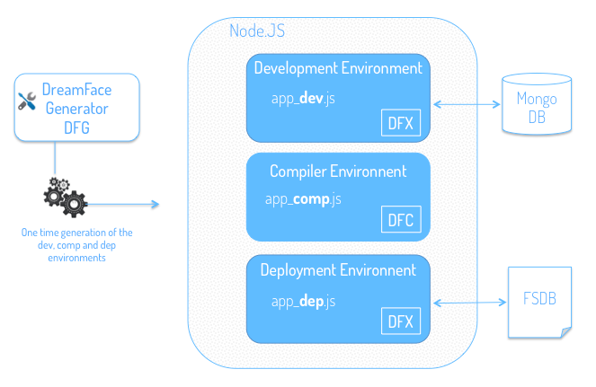

.. _platform-architecture-label:

Architecture of the DreamFace Platform
======================================

DreamFace is an open-source, cloud-based, multitenant platform used to develop and deploy web and mobile applications. The
underlying technology of DreamFace is based on :term:`MEAN Stack` (MongoDB, Expressjs, Angularjs and Nodejs) technologies.

The DreamFace Cloud Platform is composed of three Node.js modules:

* **DFX - DreamFace X-Platform** a cloud-based platform used to **develop** and **deploy** web and mobile applications.
* **DFC - DreamFace Compiler** a compiler used to compile and manage different builds of your DreamFace application.
* **DFG - DreamFace Generator** a tool used once during installation to generate development, compiler and deployment environments.

DreamFace (DFX) and the DreamFace Compiler (DFC) are node modules. Node apps that use DreamFace need to have dependencies
on DFX and DFC.

A typical architecture for the DreamFace Cloud Platform would have 3 node applications:

* one to host development environment, typically **app_dev.js** which has a dependency on DFX
* one to host the compiler environment, typically **app_comp.js** which has a dependency on DFC
* one to host the deployment environment, typically **app_dep.js** has a dependency on DFX

The DreamFace Generator (DFG) is a node module that can be installed globally and is used during the installation to generate the
environment used to create the 3 node apps: **app_dev.js**, **app_comp.js** and **app_dep.js** required by DreamFace.

|

Development Environment (app_dev.js)
------------------------------------

The app created for development, typically *app_dev.js*v with a dependency on DFX will be used to create DreamFace applications. It
requires MongoDB to be installed and running.

This app is a cloud-native, multitenant development platform. It comes with a Studio which contains all of the components needed for
building cloud-native, multitenant applications. The Studio is linked to a Reposity which is stored in MongoDB. The Studio includes
View Editors providing drag and drop development for creating desktop and mobile applications using pre-defined graphical controls.
Because is it open and extensible, you can easily add your own custom graphical controls. The View Editors have a preview capability
for the iterative process of creating and testing Views. When adding applcation logic a script editor is provided where you write your
script in javascript and Angular.

|

Compiler Environment (app_comp.js)
----------------------------------

The Compiler Environment compiles DreamFace applications and manages the builds that are created during the compilation. The application
would typically called app_comp.js and has a dependency on DFC. The manages requests for compilation coming from the Development
Environment.

**How the compiler works**

From the Cloud Platform menu under System Configuration & Setting is the Deployment option. When you click on it,
the Application Builds View is displayed.  On the bottom half of the view is the Build History list indicating Build
Version, Build Description, Date of Build, Status of Build (success, pending, failed) and Actions that can be taken
(Deploy, Download the zip if it is a Mobile application and Delete Build). The list is displayed with the most
recent build on top and the oldest build on the bottom.

Before you start your build you can set the Application Version to the version you wish to create. When you click on
Build Now the next Build Version Number will be based on the application version number and the build number, so for
Application Version: 1.0 and Build Number 3 will give a Build Version of 1.03.

To create a build, the DreamFace Studio sends an asynchronous request to the DreamFace Compiler to compile your specific
application. The asynchronous call means you can continue developing or watch the progress of the compilation until it
finishes.

Each component is compiled independently. While the compiler is working it will set the status to 'pending'. If you click
on the Pending status button a view is opened to show progress information about the build including percentage completion
the and the name of View currently being compiled.

When compilation is complete, the compiler sends back a status of 'success' or 'failed'. A status of 'success' indicates that
the compilation is complete and every component was compiled successfully. When compilation is successful, the compiler sends
back a zip file and a log file containing stack trace information.

Each component of your application will go through compilation. If the compiler encounters errors it won’t stop compiling.
When finished, if the status is 'failed', no zip file is returned and if you click on the log file a view will open up
file to find out where the compilation ran into trouble thus helping you to debug the application by identifying Views that
contain errors.

For example, if your application has 10 Views and 2 fail to compile, those Views will be indicated. The developer can look at the
stack trace in the log file to see where the error(s) occurred and quickly focus on fixing the problem. Instead of compiling and
failing on one component at a time, the DreamFace Compiler takes the approach of identifying all problem components so you can save
time in debugging and fixing your application.

By default the DreamFace Studio will reside on port 3000 and the Dreamface Compiler on port 3030. The compiler can also be
set to run on another port or server by setting an option in the Application Configuration and Settings.

|

Deployment Environment (app_dep.js)
-----------------------------------

Successful Builds can be deployed. From the list of successful builds you can click on the small cloud icon to deploy the build.

The Deployment Environment app would be called app_dep.js and has a dependency on DFX. It manages requests coming from the Compiler
Environment to deploy the application.

It is a streamlined, lightweight runtime version of the Development Environment app. It does not contain the Studio or Editors and
MongoDB is replaced by a file system database (FSDB). When the compiled application is deployed, all of the definitions that need
to be deployed are deployed in a lightweight file system database (FSDB). This means that **the deployed application does not need
MongoDB in order to run.**

It is built for speed of execution, efficiency and ease of management.

In the Studio, Deployed Builds are shown in a list at the top of the Deployment View. The list of Deployed Builds includes
Application Version, Build Number and Build Date.

|

How the 3 environments work together
------------------------------------

When the application is built, the Dev sends a request to Comp to compile the application.

When the compilation is complete and successful, Comp returns a zip file containing the application build.

When the developer clicks on the cloud icon to deploy the application, Dev sends the zip file to Dep to deploy the app.

|
|