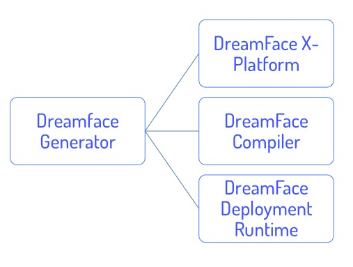

Architecture of the DreamFace Platform
^^^^^^^^^^^^^^^^^^^^^^^^^^^^^^^^^^^^^^

The DreamFace Cloud Platform that you use to develop applications is a cloud-based, multitenant development platform built on :term:`MEAN Stack` technologies.

The DreamFace Cloud Platform is composed of:

* **DreamFace X-Platform** is a cloud-based platform used to develop and deploy desktop and mobile applications.
* **DreamFace Compiler** is used to compile and manage different builds of your DreamFace application.
* **DreamFace Generator** is a tool used during installation to generate development, compiler and deployment environments.

DreamFace (DFX) and the DreamFace Compiler (DFC) are node modules. Node apps that use DreamFace need to have dependencies on DFX and DFC.

To install the DreamFace Cloud Platform, 3 node apps must be created:

* (dev) one for development which depends on DFX
* (comp) one for the compiler which depends on DFC
* (dep) one for deployment which depends on DFX

The DreamFace Generator is a node module that can be installed globally and is used to create the environment that generates the
3 node apps: dev, comp and dep.

|

DreamFace X-Platform (DFX)
--------------------------

The app created for dev by default is called *app_dev.js*. This app will be used to create cloud DreamFace applications. It requires MongoDB
to be installed and running.

This is the app we call DreamFace X-Platform (DFX) or just DreamFace. It is the development platform for creating DreamFace applications.

The DreamFace is a cloud-native, multitenant development platform. The main component is the DreamFace Studio which contains all of
the components needed for building DreamFace applications. In the DreamFace Studio there are View Editors for drag and drop development
of desktop and mobile applications using pre-defined graphical controls. DreamFace is open and extensible so you can also
add your own custom graphical controls. The DreamFace View Editors have a preview capability for the iterative process of creating and
testing Views. When adding applcation logic DreamFace provides a script editor where you write your script in javascript and Angular.

|

DreamFace Compiler (DFC)
------------------------

The DreamFace Compiler compiles DreamFace applications and manages the builds that are created during the compilation.

**How the compiler works**

From the Cloud Platform menu under System Configuration & Setting is the Deployment option. When you click on it,
the Application Builds View is displayed.  On the bottom half of the view is the Build History list indicating Build
Version, Build Description, Date of Build, Status of Build (success, pending, failed) and Actions that can be taken
(Deploy, Download the zip if it is a Mobile application and Delete Build). The list is displayed with the most
recent build on top and the oldest build on the bottom.

Before you start your build you can set the Application Version to the version you wish to create. When you click on
Build Now the next Build Version Number will be based on the application version number and the build number, so for
Application Version: 1.0 and Build Number 3 will give a Build Version of 1.03.

To create a build, the DreamFace Studio sends an asynchronous request to the DreamFace Compiler to compile your specific
application. The asynchronous call means you can continue developing or watch the progress of the compilation until it
finishes.

Each component is compiled independently. While the compiler is working it will set the status to 'pending'. If you click
on the Pending status button a view is opened to show progress information about the build including percentage completion
the and the name of View currently being compiled.

When compilation is complete, the compiler sends back a status of 'success' or 'failed'. A status of 'success' indicates that
the compilation is complete and every component was compiled successfully. When compilation is successful, the compiler sends
back a zip file and a log file containing stack trace information.

Each component of your application will go through compilation. If the compiler encounters errors it won’t stop compiling.
When finished, if the status is 'failed', no zip file is returned and if you click on the log file a view will open up
file to find out where the compilation ran into trouble thus helping you to debug the application by identifying Views that
contain errors.

For example, if your application has 10 Views and 2 fail to compile, those Views will be indicated. The developer can look at the
stack trace in the log file to see where the error(s) occurred and quickly focus on fixing the problem. Instead of compiling and
failing on one component at a time, the DreamFace Compiler takes the approach of identifying all problem components so you can save
time in debugging and fixing your application.

By default the DreamFace Studio will reside on port 3000 and the Dreamface Compiler on port 3030. The compiler can also be
set to run on another port or server by setting an option in the Application Configuration and Settings.

|

DreamFace Deployment (DFX)
--------------------------

Successful Builds can be deployed. From the list of successful builds you can click on the small cloud icon to deploy the build.

The DreamFace Deployment Edition is a streamlined, lightweight runtime version of the DreamFace Developer Edition.
It is built for speed of execution and efficiency.

Deployed Builds are shown in a list at the top of the Deployment View. The list of Deployed Builds includes
Application Version, Build Number and Build Date.

|
|