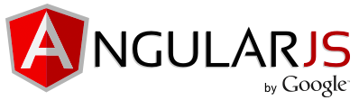
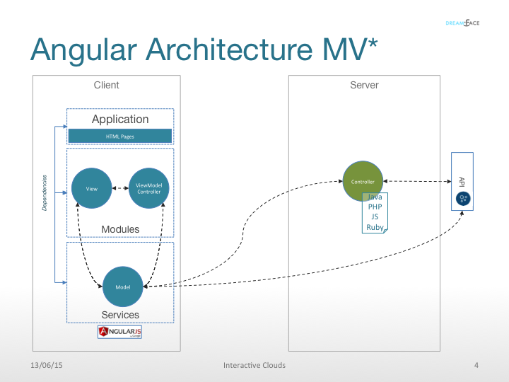
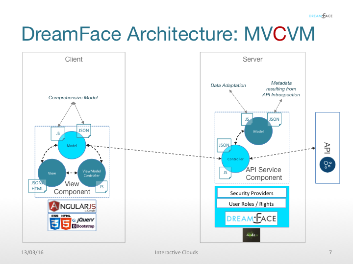
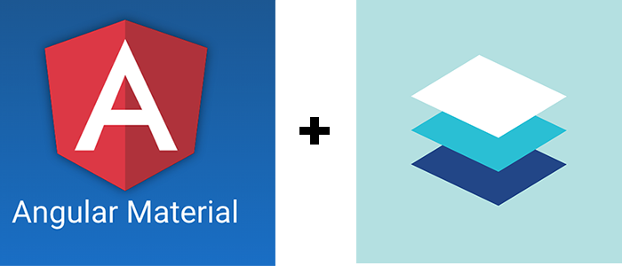

Underlying Technology
=====================

DreamFace is based on :term:`MeanStack` technologies (MongoDB, ExpressJS, NodeJS and AngularJS). In the sections below is
a description of how DreamFace integrates and leverages these open source, best of breed technologies.

|

.. image:: ../images/logos/mongodb-logo.png
   :width: 300px

DreamFace and MongoDB
---------------------

MongoDB is an open source, agile and highly scalable NoSQL database that is very well adapted to web and mobile application data constructs.

It is based on the NoSQL document store model. Data stored in the database as JSON objects and not in the traditional rows and
columns of a relational database.

MongoDB works very well with NodeJS for the following reasons:

* General Purpose - MongoDB is suited for a great variety of applications.
* Document orientation: Because MongoDB is document oriented, data is stored in the database in a format that is very close to what you deal with in both server-side and client-side scripts. This eliminates the need to transfer data from rows to objects and back.
* High performance: MongoDB supports high volomes of data exchange and is one of the highest-performing databases available today.
* High availability: MongoDB’s replication model makes it very easy to maintain scalability while keeping high performance.
* High scalability: (Sharding) MongoDB’s structure makes it easy to scale horizontally by sharding the data across multiple servers.

DreamFace leverages MongoDB in two ways:

* **Repository** - MongoDB serves a central role during application development as a :term:`repository` to store all DreamFace components.
* **Local Database** - MongoDB is used to provide a local database during Development to store application data or for prototyping.

|

As a Repository
^^^^^^^^^^^^^^

DreamFace uses MongoDB in a central role during application development as a :term:`repository` to store all DreamFace components in
JSON format.

All default and user data are stored in the DreamFace Repository in a MongoDB database. All changeable data, except the
application preferences, are stored in the repository and can updated visually using the one of the editors in the DreamFace
Studio or be modified manually by changing the source JSON.

|

As a Database
^^^^^^^^^^^^

DreamFace uses MongoDB as a local database during application development. It can be used to store real application data
a data source for your application but very often it is used for Prototyping. For example, the local database can be used
to create a sample client table with sample data to show how an application work before integrating backend APIs. Once the
application functionality is validated the data access can be changed to access API Services coming from the backend. However
you decide to use the database in DreamFace, it is replaced during compilation and replaced with a secure file based database
from DreamFace.

|
|

DreamFace and AngularJS
-----------------------

Angular is a client-side development framework developed by Google for building mobile and desktop web applications. DreamFace
fully integrates AngularJS v1.xx.

Angular is well liked because it simplifies the input, manipulation and display of data in the browser. It is written in JavaScript,
and implements web applications using the MVC framework.

Here are some of the benefits AngularJS provides:

* Data binding: AngularJS uses a powerful scope mechanism to bind data to HTML elements.
* Extensibility: The AngularJS architecture allows you to easily extend almost every aspect of the language to provide your own custom implementations.
* Reusable code: AngularJS forces developers to write structured code, combined with its extensibility this makes it easy  to write reusable code.
* Support: Google is the company behind Angular. The success of Angular combined Google's move to embrace the enterpriseis means their investing a lot into Angular.
* Compatibility: AngularJS is based on JavaScript and has a close relationship with jQuery. Angular 2.0 is planned for later in the year and will provide a migration path for Angular 1.xx apps;

DreamFace recognized the value of AngularJS as a client-side framework early on and based our client-side architecture on it.

|

Positioning
^^^^^^^^^^^

=======   ==========================================================================================================================================
 **√**     Positioning
=======   ==========================================================================================================================================
 **√**    DreamFace is a Cloud Application Platform (PaaS) for creating Web & Mobile apps, Angular is a JS Framework
 **√**    DreamFace does not compete with Angular it leverages Angular
 **√**    DreamFace uses Angular as its client-side architecture
 **√**    DreamFace supports 100% of Angular features
 **√**    DreamFace complements Angular by providing a complete platfrom around it for building and deploying web and mobile applications:
           UI builder, GC library, NodeJS server (session mgt, API consumption…), auto API introspection & consumption, Enterprise security,
           Profile management, Cloud development platform, connectivity to Git for large team development, pre-integration with Angular, Node,
           Bootstrap, and many other Enterprise features.
 **√**    DreamFace empowers Angular developers with many built-in Entarprise features: Security, data access, secured API consumption, profiled
           UI based on AAA, Global error handling, Widget concept in addition to pages, model based, application generation, multi-language and
           associated dictionary management, full configuration thru admin panels.
 **√**    DreamFace can be extended and enriched by any extisting code at the Angular level (directives, filters, etc.)
=======   ==========================================================================================================================================

|

Angular Architecture MV* (MVwhatever)
^^^^^^^^^^^^^^^^^^^^^^^^^^^^^^^^^^^^

Angular architecture is based on a form of the Model View Controller Archtitecture.
* Model which is the data
* View which is the Interface where information from the user is exchanged (graphical prensentation)
* Controller a set of functions that links the Model and the View and changes the Model based on input from the View

Basically Angular we follow the separation of presentation logic from business logic and application state and we allow
you to structure your application the way you want. Note: Some people have argued that Angular follows a MVVM architecture
(considering the $scope to be a ViewModel).

In Angular, the view is a projection of the model through the HTML template. This means that whenever the model changes,
Angular refreshes the appropriate binding points, which updates the view. (explain how this works with DF)

|

|

DreamFace MVC Architecture
^^^^^^^^^^^^^^^^^^^^^^^^^

In addition to the client side architecture provided by Angular, DreamFace also provides server side functionality for
back-end data integration. DreamFace respects the separation of presentation logic from business logic and application state.
Taking into account server side functionality, DreamFace is a MVCVM or ModelView - Controller - ViewModel arctecture.
|

|

AngularJS directives and extensibility of the Graphical Controls system
^^^^^^^^^^^^^^^^^^^^^^^^^^^^^^^^^^^^^^^^^^^^^^^^^^^^^^^^^^^^^^^^^^^^^^

DreamFace allows developers to extend pre-defined graphical conrols to enrich the development environment with their own
custom graphical controls allowing developers to create a consistent look and feel across their applications. Image that
every that you want every Cancel Button in your application to be red. You could create a custom Button with a red background
and lock that property. Then enrich the palette of controls with RedCancelButton for example. Each time a developer needs
a cancel button they would use this standarized button.

|

Angular Material
^^^^^^^^^^^^^^^

Angular Material is an open source collection of User Interface components. It provides a set of reusable, well-tested,
and accessible UI components (graphical controls like input fields, buttons, icons, menus, etc...) based on Material Design.

Material Design is a specification from Google for a unified system of visual, motion, and interaction design elements
that adapts across different devices and different screen sizes.

DreamFace uses Angular Material :term:`UI` components to standarize the look and feel of DreamFace application across web
and mobile devices.

|

How DreamFace Leverages Angular
^^^^^^^^^^^^^^^^^^^^^^^^^^^^^^^

DreamFace leverages Angular to provide the following benefits :

* Structures development / enabling teams to adopt the new technologies faster
* Boosts productivity to build/deploy complex Enterprise applications for Web and mobile
* Provides an Integrated, pre-built environment where DreamFace does all the heavy lifting to compose the environment, which includes :
    * Angular, Angular Material, NodeJS
    * Integrated Security
    * User and profile management
    * Easy integration of REST APIs
    * Rich library of pre-defined cross-platform Graphical Controls for visual development or coding
    * Support fof large and geographically dispered team development
    * Reusability concepts built-in
* Open: The Open Source foundation in the product is extensible whereas any developer can add their filters, directives, GC components, etc (although we recommend that this would be controlled better for obvious reasons)
* Allows experienced and less experienced developers to work jointly, each at a different but complimentary level
* Develop the interfaces using out built-in graphical builder or Jade (or a UI modeling tool in a near future)
* Shields your development from the future changes on the stack (for example Angular moving from 1.2 to 2.0)

|

.. image:: ../images/logos/nodejs-logo.png
   :width: 300px

DreamFace and NodeJS
--------------------

NodeJS is an open source, cross-platform runtime environment for developing server-side web appplications. It is
written in javascript making it possible to use one language across client and server development. It is based
on Google's V8 engine.

The following are just a few reasons why we chose Node.js for our server technology:

**Javascript end-to-end**

Since Node.js uses javascript for writing scripts. This is important because it means only one language for front-end and
backend development.

**Non-blocking I/O**

Event-driven scalability: Node.js applies a unique logic to handling web requests. It uses an asynchronous model for processing.
This allows Node.js webservers to scale in ways that traditional webservers can’t. This is the reason for the high performance
of node applications.

**npm**

The Node Package Manager provides extensibility. NPM is the largest module ecosystem and its growth is exponential. For anyone
who knows npm, its value is undeniable. Node.js has a very active developer comumnity adding new modules all the time to
extend Node.js functionality. Modules can have dependencies on other modules and node applications grow in a modular way.

**Easy of use**

Setting up Node.js and developing in it is easy. In just a few minutes you can install Node.js and have a working webserver.

|

DreamFace leverages the concepts of NodeJS to the fullest extent. DreamFace (DFX) is a node module. Other Node
apps can use DreamFace to extend thier functionality. The same goes for DreamFace.

For more details about how DreamFace leverages NodeJS, see the section on :ref:`platform-architecture-label`

|

Return to the `Documentation Home <http://localhost:63342/dfd/build/index.html>`_.

