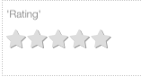

Views and ViewCards
===================

DreamFace *Views* are visual components used to build the :term:UI` of your application. They are one of the fundamental
components of a DreamFace application. Views can be used to collect user input and display data. A view might contain a
form to fill in some information or might display a list of items coming from an API call. Views can be bound to API Routes
and consume and display API data.

Views are arranged on a :term:`Page`, either separately or combined with other Views. The :term:`UI` of your application
is madef from a composition of one or more Views arranged on a :term:`Page.

Views are created in the View Editor have three main parts that need to be defined:

The Design, the Script and the Styles:

 which includes the layout and the graphical controls that will be displayed, the behavior which is defined the Script and the Styles which can be defined by setting properties

**Design**
The design of the View is done in the :term:`View Editor` by dragging and dropping pre-defined :term:`Graphical Controls` on
the :term:`Canvas`and defining their term:`Properties`.

DreamFace Views support Single Page Applications (term:`SPA`) at the View level by using ViewCards. Each View can have
multiple definitions. Each definition is called a ViewCard. There is one default ViewCard which is necessary for any View.

At design time, the default ViewCard is displayed and each additional ViewCard is accessible for definition from tabs. The
designer’s toolbar provides options to create or delete ViewCards with the exception of the default ViewCard which is required.
Clicking on a Tab will display the content of the corresponding ViewCard and allow the developer to modify the definition by
adding or removing graphical controls and defining their properties.

At runtime, the default ViewCard is displayed when the View is rendered for the first time. The other ViewCards can be displayed
programmatically either in a dialog box (using the dfxDialog.showCard() function), in a left or right sidepanel or as a bottom sheet.

**Script**
Each View has an associated script that is defined in the :term:`Script Editor. In DreamFace scripts are written in pure
Javascript and Angular.js. The associated help provides templates for creating different types of scripts like controllers
and functions.

**Styles**
Each View has associated styles which are defined directly in the properties of each graphical control on the View or in the
Styles editor of the View.

Name
    Title

    NO - We need to be able to define the size (mainly width?) of the viewCard? “SizeTofit” or percentages of the main ViewCard can be helpful?
    NO - Do we need to have a “default behaviour” for the viewCard so if it is opened with an “empty mode” it will follow a left nav (for example)?
    YES - ViewCards share the same main controller (same Angular module)
    This is not part of the card definition - Different style of representations to be supported:
    Left Nav/RightNav/Bottom Nav (not sure why not upNav as well?)
    As overlay to current ViewCard or “by pushing the curent viewCard”
    Popup in a dialog: should the dialog be centered within the viewCard or within the page in which the viewCard is rendered?
    Name should be unique to this view since it will be used to call it with YES

|

|

Properties
^^^^^^^^^^

|

+------------------------+-------------------+--------------------------------------------------------------------------------------------+
| **Main Properties**    | Possible Values   | Description                                                                                |
+========================+===================+============================================================================================+
| Name                   | rtRating#         | Name is a reference to the component's DOM element. It can be used to dynamically access   |
|                        |                   | and set component properties. DreamFace gives a default name of *rtRating#* where #        |
|                        |                   | corresponds to the order in which it was created. If it's the second rating control created|
|                        |                   | will have a default Name of *rtRating2*. Name is not required and can be removed if not    |
|                        |                   | it needed.                                                                                 |
+------------------------+-------------------+--------------------------------------------------------------------------------------------+
| Binding                | Any text          | The HTML control can be bound to data coming from a service, for example a service that    |
|                        |                   | goes to a content management system. Text that will be displayed in the field.             |
|                        |                   |                                                                                            |
+------------------------+-------------------+--------------------------------------------------------------------------------------------+
| label                  | Any text          | This is the text that will appear under the icon, for example the fa-home icon could have  |
|                        |                   | the label Home as DreamFace uses as the default for this component.                        |
+------------------------+-------------------+--------------------------------------------------------------------------------------------+
| Range                  | number            | Number is the maximum number of icons that can be displayed or maximum rating. Values are  |
|                        |                   | selected from a drop down list. Minumum value is 5, maximum is 10.                         |
+------------------------+-------------------+--------------------------------------------------------------------------------------------+
| icon                   | favicon           | Click on the **...** to the right of the field to select one of the favicons from the list.|
|                        |                   |                                                                                            |
|                        |                   |        .. image:: ../images/gcs/dfx-icons.png                                              |
+------------------------+-------------------+--------------------------------------------------------------------------------------------+
| Display                | *true* or *false* | The value can either be a literal *true* to display the field or *false* to hide it, or it |
|                        | angular expression| be a angular expression that evaulates to *true* or *false*, for example,                  |
|                        |                   |                                                                                            |
|                        |                   | 5 > 2 would evaluate to *true* and 5 < 2 would evaluate to false                           |
+------------------------+-------------------+--------------------------------------------------------------------------------------------+
| Disabled               | *true* or *false* | *true* to disable the field or *false* to make it active or it be a angular expression that|
|                        | angular expression| evaulates to *true* or *false*, for example,                                               |
|                        |                   |                                                                                            |
|                        |                   | 5 > 2 would evaluate to *true* and 5 < 2 would evaluate to false                           |
|                        |                   |                                                                                            |
+------------------------+-------------------+--------------------------------------------------------------------------------------------+

+------------------------+-------------------+--------------------------------------------------------------------------------------------+
| **Styling Attributes** | Possible Values   | Description                                                                                |
+========================+===================+============================================================================================+
| Normal Color           | CSS syles         | CSS style attribure(s) to use for this component, separated by semi-colons, for example:   |
|                        |                   | *color:red; background-color:lightgray*.                                                   |
+------------------------+-------------------+--------------------------------------------------------------------------------------------+
| Hilighted Color        | CSS syles         | CSS style attribure(s) to use for this component, separated by semi-colons, for example:   |
|                        |                   | *color:red; background-color:lightgray*.                                                   |
+------------------------+-------------------+--------------------------------------------------------------------------------------------+
| Style                  | CSS syles         | CSS style attribure(s) to use for this component, separated by semi-colons, for example:   |
|                        |                   | *color:red; background-color:lightgray*.                                                   |
+------------------------+-------------------+--------------------------------------------------------------------------------------------+
| Classes                | CSS class         | Name of CSS class to use for the component.                                                |
+------------------------+-------------------+--------------------------------------------------------------------------------------------+
| Dynamic Classes        | CSS Class         | The Dynamic Class is a CSS class that will be added to the graphical control if an Angular |
|                        |                   | Expression is verified. It is rendered as a ng-class attribute.                            |
+------------------------+-------------------+--------------------------------------------------------------------------------------------+

|
|

+------------------------+-------------------+--------------------------------------------------------------------------------------------+
| **Events**             | Possible Values   | Description                                                                                |
+========================+===================+============================================================================================+
| On Click               | function name     | Enter the name of the function that will be executed when the user clicks on the HTML      |
|                        |                   | control. The function should be defined in the controller in the script tab of the View    |
|                        |                   | Editor. Clicking on the ... opens a window to to select a function defined in the          |
|                        |                   | Controller.                                                                                |
+------------------------+-------------------+--------------------------------------------------------------------------------------------+

|

|
|
