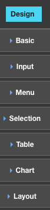

.. image:: ../images/badges/badge_web.png
   :class: pull-right

.. _webgcs-label:

Web Application Graphical Controls
==================================

DreamFace uses Angular Material to define the look and feel of web application graphical controls.

Once the view is created you have access to the View Editor containing the pre-defined graphical controls for building
web apps. The pre-defined graphical controls are grouped into categories with similar functionality:

|

|
|
|

* **Basic** - Basic Controls are simple graphical controls that do not require user input.
* **Input** - Input Controls are simple graphical controls that are usually associated with only one input field and value.
* **Menu** - Menu Controls are graphical controls that are used to create menus.
* **Selection** - Selection Controls are graphical controls that are used to selection items from a list.
* **Table** - Table Controls are used to present and manage the presentation of information in table format.
* **Chart** - Charts Controls are different types of pre-defined charts used to present data in a graph format.
* **Layout** - Layout Controls are containers for other graphical controls, organized in rows and columns.

|
|

Basic
^^^^^

Simple graphical controls that do not require user input but are used to inform the user with text, icons or images or
initiate an action. Below is a description of the Basic graphcical control available in the View Editor for building web
applications :

.. toctree::
   :maxdepth: 1

   ./web-gcs/webgc-basic-statictext
   ./web-gcs/webgc-basic-statictext2
   ./web-gcs/webgc-basic-button
   ./web-gcs/webgc-basic-icon
   ./web-gcs/webgc-basic-image
   ./web-gcs/webgc-basic-html
   ./web-gcs/webgc-basic-carousel
   ./web-gcs/webgc-basic-treeview

|

Input
^^^^^

Simple graphical controls are associated with one input field or setting one value with a knob, slider, etc.. Below is a
description of the Input graphcical controls available in the View Editor for building web applciations :

.. toctree::
   :maxdepth: 1

   ./web-gcs/webgc-input-input
   ./web-gcs/webgc-input-textarea
   ./web-gcs/webgc-input-datepicker
   ./web-gcs/webgc-input-select
   ./web-gcs/webgc-input-slider
   ./web-gcs/webgc-input-knob
   ./web-gcs/webgc-input-chips
   ./web-gcs/webgc-input-rating
   ./web-gcs/webgc-input-richtext
   ./web-gcs/webgc-input-json
   ./web-gcs/webgc-input-progressbar

|

Menu
^^^^
Menu controls are graphical controls that are used to create menus. Below is a description of the Menu graphcical controls
available in the View Editor for building web applciations :

.. toctree::
   :maxdepth: 1

   ./web-gcs/webgc-menu-fab
   ./web-gcs/webgc-menu-iconbar
   ./web-gcs/webgc-menu-treemenu
   ./web-gcs/webgc-menu-hzmenu

|

Selection
^^^^^^^^^

Selection controls are graphical controls that are used to selection items from a list. Below is a description of the
selection graphcical controls available in the View Editor for building web applciations :

.. toctree::
   :maxdepth: 1

   ./web-gcs/webgc-select-radio
   ./web-gcs/webgc-select-checkbox
   ./web-gcs/webgc-select-switch
   ./web-gcs/webgc-select-list

|

Table
^^^^^

Table controls are used to present and manage the presentation of information in table format of rows and columns. Below
is a description of the Table graphcical controls available for building web applications in the View Editor:

.. toctree::
   :maxdepth: 1

   ./web-gcs/webgc-table-datatable

|

Charts
^^^^^

Charts help to put information in context. Charts controls are different types of pre-defined charts used to present data
in a graph format. Below is a description of the Charts available for building web applications in the View Editor:

.. toctree::
   :maxdepth: 1

   ./web-gcs/webgc-chart-barchart
   ./web-gcs/webgc-chart-hzbarchart
   ./web-gcs/webgc-chart-piechart
   ./web-gcs/webgc-chart-donutchart
   ./web-gcs/webgc-chart-linechart
   ./web-gcs/webgc-chart-cmlinechart
   ./web-gcs/webgc-chart-areachart

|

Layout
^^^^^^

Layout is a special graphical control that are containers for other controls. The container is organized in a layout of
rows and columns where other graphical controls can be added to create the user interface. Below is a description the Layout
graphcical controls available for building web applications in the View Editor:

.. toctree::
   :maxdepth: 1

   ./web-gcs/webgc-layout-panel
   ./web-gcs/webgc-layout-tabs
   ./web-gcs/webgc-layout-wizard

|

Return to the `Documentation Home <http://localhost:63342/dfd/build/index.html>`_.

|