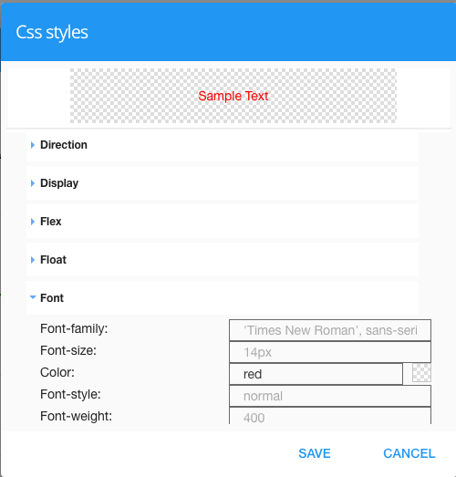

CSS Styles
==========

The CSS Styles help view assists the developer to set CSS Styles on graphical controls.

|

|

+------------------------+-------------------+--------------------------------------------------------------------------------------------+
| **Background**         | Possible Values   | Description                                                                                |
+========================+===================+============================================================================================+
|                        |                   |             .. image:: ../images/gcs/dfx-help-css-background.png                           |
+------------------------+-------------------+--------------------------------------------------------------------------------------------+
| background             | CSS class         | Name of CSS class to use for the component.                                                |
+------------------------+-------------------+--------------------------------------------------------------------------------------------+
| background-attachment  | CSS class         | Name of CSS class to use for the component.                                                |
+------------------------+-------------------+--------------------------------------------------------------------------------------------+
| background-color       | CSS class         | Name of CSS class to use for the component.                                                |
+------------------------+-------------------+--------------------------------------------------------------------------------------------+
| background-image       | CSS class         | Name of CSS class to use for the component.                                                |
+------------------------+-------------------+--------------------------------------------------------------------------------------------+
| background-position    | CSS class         | Name of CSS class to use for the component.                                                |
+------------------------+-------------------+--------------------------------------------------------------------------------------------+
| background-repeat      | CSS Class         | The Dynamic Class is a CSS class that will be added to the graphical control if an Angular |
+------------------------+-------------------+--------------------------------------------------------------------------------------------+
| background-size        | CSS Class         | The Dynamic Class is a CSS class that will be added to the graphical control if an Angular |
+------------------------+-------------------+--------------------------------------------------------------------------------------------+

|

+------------------------+-------------------+--------------------------------------------------------------------------------------------+
| **Border**             | Possible Values   | Description                                                                                |
+========================+===================+============================================================================================+
|                        |                   |             .. image:: ../images/gcs/dfx-help-css-border.png                               |
+------------------------+-------------------+--------------------------------------------------------------------------------------------+
| border                 | CSS class         | Name of CSS class to use for the component.                                                |
+------------------------+-------------------+--------------------------------------------------------------------------------------------+
| border-style           | CSS class         | Name of CSS class to use for the component.                                                |
+------------------------+-------------------+--------------------------------------------------------------------------------------------+
| border-width           | CSS class         | Name of CSS class to use for the component.                                                |
+------------------------+-------------------+--------------------------------------------------------------------------------------------+
| border-color           | CSS class         | Name of CSS class to use for the component.                                                |
+------------------------+-------------------+--------------------------------------------------------------------------------------------+
| border-topic           | CSS class         | Name of CSS class to use for the component.                                                |
+------------------------+-------------------+--------------------------------------------------------------------------------------------+
| border-right           | CSS class         | Name of CSS class to use for the component.                                                |
+------------------------+-------------------+--------------------------------------------------------------------------------------------+
| border-bottom          | CSS class         | Name of CSS class to use for the component.                                                |
+------------------------+-------------------+--------------------------------------------------------------------------------------------+
| border-left            | CSS class         | Name of CSS class to use for the component.                                                |
+------------------------+-------------------+--------------------------------------------------------------------------------------------+
| border-radius          | CSS class         | Name of CSS class to use for the component.                                                |
+------------------------+-------------------+--------------------------------------------------------------------------------------------+

|

+------------------------+-------------------+--------------------------------------------------------------------------------------------+
| **Box**                | Possible Values   | Description                                                                                |
+========================+===================+============================================================================================+
|                        |                   |             .. image:: ../images/gcs/dfx-help-css-box.png                                  |
+------------------------+-------------------+--------------------------------------------------------------------------------------------+
| Menu Style             | CSS class         | Name of CSS class to use for the component.                                                |
+------------------------+-------------------+--------------------------------------------------------------------------------------------+
| Menu Icon Style        | CSS class         | Name of CSS class to use for the component.                                                |
+------------------------+-------------------+--------------------------------------------------------------------------------------------+
| Item Style             | CSS class         | Name of CSS class to use for the component.                                                |
+------------------------+-------------------+--------------------------------------------------------------------------------------------+
| Item Icon Style        | CSS class         | Name of CSS class to use for the component.                                                |
+------------------------+-------------------+--------------------------------------------------------------------------------------------+
| Item Class             | CSS class         | Name of CSS class to use for the component.                                                |
+------------------------+-------------------+--------------------------------------------------------------------------------------------+
| Dynamic Class          | CSS Class         | The Dynamic Class is a CSS class that will be added to the graphical control if an Angular |
|                        |                   | Expression is verified. It is rendered as a ng-class attribute.                            |
+------------------------+-------------------+--------------------------------------------------------------------------------------------+

|

+------------------------+-------------------+--------------------------------------------------------------------------------------------+
| **Cursor**             | Possible Values   | Description                                                                                |
+========================+===================+============================================================================================+
|                        |                   |             .. image:: ../images/gcs/dfx-help-css-cursor.png                               |
+------------------------+-------------------+--------------------------------------------------------------------------------------------+
| Menu Style             | CSS class         | Name of CSS class to use for the component.                                                |
+------------------------+-------------------+--------------------------------------------------------------------------------------------+
| Menu Icon Style        | CSS class         | Name of CSS class to use for the component.                                                |
+------------------------+-------------------+--------------------------------------------------------------------------------------------+
| Item Style             | CSS class         | Name of CSS class to use for the component.                                                |
+------------------------+-------------------+--------------------------------------------------------------------------------------------+
| Item Icon Style        | CSS class         | Name of CSS class to use for the component.                                                |
+------------------------+-------------------+--------------------------------------------------------------------------------------------+
| Item Class             | CSS class         | Name of CSS class to use for the component.                                                |
+------------------------+-------------------+--------------------------------------------------------------------------------------------+
| Dynamic Class          | CSS Class         | The Dynamic Class is a CSS class that will be added to the graphical control if an Angular |
|                        |                   | Expression is verified. It is rendered as a ng-class attribute.                            |
+------------------------+-------------------+--------------------------------------------------------------------------------------------+

|

+------------------------+-------------------+--------------------------------------------------------------------------------------------+
| **Direction**          | Possible Values   | Description                                                                                |
+========================+===================+============================================================================================+
|                        |                   |             .. image:: ../images/gcs/dfx-help-css-direction.png                            |
+------------------------+-------------------+--------------------------------------------------------------------------------------------+
| Direction              | CSS class         | Name of CSS class to use for the component.                                                |
+------------------------+-------------------+--------------------------------------------------------------------------------------------+

|

+------------------------+-------------------+--------------------------------------------------------------------------------------------+
| **Display**            | Possible Values   | Description                                                                                |
+========================+===================+============================================================================================+
|                        |                   |             .. image:: ../images/gcs/dfx-help-css-display.png                              |
+------------------------+-------------------+--------------------------------------------------------------------------------------------+
| Display                | CSS class         | Name of CSS class to use for the component.                                                |
+------------------------+-------------------+--------------------------------------------------------------------------------------------+

|

+------------------------+-------------------+--------------------------------------------------------------------------------------------+
| **Flex**               | Possible Values   | Description                                                                                |
+========================+===================+============================================================================================+
|                        |                   |             .. image:: ../images/gcs/dfx-help-css-flex.png                                 |
+------------------------+-------------------+--------------------------------------------------------------------------------------------+
| flex                   | CSS class         | Name of CSS class to use for the component.                                                |
+------------------------+-------------------+--------------------------------------------------------------------------------------------+
| flex-basis             | CSS class         | Name of CSS class to use for the component.                                                |
+------------------------+-------------------+--------------------------------------------------------------------------------------------+
| flex-direction         | CSS class         | Name of CSS class to use for the component.                                                |
+------------------------+-------------------+--------------------------------------------------------------------------------------------+
| flex-flow              | CSS class         | Name of CSS class to use for the component.                                                |
+------------------------+-------------------+--------------------------------------------------------------------------------------------+
| flex-grow              | CSS class         | Name of CSS class to use for the component.                                                |
+------------------------+-------------------+--------------------------------------------------------------------------------------------+
| flex-shrink            | CSS class         | Name of CSS class to use for the component.                                                |
+------------------------+-------------------+--------------------------------------------------------------------------------------------+
| flex-wrap              | CSS class         | Name of CSS class to use for the component.                                                |
+------------------------+-------------------+--------------------------------------------------------------------------------------------+
| justify-content        | CSS class         | Name of CSS class to use for the component.                                                |
+------------------------+-------------------+--------------------------------------------------------------------------------------------+

|

+------------------------+-------------------+--------------------------------------------------------------------------------------------+
| **Float**              | Possible Values   | Description                                                                                |
+========================+===================+============================================================================================+
|                        |                   |             .. image:: ../images/gcs/dfx-help-css-float.png                                |
+------------------------+-------------------+--------------------------------------------------------------------------------------------+
| float                  | CSS class         | Name of CSS class to use for the component.                                                |
+------------------------+-------------------+--------------------------------------------------------------------------------------------+
| clear                  | CSS class         | Name of CSS class to use for the component.                                                |
+------------------------+-------------------+--------------------------------------------------------------------------------------------+

|

+------------------------+-------------------+--------------------------------------------------------------------------------------------+
| **Font**               | Possible Values   | Description                                                                                |
+========================+===================+============================================================================================+
|                        |                   |             .. image:: ../images/gcs/dfx-help-css-font.png                                 |
+------------------------+-------------------+--------------------------------------------------------------------------------------------+
| Menu Style             | CSS class         | Name of CSS class to use for the component.                                                |
+------------------------+-------------------+--------------------------------------------------------------------------------------------+
| Menu Icon Style        | CSS class         | Name of CSS class to use for the component.                                                |
+------------------------+-------------------+--------------------------------------------------------------------------------------------+
| Item Style             | CSS class         | Name of CSS class to use for the component.                                                |
+------------------------+-------------------+--------------------------------------------------------------------------------------------+
| Item Icon Style        | CSS class         | Name of CSS class to use for the component.                                                |
+------------------------+-------------------+--------------------------------------------------------------------------------------------+
| Item Class             | CSS class         | Name of CSS class to use for the component.                                                |
+------------------------+-------------------+--------------------------------------------------------------------------------------------+
| Dynamic Class          | CSS Class         | The Dynamic Class is a CSS class that will be added to the graphical control if an Angular |
|                        |                   | Expression is verified. It is rendered as a ng-class attribute.                            |
+------------------------+-------------------+--------------------------------------------------------------------------------------------+

|

+------------------------+-------------------+--------------------------------------------------------------------------------------------+
| **Height**             | Possible Values   | Description                                                                                |
+========================+===================+============================================================================================+
|                        |                   |             .. image:: ../images/gcs/dfx-help-css-height.png                               |
+------------------------+-------------------+--------------------------------------------------------------------------------------------+
| Height                 | CSS class         | Name of CSS class to use for the component.                                                |
+------------------------+-------------------+--------------------------------------------------------------------------------------------+
| Min-height             | CSS class         | Name of CSS class to use for the component.                                                |
+------------------------+-------------------+--------------------------------------------------------------------------------------------+
| Max-height             | CSS class         | Name of CSS class to use for the component.                                                |
+------------------------+-------------------+--------------------------------------------------------------------------------------------+

|

+------------------------+-------------------+--------------------------------------------------------------------------------------------+
| **List Style**         | Possible Values   | Description                                                                                |
+========================+===================+============================================================================================+
|                        |                   |             .. image:: ../images/gcs/dfx-help-css-liststyle.png                            |
+------------------------+-------------------+--------------------------------------------------------------------------------------------+
| List-style             | CSS class         | Name of CSS class to use for the component.                                                |
+------------------------+-------------------+--------------------------------------------------------------------------------------------+
| List-style-position    | CSS class         | Name of CSS class to use for the component.                                                |
+------------------------+-------------------+--------------------------------------------------------------------------------------------+
| List-style-type        | CSS class         | Name of CSS class to use for the component.                                                |
+------------------------+-------------------+--------------------------------------------------------------------------------------------+

|

+------------------------+-------------------+--------------------------------------------------------------------------------------------+
| **Margin**             | Possible Values   | Description                                                                                |
+========================+===================+============================================================================================+
|                        |                   |             .. image:: ../images/gcs/dfx-help-css-margin.png                               |
+------------------------+-------------------+--------------------------------------------------------------------------------------------+
| Margin                 | CSS class         | Name of CSS class to use for the component.                                                |
+------------------------+-------------------+--------------------------------------------------------------------------------------------+
| Margin Top             | CSS class         | Name of CSS class to use for the component.                                                |
+------------------------+-------------------+--------------------------------------------------------------------------------------------+
| Margin Righ            | CSS class         | Name of CSS class to use for the component.                                                |
+------------------------+-------------------+--------------------------------------------------------------------------------------------+
| Margin Bottom          | CSS class         | Name of CSS class to use for the component.                                                |
+------------------------+-------------------+--------------------------------------------------------------------------------------------+
| Margin Left            | CSS class         | Name of CSS class to use for the component.                                                |
+------------------------+-------------------+--------------------------------------------------------------------------------------------+

+------------------------+-------------------+--------------------------------------------------------------------------------------------+
| **Opacity**            | Possible Values   | Description                                                                                |
+========================+===================+============================================================================================+
|                        |                   |             .. image:: ../images/gcs/dfx-help-css-opacity.png                              |
+------------------------+-------------------+--------------------------------------------------------------------------------------------+
| Opacity                | CSS class         | Name of CSS class to use for the component.                                                |
+------------------------+-------------------+--------------------------------------------------------------------------------------------+

|

+------------------------+-------------------+--------------------------------------------------------------------------------------------+
| **Padding**            | Possible Values   | Description                                                                                |
+========================+===================+============================================================================================+
|                        |                   |             .. image:: ../images/gcs/dfx-help-css-padding.png                              |
+------------------------+-------------------+--------------------------------------------------------------------------------------------+
| Padding                | CSS class         | Name of CSS class to use for the component.                                                |
+------------------------+-------------------+--------------------------------------------------------------------------------------------+
| Padding Top            | CSS class         | Name of CSS class to use for the component.                                                |
+------------------------+-------------------+--------------------------------------------------------------------------------------------+
| Padding Righ           | CSS class         | Name of CSS class to use for the component.                                                |
+------------------------+-------------------+--------------------------------------------------------------------------------------------+
| Padding Bottom         | CSS class         | Name of CSS class to use for the component.                                                |
+------------------------+-------------------+--------------------------------------------------------------------------------------------+
| Padding Left           | CSS class         | Name of CSS class to use for the component.                                                |
+------------------------+-------------------+--------------------------------------------------------------------------------------------+

+------------------------+-------------------+--------------------------------------------------------------------------------------------+
| **Position**           | Possible Values   | Description                                                                                |
+========================+===================+============================================================================================+
|                        |                   |             .. image:: ../images/gcs/dfx-help-css-position.png                             |
+------------------------+-------------------+--------------------------------------------------------------------------------------------+
| Menu Style             | CSS class         | Name of CSS class to use for the component.                                                |
+------------------------+-------------------+--------------------------------------------------------------------------------------------+
| Menu Icon Style        | CSS class         | Name of CSS class to use for the component.                                                |
+------------------------+-------------------+--------------------------------------------------------------------------------------------+
| Item Style             | CSS class         | Name of CSS class to use for the component.                                                |
+------------------------+-------------------+--------------------------------------------------------------------------------------------+
| Item Icon Style        | CSS class         | Name of CSS class to use for the component.                                                |
+------------------------+-------------------+--------------------------------------------------------------------------------------------+
| Item Class             | CSS class         | Name of CSS class to use for the component.                                                |
+------------------------+-------------------+--------------------------------------------------------------------------------------------+
| Dynamic Class          | CSS Class         | The Dynamic Class is a CSS class that will be added to the graphical control if an Angular |
|                        |                   | Expression is verified. It is rendered as a ng-class attribute.                            |
+------------------------+-------------------+--------------------------------------------------------------------------------------------+

|

+------------------------+-------------------+--------------------------------------------------------------------------------------------+
| **Transition**         | Possible Values   | Description                                                                                |
+========================+===================+============================================================================================+
|                        |                   |             .. image:: ../images/gcs/dfx-help-css-transition.png                           |
+------------------------+-------------------+--------------------------------------------------------------------------------------------+
| Menu Style             | CSS class         | Name of CSS class to use for the component.                                                |
+------------------------+-------------------+--------------------------------------------------------------------------------------------+
| Menu Icon Style        | CSS class         | Name of CSS class to use for the component.                                                |
+------------------------+-------------------+--------------------------------------------------------------------------------------------+
| Item Style             | CSS class         | Name of CSS class to use for the component.                                                |
+------------------------+-------------------+--------------------------------------------------------------------------------------------+
| Item Icon Style        | CSS class         | Name of CSS class to use for the component.                                                |
+------------------------+-------------------+--------------------------------------------------------------------------------------------+
| Item Class             | CSS class         | Name of CSS class to use for the component.                                                |
+------------------------+-------------------+--------------------------------------------------------------------------------------------+
| Dynamic Class          | CSS Class         | The Dynamic Class is a CSS class that will be added to the graphical control if an Angular |
|                        |                   | Expression is verified. It is rendered as a ng-class attribute.                            |
+------------------------+-------------------+--------------------------------------------------------------------------------------------+

|

+------------------------+-------------------+--------------------------------------------------------------------------------------------+
| **Width**              | Possible Values   | Description                                                                                |
|                        |                   |                                                                                            |
+========================+===================+============================================================================================+
|                        |                   |             .. image:: ../images/gcs/dfx-help-css-width.png                                |
+------------------------+-------------------+--------------------------------------------------------------------------------------------+
| Width                  | CSS class         | Name of CSS class to use for the component.                                                |
+------------------------+-------------------+--------------------------------------------------------------------------------------------+
| Min-width              | CSS class         | Name of CSS class to use for the component.                                                |
+------------------------+-------------------+--------------------------------------------------------------------------------------------+
| Max-width              | CSS class         | Name of CSS class to use for the component.                                                |
+------------------------+-------------------+--------------------------------------------------------------------------------------------+
