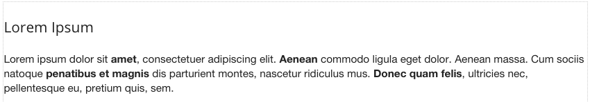

HTML
====
.. image:: ../images/icons/icon_web.png
   :class: pull-right

The HTML graphical control allows a developer to add any custom HTML in pure HTML. By default the control contains
a Lorem Ipsum text. This contect can be edited to include any HTML content. For example, if you find that one of the
pre-defined graphical controls does not have the functionality that you need, you can add your own in the HTML control.

|

|

Properties
^^^^^^^^^^

|

+------------------------+-------------------+--------------------------------------------------------------------------------------------+
| **Main Properties**    | Possible Values   | Description                                                                                |
+========================+===================+============================================================================================+
| Name                   | htHtml#           | Name is a reference to the component's DOM element. It can be used to dynamically access   |
|                        |                   | and set component properties. DreamFace gives a default name of *htHtml* where #           |
|                        |                   | corresponds to the order in which it was created. If it's the second control created it    |
|                        |                   | will have a default Name of *htHtml12*. Name is not required and can be removed if not     |
|                        |                   | needed.                                                                                    |
+------------------------+-------------------+--------------------------------------------------------------------------------------------+
| Binding                | Any text          | The HTML control can be bound to data coming from a service, for example a service that    |
|                        |                   | goes to a content management system. Text that will be displayed in the field.             |
|                        |                   |                                                                                            |
+------------------------+-------------------+--------------------------------------------------------------------------------------------+
| Content                | Any text          | The content can be edited to enter the HTML manually in a contextual script editor. The    |
|                        |                   | new content will be displayed as soon as it is saved.                                      |
|                        |                   |                                                                                            |
|                        |                   |        .. image:: ../images/gcs/dfx-html-editor.png                                        |
+------------------------+-------------------+--------------------------------------------------------------------------------------------+
| Display                | *true* or *false* | *true* to display the field or *false* to hide it.                                         |
|                        |                   |                                                                                            |
+------------------------+-------------------+--------------------------------------------------------------------------------------------+
| Disabled               | *true* or *false* | *true* to disable the field or *false* to make it active.                                  |
|                        |                   |                                                                                            |
+------------------------+-------------------+--------------------------------------------------------------------------------------------+

|

+------------------------+-------------------+--------------------------------------------------------------------------------------------+
| **Styling Attributes** | Possible Values   | Description                                                                                |
+========================+===================+============================================================================================+
| Style                  | CSS syles         | CSS style attribure(s) to use for this component, separated by semi-colons, for example:   |
|                        |                   | *color:red; background-color:lightgray*.                                                   |
+------------------------+-------------------+--------------------------------------------------------------------------------------------+
| Classes                | CSS class         | Name of CSS class to use for the component.                                                |
+------------------------+-------------------+--------------------------------------------------------------------------------------------+
| Dynamic Classes        | CSS Class         | The Dynamic Class is a CSS class that will be added to the graphical control if an Angular |
|                        |                   | Expression is verified. It is rendered as a ng-class attribute.                            |
+------------------------+-------------------+--------------------------------------------------------------------------------------------+

|

+------------------------+-------------------+--------------------------------------------------------------------------------------------+
| **Events**             | Possible Values   | Description                                                                                |
+========================+===================+============================================================================================+
| On Click               | function name     | Enter the name of the function that will be executed when the user clicks on the HTML      |
|                        |                   | control. The function should be defined in the controller in the script tab of the View    |
|                        |                   | Editor. Clicking on the ... opens a window to to select a function defined in the          |
|                        |                   | Controller.                                                                                |
+------------------------+-------------------+--------------------------------------------------------------------------------------------+

|
|

