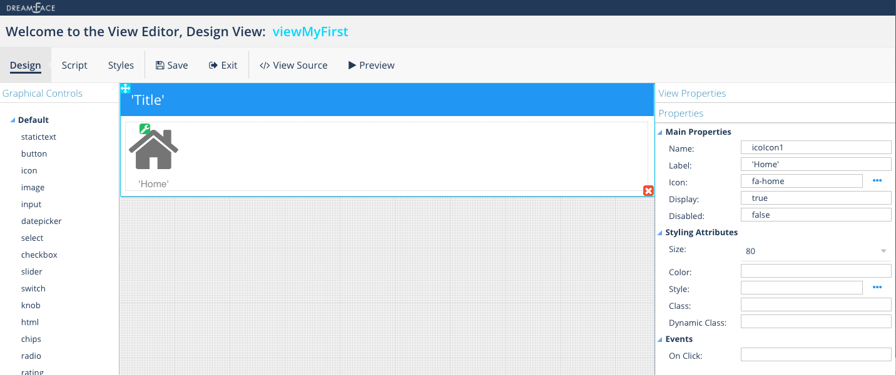

Icon
====

.. image:: ../images/icons/icon_web.png
   :class: pull-right

An icon is a graphical image that conveys a message, for example an image of a telephone might indicate that the view is
about telephone numbers, a house might mean to fill in your home address in a form.

|

|

Properties
^^^^^^^^^^

|

+------------------------+-------------------+--------------------------------------------------------------------------------------------+
| **Main Properties**    | Possible Values   | Description                                                                                |
+========================+===================+============================================================================================+
| Name                   | icoIcon#          | Name is a reference to the component's DOM element. It can be used to dynamically access   |
|                        |                   | and set component properties. DreamFace gives a default name of *icoIcon#* where #         |
|                        |                   | corresponds to the order in which it was created. If it's the second accordion created it  |
|                        |                   | will have a default Name of *fldhtml2*. Name is not required and can be removed if not     |
|                        |                   | needed.                                                                                    |
+------------------------+-------------------+--------------------------------------------------------------------------------------------+
| label                  | Any text          | This is the text that will appear under the icon, for example the fa-home icon could have  |
|                        |                   | the label Home as DreamFace uses as the default for this component.                        |
+------------------------+-------------------+--------------------------------------------------------------------------------------------+
| icon                   | favicon           | Click on the **...** to the right of the field to select one of the favicons from the list.|
|                        |                   |                                                                                            |
|                        |                   |        .. image:: ../images/gcs/dfx-icons.png                                              |
+------------------------+-------------------+--------------------------------------------------------------------------------------------+
| Display                | *true* or *false* | *true* to display the field or *false* to hide it.                                         |
|                        |                   |                                                                                            |
+------------------------+-------------------+--------------------------------------------------------------------------------------------+
| Disabled               | *true* or *false* | *true* to disable the field or *false* to make it active.                                  |
|                        |                   |                                                                                            |
+------------------------+-------------------+--------------------------------------------------------------------------------------------+

+------------------------+-------------------+--------------------------------------------------------------------------------------------+
| **Styling Attributes** | Possible Values   | Description                                                                                |
+========================+===================+============================================================================================+
| Style                  | CSS syles         | CSS style attribure(s) to use for this component, separated by semi-colons, for example:   |
|                        |                   | *color:red; background-color:lightgray*. By clicking on the **...** on the right hand side |
|                        |                   | of the field, a window opens up proposing to change attributes for **font**, **color**,    |
|                        |                   | **padding** and **margin** presented in a tree. When clicking on the arrow to the left of  |
|                        |                   | the attribute type, the user is guide by placeholder to enter the correct settings         |
|                        |                   |                                                                                            |
|                        |                   |        .. image:: ../images/gcs/dfx-icon-css.png                                              |
+------------------------+-------------------+-------------------------------------------------------------------------------------------+|
|    *Font*              | CSS font family   | For the font there are three setting: Font-family, Font-size and Font-weight               |
|                        | CSS font size     |                                                                                            |
|                        | CSS font weight   |                                                                                            |
+------------------------+-------------------+--------------------------------------------------------------------------------------------+
|    *Color*             | #hexcode for color| CSS colors are defined using a hexadecimal (HEX) notation (see :term:`Hexadecimal Colors`) |
|                        | Predefined Cross- | or enter one of the Pre-defined cross browser colors.                                      |
|                        | Browser Colors    | `140 cross browser colors <http://www.w3schools.com/cssref/css_colornames.asp>`_           |
+------------------------+-------------------+--------------------------------------------------------------------------------------------+
|    *Padding*           | *length*, *%*     | Padding defines space between the content and the border of the component. Length defines  |
|                        |                   | the fixed paddingwhile percent defines the padding as a percentage of the container. When  |
|                        |                   | specifying length, pixels (px), centimeters (cm) and other units can be used *example* -   |
|                        |                   | 10px or 10cm. Default value is 0px. There are four values possible to set: top, left,      |
|                        |                   | bottom, and right, *example* - 10px 5px 10px 15px would set top and bottom to 10px and left|
|                        |                   | to 5px and right to 15px. Padding shorthand is accepted, for example 10px 5px would set    |
|                        |                   | padding on top and bottom to 10px and left and right to 5px. If only one value is specified|
|                        |                   | for length it is used for all four values, *example* - 20px would set all values to 20px.  |
+------------------------+-------------------+--------------------------------------------------------------------------------------------+
|    *Margin*            | *auto*, *length*, | Margin defines the space around the component. It is transparent and has no background     |
|                        | *%*, *inherit*    | Auto lets the browser calculate the margin, *example* - auto. When specifying the length   |
|                        |                   | pixels (px), centimeters (cm) and other units can be used *example* - 10px or 10cm.        |
|                        |                   | Default value is 0px. There are four values possible to set: top, left, bottom, and right  |
|                        |                   | and left margins to 0px. Margin shorthand is accepted, for example 10px 5px would set both |
|                        |                   | top and bottom margins to 10px and left and right to 5px.*%* specifies margin as           |
|                        |                   | percentage of its parent container, *example* - 100% to indicate to use the entire width of|
|                        |                   | the parent. *inherit* indicates that the value will be inherited from its parent,          |
|                        |                   | *example* - inherit.                                                                       |
+------------------------+-------------------+--------------------------------------------------------------------------------------------+
| Classes                | CSS class         | Name of CSS class to use for the HTMLcomponent.                                            |
+------------------------+-------------------+--------------------------------------------------------------------------------------------+
| Dynamic Classes        | CSS Class         | The Dynamic Class is a CSS class that will be added to the HTML control if an Angular      |
|                        |                   | Expression is verified. It is rendered as a ng-class attribute.                            |
+------------------------+-------------------+--------------------------------------------------------------------------------------------+

|
|

+------------------------+-------------------+--------------------------------------------------------------------------------------------+
| **Events**             | Possible Values   | Description                                                                                |
+========================+===================+============================================================================================+
| On Click               | function name     | Enter the name of the function that will be executed when the user clicks on the HTML      |
|                        |                   | control. The function should be defined in the controller in the script tab of the View    |
|                        |                   | Editor. Clicking on the ... opens a window to to select a function defined in the          |
|                        |                   | Controller.                                                                                |
+------------------------+-------------------+--------------------------------------------------------------------------------------------+

|
|
