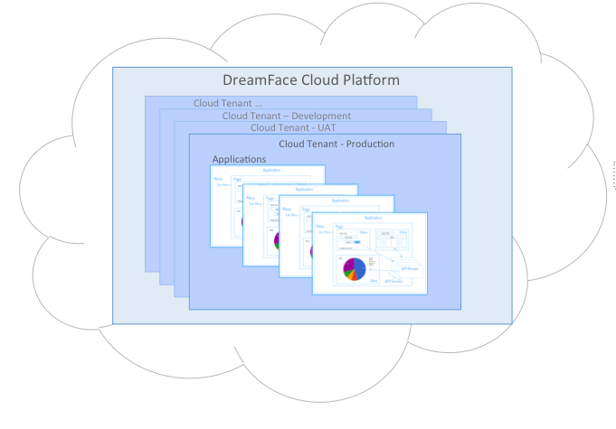

Understanding DreamFace
=======================

What is DreamFace?
------------------
DreamFace X-Platform (DFX) or just DreamFace as we will refer to it throughout this documentation is a :term:`cloud-native`
development platform that empowers developers to consistently deliver well-architected, Enterprise grade, :term:`cross-platorm`,
cloud-native applications, with Ease and Speed, resulting in an uncompromising personalized User Experience with the right
data on the right device for the right user, with codeless integration of virtually any enterprise service, process, public
or private API available.

DreamFace accelerates development and leaves room for developer creativity in solving business problems by removing much of the heavy-lifting
in writing application logic, connecting to multiple data sources and packaging applications. Developers focus their development on
creating a compelling user experience with reduced coding required because a comprehensive integration of backend data services with
codelss consumption or APIs.

DreamFace is based on the technologies proven by the major internet application providers like facebook, twitter and google.

DreamFace applications are modular, composite applications that are secure and build to scale in the cloud. They are inherently
multi-tenant, open and extensible.

Why did we create DreamFace?
----------------------------

For Developers
^^^^^^^^^^^^^
The success of social media applications on the internet has lead to a proliferation of new and robust open source technologies. It has
also created expectations with end users for beautiful and intuitive user interfaces. At the same, IT departments and businesses have
been opening up there back-end data and applications as services through the creation of pubic and private APIs. These new trends toward
componentization and modularity have transformed application development. Developers no longer have to create everything from scratch
in monolithic projects that take much too long and cost way too much. Application development today is an assembly of pieces coming from
different libraries, languages, frameworks and technologies. DreamFace was build in this world, to leverage these new concepts
put them in the hands of developers.

For Businesses
^^^^^^^^^^^^^^
Businesses are in a difficult situation today because they want to take advantage of the flexibility offered by new open
source technologies. They want the software and the APIs they use be open and extensible. They want to be able to customize
the pieces and interface with existing applications, public and external data sources and legacy technology. There is an
expectation of great benefit by using new components and technologies and at the same time there is not a lot of experience
about how to put it all together. Businesses have real applications to build and real delerivables to provide, real budgets
and real security needs to meet. They want to benefit from these new development methodologies and meet their commitments,
but how to do it?

That's where DreamFace steps in. DreamFace was built to provide any easy way to leverage these new open source technologies to :

* **Create modern and beautiful User Interfaces**
* **Integrete back-end data sources coming from any API**
* **Interface with existing applications and legacy technology**
* **Use containerization and virtualization to scale the applications in the cloud**

Like many frameworks and platforms, DreamFace was created to help reduce the amount of work to build consistently good applications.
There are  a lot of great developers in the world and many more will come with the new coding initiatives. The problem isn’t
really knowing how to use HTML or CSS, or Angular or any other new technology that comes along. The problem is knowing all of
the technologies necessary to build a really good application that works in the cloud and scales and that can evolve and
to the ever changing business requirements of today's competetive business environment.

The goal of DreamFace is to reduce the need to know every technology in depth by providing built-in best practices for error handling,
API integration, security, version management, remote team development, build management and deployment and containerization to name a few.
DreamFace provides and open and exetensible environment where the developer is empowered to use their skills to focus on
the functionality and providing a great user experience without rebuilding the wheel every time.

DreamFace can also leverage the experts in a project. For example, one developer could build the complex data queries that can be reused by
the rest of the team. Being able to share reusable components allows a team to build a catalogue of shared components that they can leverage.

**Some of the ways DreamFace helps to empower developers:**

* A Software Development PaaS enabling developers to collaborate in the development of Web and Mobile apps
* Built on Open Source technologies and Frameworks (NodeJS, AngularJS, Bootstrap, MongoDB, GITHub…)
* Leverages all the capabilities and power of this selection of technologies
* Allows all levels of developers to contribute on the same project, each using a preferred technique to do so
* Designed to evolve architecturally but transparently to developers and user (such as adding a new open source framework, a new graphical component library, etc.)
* Structures the way developers need to use these technologies by wrapping best practices around them.

Below is a more in depth presentation of some of the key concepts of DreamFace.

|

Platform
^^^^^^^^

DreamFace is a :term:`native cloud application`. The applications that you build with DreamFace are also :term:`cloud-native`
applications. The support for the :term:`multitenancy`,
:term:`containerization`,
:term:`virtualization` and other familiar
cloud tehniques is at the core of the product.

When installed for the first time, a DreamFace :term:`platform` is available to create multi-tenants for the various purposes
of application development :

* One DreamFace platform can create one or more Tenants (such as Development, QA, UAT or production)
* One Tenant can be used to create one or more applications (Web or mobile)

It is important to note that the creation of tenants under the same platform is an instantaneous action, using the same
code base of the underlying installed DreamFace platform. Under the hood, DreamFace creates a JSON object that maps to
the tenant in the Global JSON DataStore. The DreamFace Platform has some global attributes that can be used for all tenants
under the Platform, such as the developers and their roles or the deployment features supported by the Platform (Docker
interface for dockerization of your application, deployment on Bluemix, etc.)

|

Application
^^^^^^^^^^^

A DreamFace Application is a collection of :ref:`application-components-label` consisting of:

* **Pages** - Pages are the highest UI concept through which a user interacts with the application. A page can be a mobile “screen” or a web “screen”. A page is:

   * created using a template to give a consistent look and feel throughout the applcation
   * composed of one or more Views
   * generally connected to other pages via navigational menus

*	**Views** - Views, as the name implies, are graphical views made up of Graphical controls. Views are meant to be reusable across Pages. Views contains “cards” (a notion of multi-layering) allowing some very complex interface representations to be built easier.
*	**API Services** - These are are endpoints that reference virtually any API end point that needs to be called in the application. API Services are organized under the notion of an “API Service Object” whichh allows them to be better classified and managed. They connect to the backend using “API Sources” (handlers that contains the type of the backend to call, the URL and the security credentials).
*	**Global Resources**:

   * *JavaScript files* - can contain any JavaScript and make it available throughout your application
   * *CSS files* - any CSS that you wish to use across the application. Note that the current version ships with an Angular Material Design Global CSS model that already contains a very rich and wide set of classes that can be leveraged and used throughout.
   * *Assets* - A placeholder to put application wide Resources such as images or icons

* **Global Configuration & Settings** - A DreamFace application is highly and easily configurable. Each Application allows the developer to configure it appropriately for the type of users to access it, how to deploy, where to share code via Github, Global variables and DataTypes to be used, and how to deploy it (Docker or not), etc.
* **A Shared Catalog** - the “Shared Catalog” is a special application that is created by default to allow the developers to reuse any application component across multiple applications within the same tenant. To share Application Components across tenants, use export/import through the Github interface in DreamFace

|

.. _application-components-label:

Application Components
----------------------

DreamFace applications are composed from Pages, Views and API components.

|

Pages
^^^^^

Pages are graphical elements that are made of
* One Page Template
* One or many

Pages are the graphical compositions through which a user interacts with the application.

?? <<embed a picture of a page>>

Pages have their own controller for:
* Page wide actions
* Page wide scope (variables, functions, etc.)
* A specific view can refer to “parent scope” (i.e. the instance of the page in which it is rendered)

?? <<show code on how to do this>>

Pages uses Templates in order to respect a specific Look & Feel.

**Page Templates**
A Page Template is a developer/designer concept in which one can specify a “graphical look” to be used while developing pages. A “Page Template” is built, graphically, using a specific editor. For example, one can build
* Single View Page Template
* Single View Page Template with a Left Navigation
* Multiple View Page Template with a bottom navigation and a header

The various sections of a page Template can use Views to populate them.
The Page Template will have “locked areas” (developer using the Template cannot alter these) and “unlocked areas” (developer can drop their views in theses areqs while constructing application pages).
This mechanism ensures consistency in developing User Interfaces where only a few Templates may be needed to develop an entire application.

Views
^^^^^

Views are the core concept of what makes an User Interface. Views are functional graphical areas, with an embedded logic (via the controller) as well as a REST based invocation interface. Views are deployed as :term:`Angular modules`. Views are usually assembled in Pages and communicate with each other via a natively supported :term:`pub/sub mechanism.

?? <<show sample views>>

When deployed in a page, views can:
* communicate with eachother via a pub/sub mechanism. This mechanism will evolve in a near future to become the foundation of the “View Interface”. An easy programming model to allow the implementation of “onBusinessEvent do…” will be implemented. The sum of all events handled by the View or Emitted by the View will become the “View Interface” allowing an easy and graphical wiring between Views in order to produce a more granular concerted experience
?? >>show some example of pub/syb>>
* Access a higher level context such as the ones for the host page or the applicaton
?? <<show code that demonstrates that>>

** Cards**
Cards are a very interesting concept that was added in DreamFace v3.0. The idea of Cards stemmed from the need to produce
MicroServices where a concerted set of Views are needed as part of the “UI module” in a “Single Page UI Design” :term:`SPA`.
For example, A Micro Service can be made from a View that shows the Customer list in a Table, clicking on a customer to
edit the properties in a form like fashion, along with a variety of Dialogs to confirm actions. In order to easily implement
such an interaction, Cards can be used in order to provide the variety of “layers” needed for such an interaction, where
a context links them together and where a variety of look & feel can be needed “Cards” implements the facility to allow
the development of “multiple views within the same view”. They allow the implementation of a “depth” or a “layering model”
to the view where very complex representations can be easily produce.

All Cards share the same “controller” allowing them to share information easily without the need of a pub/sub mechanism.
Cards can be invoked in a variety of ways in order to be shown as a “sliding view: left/right/bottom” or a Dialog Box or
even to become the default Card to occupy the whole real estate of a view.
* Example of Card ?? <<Show graphical Examples >>
* Example of View ?? <<show code that invokes it>>

API Integration
^^^^^^^^^^^^^^^

DreamFace applications exclusively consume API’s. All interactions with the backend(s) are modeled as API calls, using
standard REST as a way to interact and standardize the consumption of services. DreamFace introduces many concepts to ease
the adaptation and the consumption of API’s for the purpose of building the User Interface.

?? <<show an architectural diagram on how UI consumes API in DFX>>

**API Source**
“API Sources” are the construct to define a “backend API source” to be used later on to define services. An “API Source” is the equivalent concept to a DataSource in the DataBase metaphor of things.
* Type of the API endpoint (REST, XML,WebService, DataBase, etc..)
* URL/Address of the endpoint
* Security Type and credentials

DreamFace provides an added value to some of the providers in order to ease the interaction effort
* REST to XML mapping
* DataBase consumption and mapping to REST
* Introspection of some of the backends (such as StrongLoop , Swagger, etc.) in order to allow an interactive consumption of such backend services
* High Value add services: List of “specific usable providers” such as SalesForce API, NetSuite API, Weather.com, News API, Google API, etc. These providers’ services will be ready for consumption “out of the box”. DreamFace engineers and/or user community will be adding to this list in order to provide an exponential value to the whole user community

**API Service Object**
API Service Object is a concept to gather “business related services” in a single object construct and this, regardless if the Services endpoint are provided from the same source or not.
As an example, an “API Service Obejct” called “News” can have services (aka methods) such as “getCNNNews” or “getYahooNews” as well as get “getAllNews”, irrespective if the news are using the same API Source or not. This association via the Service Ibejct will be enriched in the future to allow a “common behavior” at the Object level such as accessibility rules, caching rules, filtering rules, etc.
<<schema to depict the concept of API Service Ibject>>

**API Services**
An API Service is a concept that maps to a specific end point API. An API Service is one interaction with the backend.
The basic concepts to retain on API Services in DreamFace are
-	An API Service Object is made of one or more API Servcie(s)
-	An API Service
o	Maps to an API URL. This URL can be manually entered or introspected if the backend source allows it
o	Uses an API Source to determine the nature of the backend as well as the security credentials to access it
o	Always take a JSON in and produces a JSON out. The notion of these in/out payload makes the API Service Interface. Future releases of DreamFace will extend on the notion of these interfaces in order to build a “Business Object Repository” that maps the interfaces to reusable BO constructs to be used between the backend and front end sides of an application
o	PreHandler/PostHandler/Application Exception Handler: These NodeJS modules of codes will allow the API Service that is declared in DreamFace to have an intelligent behavior that overloads the API call to the backend.  Through these mechanisms, once can filter the API call to the backend, overload it, merge API invocations, aggregate API calls, etc.

API Services can be consumed by any REST client (postman for example). DreamFace adds an embedded Oauth2 security to these
API Services making a non-secured backend automatically secured.

Important DreamFace Concepts
^^^^^^^^^^^^^^^^^^^^^^^^^^^^^

1.	Templates
2.	Application/Pages/Views
3.	Pub/Sub
4.	Views interface and Reusability
5.	Cards
6.	AngularJS Support
7.	AngularJS directives and extensibility of the Graphical Controls system
8.	NodeJS Support

