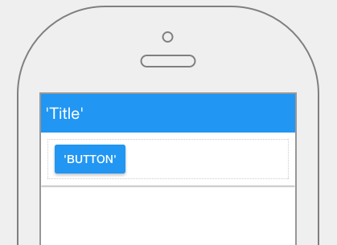

.. image:: ../../images/icons/badge_mobile.png
   :class: pull-right

Button
======

A button communicates an action to be performed when the user clicks on it. It consists of a label, an icon or both that
indicate the action to be performed when the button is clicked.

|

|

The Button control properties can be set for the following categories of properties:

* :ref:`mobgc-button-main-label`
* :ref:`mobgc-button-menu-label`
* :ref:`mobgc-button-styling-label`
* :ref:`mobgc-button-events-label`

|

.. _mobgc-button-main-label:

Main Properties
---------------

|

+------------------------+-------------------+--------------------------------------------------------------------------------------------+
| **Main Properties**    | Possible Values   | Description                                                                                |
+========================+===================+============================================================================================+
| Id                     | nnnnn             | Id is a unique identifier that is 5 or more digits long. It is generated by DreamFace and  |
|                        |                   | can be used when refering to this field in script.                                         |
+------------------------+-------------------+--------------------------------------------------------------------------------------------+
| Name                   | btnButton#        | Name is a reference to the component's DOM element. It can be used to dynamically access   |
|                        |                   | and set component properties. DreamFace gives a default name of *btnButton#* where #       |
|                        |                   | corresponds to the order in which the control was created. The second button created       |
|                        |                   | will have a default Name of *btnButton2*. Name is not required and can be removed if not   |
|                        |                   | needed.                                                                                    |
+------------------------+-------------------+--------------------------------------------------------------------------------------------+
| label                  | Any text or       | This is the text that will appear on the button indicating which  action that will         |
|                        | *expression*      | performed when the button is clicked. For example, the label might be *Cancel*, *OK*,      |
|                        |                   | *DEPLOY TO CLOUD*, or *ADD COMMENT*.                                                       |
|                        |                   |                                                                                            |
|                        |                   |        .. image:: ../../images/gcs/dfx-button-label.png                                    |
|                        |                   |                                                                                            |
|                        |                   | **Labels can also be expressions** that are evaluated at runtime.                          |
|                        |                   |                                                                                            |
|                        |                   | See more about how to define :ref:`expressions-label` here.                                |
|                        |                   |                                                                                            |
|                        |                   | *Note* - Text needs to be in quotes otherwise it will be treated as a variable. If your    |
|                        |                   | label doesn't appear in Preview mode, make sure the text is in quotes. For words that      |
|                        |                   | contain an apostrophe, use double quotes. For example "It's a button" would evaluate to:   |
|                        |                   |                                                                                            |
|                        |                   | *It's a button* at runtime (in Preview Mode or when testing the application.               |
+------------------------+-------------------+--------------------------------------------------------------------------------------------+
| icon                   | favicon           | Click on the **...** to the right of the field to select one of the favicons from the list.|
|                        |                   |                                                                                            |
|                        |                   |        .. image:: ../../images/gcs/dfx-icons.png                                           |
+------------------------+-------------------+--------------------------------------------------------------------------------------------+
| icon position          | *left* or *right* | *left* to display on the left and *right* to display on the right side of the button.      |
|                        |                   |                                                                                            |
+------------------------+-------------------+--------------------------------------------------------------------------------------------+
| Display                | *true* or *false* | The value can either be a literal *true* to display the field or *false* to hide it, or it |
|                        | angular expression| be a angular expression that evaulates to *true* or *false*, for example,                  |
|                        |                   |                                                                                            |
|                        |                   | 5 > 2 would evaluate to *true* and 5 < 2 would evaluate to false                           |
+------------------------+-------------------+--------------------------------------------------------------------------------------------+
| Disabled               | *true* or *false* | *true* to disable the field or *false* to make it active or it be a angular expression that|
|                        | angular expression| evaulates to *true* or *false*, for example,                                               |
|                        |                   |                                                                                            |
|                        |                   | 5 > 2 would evaluate to *true* and 5 < 2 would evaluate to false                           |
|                        |                   |                                                                                            |
+------------------------+-------------------+--------------------------------------------------------------------------------------------+

|

.. _mobgc-button-menu-label:

Menu Items
----------

+------------------------+-------------------+--------------------------------------------------------------------------------------------+
| **Menu Items**         | Possible Values   | Description                                                                                |
+========================+===================+============================================================================================+
| Static                 | Editor            | Beside the Static menu property is a **Edit** link to the Menu Editor. You define the Menu |
|                        |                   | in the Menu Editor. Once you are satisfied you save the menu that has been defined.        |
|                        |                   |                                                                                            |
+------------------------+-------------------+--------------------------------------------------------------------------------------------+
| Dynamic                | Name              | This field takes the name of a Dynamic Menu                                                |
+------------------------+-------------------+--------------------------------------------------------------------------------------------+

|

.. _mobgc-button-styling-label:

.. include:: mobgc-props-styling.rst

|

.. _mobgc-button-events-label:

.. include:: mobgc-props-events.rst

|
|

