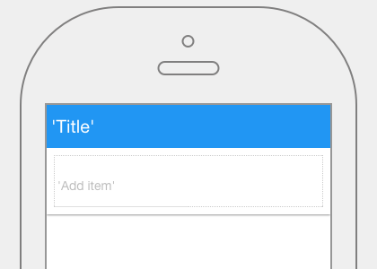

.. image:: ../../images/icons/badge_mobile.png
   :class: pull-right

Chips
=====

Chips can be used for various types of entities, including free form text, predefined text, rules, or contacts. Chips may
also contain icons.

|

|

The Chips control properties can be set for the following property categories:

* :ref:`webgc-chips-main-label`
* :ref:`webgc-chips-styling-label`
* :ref:`webgc-chips-events-label`

|

.. _webgc-chips-main-label:

Main Properties
---------------

|

+------------------------+-------------------+--------------------------------------------------------------------------------------------+
| **Main Properties**    | Possible Values   | Description                                                                                |
+========================+===================+============================================================================================+
| Name                   | chpChips#         | Name is a reference to the component's DOM element. It can be used to dynamically access   |
|                        |                   | and set component properties. DreamFace gives a default name of *chpChips#* where #        |
|                        |                   | corresponds to the order in which it was created. If it's the second chips control created |
|                        |                   | it will have a default Name of *chpChips2*. Name is not required and can be removed if not |
|                        |                   | needed.                                                                                    |
+------------------------+-------------------+--------------------------------------------------------------------------------------------+
| label                  | Any text          | This is the text that will appear under the icon, for example the fa-home icon could have  |
|                        |                   | the label Home as DreamFace uses as the default for this component.                        |
+------------------------+-------------------+--------------------------------------------------------------------------------------------+
| icon                   | favicon           | Click on the **...** to the right of the field to select one of the favicons from the list.|
|                        |                   |                                                                                            |
|                        |                   |        .. image:: ../images/gcs/dfx-icons.png                                              |
+------------------------+-------------------+--------------------------------------------------------------------------------------------+
| Display                | *true* or *false* | *true* to display the field or *false* to hide it.                                         |
|                        |                   |                                                                                            |
+------------------------+-------------------+--------------------------------------------------------------------------------------------+
| Disabled               | *true* or *false* | *true* to disable the field or *false* to make it active.                                  |
|                        |                   |                                                                                            |
+------------------------+-------------------+--------------------------------------------------------------------------------------------+

|

.. _webgc-chips-styling-label:

.. include:: webgc-props-styling-slider.rst

|

.. _webgc-chips-events-label:

Events
------

+------------------------+-------------------+--------------------------------------------------------------------------------------------+
| **Events**             | Possible Values   | Description                                                                                |
+========================+===================+============================================================================================+
| On Remove              | function name     | Enter the name of the function that will be executed when the user clicks on the           |
|                        |                   | control. The function should be defined in the controller in the script tab of the View    |
|                        |                   | Editor. Clicking on the ... opens a window to to select a function defined in the          |
|                        |                   | Controller.                                                                                |
+------------------------+-------------------+--------------------------------------------------------------------------------------------+
| On Select              | function name     | Enter the name of the function that will be executed when the user clicks on the           |
|                        |                   | control. The function should be defined in the controller in the script tab of the View    |
|                        |                   | Editor. Clicking on the ... opens a window to to select a function defined in the          |
|                        |                   | Controller.                                                                                |
+------------------------+-------------------+--------------------------------------------------------------------------------------------+

|
|