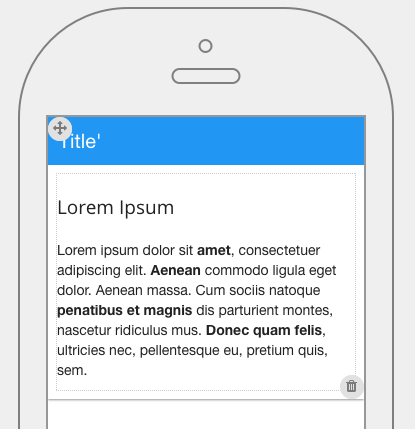

.. image:: ../../images/badges/badge_mobile.png
   :class: pull-right

HTML
====

The HTML graphical control allows a developer to add any custom HTML The contents of the HTML field is pure HTML. By
default the control contains a Lorem Ipsum text. This contect can be edited to include any HTML content. For example,
if you find that one of the pre-defined graphical controls does not have the functionality that you need, you can add
your own in the HTML control.

|

|

The HTML control properties can be set for the following property categories:

* :ref:`mobgc-html-main-label`
* :ref:`mobgc-html-styling-label`
* :ref:`mobgc-html-events-label`

|

|

.. _mobgc-html-main-label:

Main Properties
---------------

|

+------------------------+-------------------+--------------------------------------------------------------------------------------------+
| **Main Properties**    | Possible Values   | Description                                                                                |
+========================+===================+============================================================================================+
| Name                   | htHtml#           | Name is a reference to the component's DOM element. It can be used to dynamically access   |
|                        |                   | and set component properties. DreamFace gives a default name of *htHtml* where #           |
|                        |                   | corresponds to the order in which the control was created. If it's the second control      |
|                        |                   | created it will have a default Name of *htHtml12*. Name is not required and can be removed |
|                        |                   | if not needed.                                                                             |
+------------------------+-------------------+--------------------------------------------------------------------------------------------+
| Binding                | Any text          | The HTML control can be bound to data coming from a service, for example a service that    |
|                        |                   | goes to a content management system. Text that will be displayed in the field.             |
|                        |                   |                                                                                            |
+------------------------+-------------------+--------------------------------------------------------------------------------------------+
| Content                | Any HTML text     | The content can be edited to enter any HTML text manually in a contextual script editor.   |
|                        |                   | The new content will be displayed as soon as it is saved.                                  |
|                        |                   |                                                                                            |
|                        |                   |        .. image:: ../../images/gcs/dfx-html-editor.png                                     |
+------------------------+-------------------+--------------------------------------------------------------------------------------------+
| Display                | *true* or *false* | *true* to display the field or *false* to hide it.                                         |
|                        |                   |                                                                                            |
+------------------------+-------------------+--------------------------------------------------------------------------------------------+
| Disabled               | *true* or *false* | *true* to disable the field or *false* to make it active.                                  |
|                        |                   |                                                                                            |
+------------------------+-------------------+--------------------------------------------------------------------------------------------+

|

.. _mobgc-html-styling-label:

.. include:: mobgc-props-styling-slider.rst

|

.. _mobgc-html-events-label:

.. include:: mobgc-props-events.rst

Return to the `Documentation Home <http://localhost:63342/dfd/build/index.html>`_.

|
