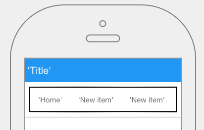

.. image:: ../../images/icons/badge_mobile.png
   :class: pull-right

Horizontalmenu
==============

A Horizontalmenu (sometimes referred to as Navigation Bar) is a menu that is displayed horizontally usually across the
top of a page. Each menu item can have an icon and any number of submenus. A Horizontalmenu can either have a static or
dynamic representation. The static menu is created in the Menu editor and the dynamic menu is defined in the script for
the view.

|

|

Properties
^^^^^^^^^^

|

+------------------------+-------------------+--------------------------------------------------------------------------------------------+
| **Main Properties**    | Possible Values   | Description                                                                                |
+========================+===================+============================================================================================+
| Name                   | iconBar#          | Name is a reference to the component's DOM element. It can be used to dynamically access   |
|                        |                   | and set component properties. DreamFace gives a default name of *icoBar#* where #          |
|                        |                   | corresponds to the order in which the control was created. The second iconbar control      |
|                        |                   | created it will have a default Name of *icoBar2*. Name is not required and can be removed  |
|                        |                   | if not needed.                                                                             |
+------------------------+-------------------+--------------------------------------------------------------------------------------------+
| Display                | *true* or *false* | The value can either be a literal *true* to display the field or *false* to hide it. It can|
|                        | angular expression| also be a angular expression that evaulates to *true* or *false*, for example,             |
|                        |                   |                                                                                            |
|                        |                   | 5 > 2 would evaluate to *true* and 5 < 2 would evaluate to false                           |
+------------------------+-------------------+--------------------------------------------------------------------------------------------+

|

Styling Attributes
------------------

+------------------------+-------------------+--------------------------------------------------------------------------------------------+
| **Styling Attributes** | Possible Values   | Description                                                                                |
+========================+===================+============================================================================================+
| xxxxxxx                | CSS class         | Name of CSS class to use for the component.                                                |
+------------------------+-------------------+--------------------------------------------------------------------------------------------+
| Style                  | CSS syles         | CSS style attribure(s) to use for this component, separated by semi-colons, for example:   |
|                        |                   | *color:red; background-color:lightgray*. By clicking on the **...** on the right hand side |
|                        |                   | of the field, a window opens up proposing to change attributes for **font**, **color**,    |
|                        |                   | **padding** and **margin** presented in a tree. When clicking on the arrow to the left of  |
|                        |                   | the attribute type, the user is guide by placeholder to enter the correct settings         |
|                        |                   |                                                                                            |
|                        |                   |        .. image:: ../../images/gcs/dfx-icon-css.png                                        |
+------------------------+-------------------+-------------------------------------------------------------------------------------------+|
| Classes                | CSS class         | Name of CSS class to use for the component.                                                |
+------------------------+-------------------+--------------------------------------------------------------------------------------------+
| Dynamic Classes        | CSS Class         | The Dynamic Class is a CSS class that will be added to the graphical control if an Angular |
|                        |                   | Expression is verified. It is rendered as a ng-class attribute.                            |
+------------------------+-------------------+--------------------------------------------------------------------------------------------+

Return to the `Documentation Home <http://localhost:63342/dfd/build/index.html>`_.

|
