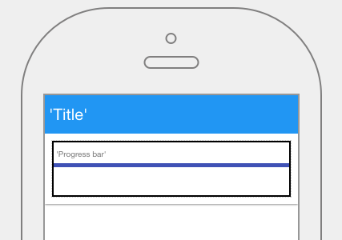

.. image:: ../../images/badges/badge_mobile.png
   :class: pull-right

Progress Bar
============

A progressbar is a graphical control containing a graphical bar used to show the progress of a task or process, such as a
download or file transfer.

|

|

The Progressbar control properties can be set for the following property categories:

* :ref:`mobgc-progressbar-main-label`
* :ref:`mobgc-progressbar-styling-label`
* :ref:`mobgc-progressbar-events-label`

|

.. _mobgc-progressbar-main-label:

Main Properties
---------------

+------------------------+-------------------+--------------------------------------------------------------------------------------------+
| Main Properties        | Possible Values   | Description                                                                                |
+========================+===================+============================================================================================+
| Id                     | nnnnn             | Id is a unique identifier that is 5 or more digits long. It is generated by DreamFace and  |
|                        |                   | can be used when refering to this field in script.                                         |
+------------------------+-------------------+--------------------------------------------------------------------------------------------+
| Name                   | progressBar#      | Name is a reference to the component's DOM element. It can be used to dynamically access   |
|                        |                   | and set component properties. DreamFace gives a default name of *progressBar#* where #     |
|                        |                   | corresponds to the order in which it was created. If it's the second control created it    |
|                        |                   | will have a default Name of *progressBar2*. Name is not required and can be removed if not |
|                        |                   | needed.                                                                                    |
+------------------------+-------------------+--------------------------------------------------------------------------------------------+
| Binding                | $scope variable   | The data table can be bound to a value contained in a $scope variable.                     |
|                        |                   |                                                                                            |
+------------------------+-------------------+--------------------------------------------------------------------------------------------+
| label                  | Any text          | This is the text that will appear under the icon, for example the fa-home icon could have  |
|                        |                   | the label Home as DreamFace uses as the default for this component.                        |
+------------------------+-------------------+--------------------------------------------------------------------------------------------+
|Type                    | *determinate* or  | Select the value *determinate* or indeterminate* from a dropdown list. Default is          |
|                        | *indeterminate*   | *determinate*                                                                              |
+------------------------+-------------------+--------------------------------------------------------------------------------------------+
| Display                | *true* or *false* | The value can be a literal **true** to display the component or **false** to hide it. This |
|                        | Angular Expression| value can also be the result of an :ref:`angular-expression-label` that returns a boolean  |
|                        |                   | value of the true or false, *true* meaning it will be visible, *false* meaning it will not |
|                        |                   | be displayed.                                                                              |
+------------------------+-------------------+--------------------------------------------------------------------------------------------+

|

|

.. _mobgc-progressbar-styling-label:

.. include:: mobgc-props-styling-slider.rst

|

.. _mobgc-progressbar-events-label:

.. include::
-props-events-onchange.rst

Return to the `Documentation Home <http://localhost:63342/dfd/build/index.html>`_.

|