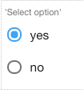

Radio
=====

.. image:: ../../images/icons/icon_mobile.png
   :class: pull-right

The Radio control allows the end-user to toggle an option on or off by checking the box associated with a label, usually
reflecting a Boolean value. Only one radio control can be selected at a time.

|

|

The Radio control properties can be set for the following property categories:

* :ref:`webgc-radio-main-label`
* :ref:`webgc-radio-styling-label`
* :ref:`webgc-radio-events-label`

|

.. _webgc-radio-main-label:

Main Properties
---------------

|

+------------------------+-------------------+--------------------------------------------------------------------------------------------+
| **Main Properties**    | Possible Values   | Description                                                                                |
+========================+===================+============================================================================================+
| Name                   | rdRadio#          | Name is a reference to the component's DOM element. It can be used to dynamically access   |
|                        |                   | and set component properties. DreamFace gives a default name of *rdRadio#* where #         |
|                        |                   | corresponds to the order in which it was created. If it's the second radio control created |
|                        |                   | it will have a default Name of *rdRadio12*. Name is not required and can be removed if not |
|                        |                   | needed.                                                                                    |
+------------------------+-------------------+--------------------------------------------------------------------------------------------+
| label                  | Any text          | This is the text that will appear under the icon, for example the fa-home icon could have  |
|                        |                   | the label Home as DreamFace uses as the default for this component.                        |
+------------------------+-------------------+--------------------------------------------------------------------------------------------+
| icon                   | favicon           | Click on the **...** to the right of the field to select one of the favicons from the list.|
|                        |                   |                                                                                            |
|                        |                   |        .. image:: ../../images/gcs/dfx-icons.png                                           |
+------------------------+-------------------+--------------------------------------------------------------------------------------------+
| Display                | *true* or *false* | *true* to display the field or *false* to hide it.                                         |
|                        |                   |                                                                                            |
+------------------------+-------------------+--------------------------------------------------------------------------------------------+
| Disabled               | *true* or *false* | *true* to disable the field or *false* to make it active.                                  |
|                        |                   |                                                                                            |
+------------------------+-------------------+--------------------------------------------------------------------------------------------+

|

.. _webgc-radio-styling-label:

Styling Attributes
------------------

+------------------------+-------------------+--------------------------------------------------------------------------------------------+
| **Styling Attributes** | Possible Values   | Description                                                                                |
+========================+===================+============================================================================================+
| Style                  | CSS syles         | CSS style attribure(s) to use for this component, separated by semi-colons, for example:   |
|                        |                   | *color:red; background-color:lightgray*. By clicking on the **...** on the right hand side |
|                        |                   | of the field, a window opens up proposing to change attributes for **font**, **color**,    |
|                        |                   | **padding** and **margin** presented in a tree. When clicking on the arrow to the left of  |
|                        |                   | the attribute type, the user is guide by placeholder to enter the correct settings         |
|                        |                   |                                                                                            |
|                        |                   |        .. image:: ../../images/gcs/dfx-icon-css.png                                        |
+------------------------+-------------------+--------------------------------------------------------------------------------------------+
| Classes                | CSS class         | Name of CSS class to use for the component.                                                |
+------------------------+-------------------+--------------------------------------------------------------------------------------------+
| Dynamic Classes        | CSS Class         | The Dynamic Class is a CSS class that will be added to the graphical control if an Angular |
|                        |                   | Expression is verified. It is rendered as a ng-class attribute.                            |
+------------------------+-------------------+--------------------------------------------------------------------------------------------+

|

.. _webgc-radio-events-label:

.. include:: webgc-props-events-onchange.rst

|
|