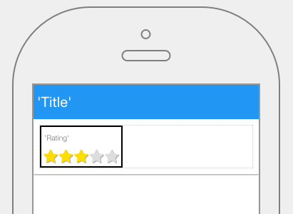

Rating
======

Rating controls allow users to rate or give an appreciation to something by selecting a number of icons from fixed number
of icons, often presented as stars.

|

|

The Rating control properties can be set for the following property categories:

* :ref:`mobgc-rating-main-label`
* :ref:`mobgc-rating-styling-label`
* :ref:`mobgc-rating-events-label`

|

.. _mobgc-rating-main-label:

Main Properties
---------------

|

+------------------------+-------------------+--------------------------------------------------------------------------------------------+
| **Main Properties**    | Possible Values   | Description                                                                                |
+========================+===================+============================================================================================+
| Name                   | rtRating#         | Name is a reference to the component's DOM element. It can be used to dynamically access   |
|                        |                   | and set component properties. DreamFace gives a default name of *rtRating#* where #        |
|                        |                   | corresponds to the order in which it was created. If it's the second rating control created|
|                        |                   | will have a default Name of *rtRating2*. Name is not required and can be removed if not    |
|                        |                   | it needed.                                                                                 |
+------------------------+-------------------+--------------------------------------------------------------------------------------------+
| Binding                | Any text          | The HTML control can be bound to data coming from a service, for example a service that    |
|                        |                   | goes to a content management system. Text that will be displayed in the field.             |
|                        |                   |                                                                                            |
+------------------------+-------------------+--------------------------------------------------------------------------------------------+
| label                  | Any text          | This is the text that will appear under the icon, for example the fa-home icon could have  |
|                        |                   | the label Home as DreamFace uses as the default for this component.                        |
+------------------------+-------------------+--------------------------------------------------------------------------------------------+
| Range                  | number            | Number is the maximum number of icons that can be displayed or maximum rating. Values are  |
|                        |                   | selected from a drop down list. Minumum value is 5, maximum is 10.                         |
+------------------------+-------------------+--------------------------------------------------------------------------------------------+
| icon                   | favicon           | Click on the **...** to the right of the field to select one of the favicons from the list.|
|                        |                   |                                                                                            |
|                        |                   |        .. image:: ../../images/gcs/dfx-icons.png                                           |
+------------------------+-------------------+--------------------------------------------------------------------------------------------+
| Display                | *true* or *false* | The value can either be a literal *true* to display the field or *false* to hide it, or it |
|                        | angular expression| be a angular expression that evaulates to *true* or *false*, for example,                  |
|                        |                   |                                                                                            |
|                        |                   | 5 > 2 would evaluate to *true* and 5 < 2 would evaluate to false                           |
+------------------------+-------------------+--------------------------------------------------------------------------------------------+
| Disabled               | *true* or *false* | *true* to disable the field or *false* to make it active or it be a angular expression that|
|                        | angular expression| evaulates to *true* or *false*, for example,                                               |
|                        |                   |                                                                                            |
|                        |                   | 5 > 2 would evaluate to *true* and 5 < 2 would evaluate to false                           |
|                        |                   |                                                                                            |
+------------------------+-------------------+--------------------------------------------------------------------------------------------+

|

.. _mobgc-rating-styling-label:

Styling Attributes
------------------

+------------------------+-------------------+--------------------------------------------------------------------------------------------+
| **Styling Attributes** | Possible Values   | Description                                                                                |
+========================+===================+============================================================================================+
| Normal Color           | CSS syles         | CSS style attribure(s) to use for this component, separated by semi-colons, for example:   |
|                        |                   | *color:red; background-color:lightgray*.                                                   |
+------------------------+-------------------+--------------------------------------------------------------------------------------------+
| Hilighted Color        | CSS syles         | CSS style attribure(s) to use for this component, separated by semi-colons, for example:   |
|                        |                   | *color:red; background-color:lightgray*.                                                   |
+------------------------+-------------------+--------------------------------------------------------------------------------------------+
| Style                  | CSS syles         | CSS style attribure(s) to use for this component, separated by semi-colons, for example:   |
|                        |                   | *color:red; background-color:lightgray*.                                                   |
+------------------------+-------------------+--------------------------------------------------------------------------------------------+
| Classes                | CSS class         | Name of CSS class to use for the component.                                                |
+------------------------+-------------------+--------------------------------------------------------------------------------------------+
| Dynamic Classes        | CSS Class         | The Dynamic Class is a CSS class that will be added to the graphical control if an Angular |
|                        |                   | Expression is verified. It is rendered as a ng-class attribute.                            |
+------------------------+-------------------+--------------------------------------------------------------------------------------------+

|

.. _mobgc-rating-events-label:

.. include:: mobgc-props-events-onchange.rst

Return to the `Documentation Home <http://localhost:63342/dfd/build/index.html>`_.

|