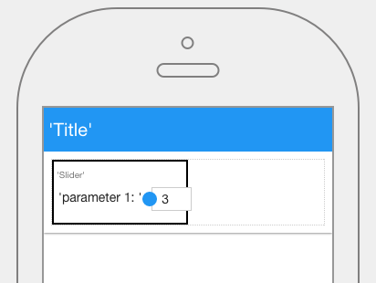

.. image:: ../../images/icons/badge_mobile.png
   :class: pull-right

Slider
======

The slider control allows the user to slide a handle along a bar a range of values to set a value, for example it could
slide between 0 and 100. When the user slides the handle and stops that is the value of the field.

|

|

The Slider control properties can be set for the following property categories:

* :ref:`webgc-slider-main-label`
* :ref:`webgc-slider-styling-label`
* :ref:`webgc-slider-events-label`

|

.. _webgc-slider-main-label:

Main Properties
---------------

|

+------------------------+-------------------+--------------------------------------------------------------------------------------------+
| **Main Properties**    | Possible Values   | Description                                                                                |
+========================+===================+============================================================================================+
| Name                   | sldSlider#        | Name is a reference to the component's DOM element. It can be used to dynamically access   |
|                        |                   | and set component properties. DreamFace gives a default name of *sldSlider#* where #       |
|                        |                   | corresponds to the order in which it was created. If it's the second control created it    |
|                        |                   | will have a default Name of *sldSlider2*. Name is not required and can be removed if not   |
|                        |                   | needed.                                                                                    |
+------------------------+-------------------+--------------------------------------------------------------------------------------------+
| label                  | Any text          | This is the text that will appear under the icon, for example the fa-home icon could have  |
|                        |                   | the label Home as DreamFace uses as the default for this component.                        |
+------------------------+-------------------+--------------------------------------------------------------------------------------------+
| icon                   | favicon           | Click on the **...** to the right of the field to select one of the favicons from the list.|
|                        |                   |                                                                                            |
|                        |                   |        .. image:: ../../images/gcs/dfx-icons.png                                           |
+------------------------+-------------------+--------------------------------------------------------------------------------------------+
| Display                | *true* or *false* | The value can either be a literal *true* to display the field or *false* to hide it, or it |
|                        | angular expression| be a angular expression that evaulates to *true* or *false*, for example,                  |
|                        |                   |                                                                                            |
|                        |                   | 5 > 2 would evaluate to *true* and 5 < 2 would evaluate to false                           |
+------------------------+-------------------+--------------------------------------------------------------------------------------------+
| Disabled               | *true* or *false* | *true* to disable the field or *false* to make it active or it be a angular expression that|
|                        | angular expression| evaulates to *true* or *false*, for example,                                               |
|                        |                   |                                                                                            |
|                        |                   | 5 > 2 would evaluate to *true* and 5 < 2 would evaluate to false                           |
|                        |                   |                                                                                            |
+------------------------+-------------------+--------------------------------------------------------------------------------------------+

|

|

.. _webgc-slider-styling-label:

.. include:: webgc-props-styling-slider.rst

|
|

.. _webgc-slider-events-label:

.. include:: webgc-props-events-onchange.rst

|
|