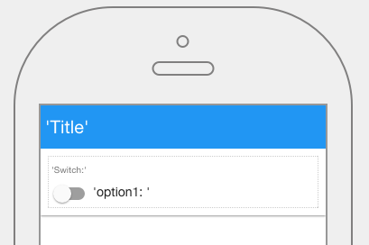

.. image:: ../../images/icons/badge_mobile.png
   :class: pull-right

Switch
======

The switch graphical component allows the users to set a swich between two values, for example to *on* or *off*, *left* or *right*.

|

Switch

|

The Switch control properties can be set for the following property categories:

* :ref:`mobgc-switch-main-label`
* :ref:`mobgc-switch-styling-label`
* :ref:`mobgc-switch-events-label`

|

.. _mobgc-switch-main-label:

Main Properties
---------------

|

+------------------------+-------------------+--------------------------------------------------------------------------------------------+
| **Main Properties**    | Possible Values   | Description                                                                                |
+========================+===================+============================================================================================+
| Name                   | swtSwitchd#       | Name is a reference to the component's DOM element. It can be used to dynamically access   |
|                        |                   | and set component properties. DreamFace gives a default name of *swtSwitchd#* where #      |
|                        |                   | corresponds to the order in which the control was created. If it's the second Switch       |
|                        |                   | created it will have a default Name of *swtSwitch*. Name is not required and can be        |
|                        |                   | removed if notneeded.                                                                      |
+------------------------+-------------------+--------------------------------------------------------------------------------------------+
| Binding                | Any text          | The HTML control can be bound to data coming from a service, for example a service that    |
|                        |                   | goes to a content management system. Text that will be displayed in the field.             |
|                        |                   |                                                                                            |
+------------------------+-------------------+--------------------------------------------------------------------------------------------+
| label                  | Any text          | This is the text that will appear above the date field to indicate to the user what date   |
|                        |                   | is being entered.                                                                          |
|                        |                   |                                                                                            |
+------------------------+-------------------+--------------------------------------------------------------------------------------------+
| Display value          | *true* or *false* | *true* to display the field or *false* to hide it. By clicking on the arrow to the right   |
|                        |                   | side of the field a drop down list will propose the values  *true* or *false*              |
|                        |                   |                                                                                            |
+------------------------+-------------------+--------------------------------------------------------------------------------------------+
| true value             |                   |                                                                                            |
|                        |                   |                                                                                            |
+------------------------+-------------------+--------------------------------------------------------------------------------------------+
| false value            |                   |                                                                                            |
|                        |                   |                                                                                            |
+------------------------+-------------------+--------------------------------------------------------------------------------------------+
| Display                | *true* or *false* | *true* to display the field or *false* to hide it.                                         |
|                        |                   |                                                                                            |
+------------------------+-------------------+--------------------------------------------------------------------------------------------+
| Disabled               | *true* or *false* | *true* to disable the field or *false* to make it active.                                  |
|                        |                   |                                                                                            |
+------------------------+-------------------+--------------------------------------------------------------------------------------------+

|

.. _mobgc-switch-styling-label:

Styling Attributes
------------------

+------------------------+-------------------+--------------------------------------------------------------------------------------------+
| **Styling Attributes** | Possible Values   | Description                                                                                |
+========================+===================+============================================================================================+
| Style                  | CSS syles         | By clicking on the **...** on the right h                                                  |
+------------------------+-------------------+--------------------------------------------------------------------------------------------+
| Classes                | CSS class         | Name of CSS class to use for the component.                                                |
+------------------------+-------------------+--------------------------------------------------------------------------------------------+
| Dynamic Classes        | CSS Class         | The Dynamic Class is a CSS class that will be added to the graphical control if an Angular |
|                        |                   | Expression is verified. It is rendered as a ng-class attribute.                            |
+------------------------+-------------------+--------------------------------------------------------------------------------------------+

|

|

.. _mobgc-switch-events-label:

.. include:: mobgc-props-events-onchange.rst

|
|

