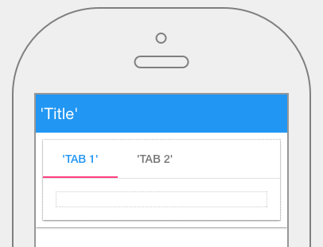

.. image:: ../../images/icons/badge_mobile.png
   :class: pull-right

Tabs
====

A panel is one of the most important graphical controls because it defines the layout of the View or a portion of the View.
It consists of a title and an area where the layout will be organized. The layout is based on Angular Material and Material
Design layout definition of rows and columns. Each row can be independently defined with horizontal or vertical layouts and
CSS styles and classes.

|

|

The Tabs control properties can be set for the following property categories:

* :ref:`mobgc-tabs-main-label`
* :ref:`mobgc-tabs-repeatable-label`
* :ref:`mobgc-tabs-styling-label`
* :ref:`mobgc-tabs-layout-label`
* :ref:`mobgc-tabs-events-label`

|

.. _mobgc-tabs-main-label:

Main Properties
---------------

**Main Properties**

+------------------------+-------------------+--------------------------------------------------------------------------------------------+
| **Main Properties**    | Possible Values   | Description                                                                                |
+========================+===================+============================================================================================+
| Id                     | nnnnn             | Id is a unique identifier that is 5 or more digits long. It is generated by DreamFace and  |
|                        |                   | can be used when refering to this field in script.                                         |
+------------------------+-------------------+--------------------------------------------------------------------------------------------+
| Name                   | btnButton#        | Name is a reference to the component's DOM element. It can be used to dynamically access   |
|                        |                   | and set component properties. DreamFace gives a default name of *btnButton#* where #       |
|                        |                   | corresponds to the order in which the control was created. The second button created       |
|                        |                   | will have a default Name of *btnButton2*. Name is not required and can be removed if not   |
|                        |                   | needed.                                                                                    |
+------------------------+-------------------+--------------------------------------------------------------------------------------------+
|Title                   | Any text          | Title text or expression defines title of the panel.                                       |
|                        | Angular Expression|                                                                                            |
|                        |                   |                                                                                            |
+------------------------+-------------------+--------------------------------------------------------------------------------------------+
| Title Visible          | Boolean value     | Title visible can either be set directly using *true* or *false* values or can be the      |
|                        | Angular Expression| result of an angular expression that returns a boolean value of the true or false, $true*  |
|                        |                   | meaning the title will be visible, *false* meaning title will not be displayed.            |
+------------------------+-------------------+--------------------------------------------------------------------------------------------+
| Whiteframe             | number in dp units| Defines the border of the panel in :term:`dp` units, the higher the value of the dp the    |
|                        |                   | more shadow depth the panel will have which helps the user with the perception of which    |
|                        |                   | object is above the other.                                                                 |
+------------------------+-------------------+--------------------------------------------------------------------------------------------+
| Display                | Any text          | Tip to help the user. It will be displayed when mouse passes over this control. Tooltip    |
|                        |                   | text can also be an expression.                                                            |
+------------------------+-------------------+--------------------------------------------------------------------------------------------+

|

.. _mobgc-tabs-repeatable-label:

Repeatable
----------

+------------------------+-------------------+--------------------------------------------------------------------------------------------+
| **Repeatable**         | Possible Values   | Description                                                                                |
+========================+===================+============================================================================================+
|Repeat for all $item in | Any text          | Title text or expression defines title of the panel.                                       |
|                        | Angular Expression|                                                                                            |
|                        |                   |                                                                                            |
+------------------------+-------------------+--------------------------------------------------------------------------------------------+

|

.. _mobgc-tabs-styling-label:

.. include:: mobgc-props-styling.rst

|

.. _mobgc-tabs-layout-label:

Layout Properties
-----------------

+------------------------+-------------------+--------------------------------------------------------------------------------------------+
| **Layout Properties**  | Possible Values   | Description                                                                                |
+========================+===================+============================================================================================+
| row #                  | number            | Number of a row in the panel                                                               |
+------------------------+-------------------+--------------------------------------------------------------------------------------------+
| col #                  | number            | Number of a column in the panel                                                            |
+------------------------+-------------------+--------------------------------------------------------------------------------------------+
| width                  | number in pixels  | The width of the column in pixels. Default value is 100px.                                 |
+------------------------+-------------------+--------------------------------------------------------------------------------------------+
| layout direction       | number            |                                                                                            |
+------------------------+-------------------+--------------------------------------------------------------------------------------------+
| Hor. alignment         | number            | This value is chosen from a drop down list. Default value is *start*.                      |
+------------------------+-------------------+--------------------------------------------------------------------------------------------+
| Ver. alignment         | number            | This value is chosen from a drop down list. Default value is *start*.                      |
+------------------------+-------------------+--------------------------------------------------------------------------------------------+
| Style                  | CSS styles        | CSS style attribure(s) to use for this component, separated by semi-colons, for example:   |
|                        |                   | *color:red; background-color:lightgray*.                                                   |
+------------------------+-------------------+--------------------------------------------------------------------------------------------+
| Classes                | CSS class         | Name of CSS class to use for the component.                                                |
+------------------------+-------------------+--------------------------------------------------------------------------------------------+
| Dynamic Classes        | CSS Class         | The Dynamic Class is a CSS class that will be added to the graphical control if an Angular |
|                        |                   | Expression is verified. It is rendered as a ng-class attribute.                            |
+------------------------+-------------------+--------------------------------------------------------------------------------------------+

|

.. _mobgc-tabs-events-label:

.. include:: mobgc-props-events.rst

|

|
|
