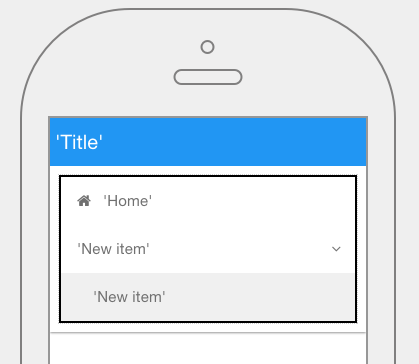

Treemenu
========

A Treemenu can have a static or dynamic representation

|

|

The Treemenu control properties can be set for the following property categories:

* :ref:`mobgc-treemenu-main-label`
* :ref:`mobgc-treemenu-menu-label`
* :ref:`mobgc-treemenu-styling-label`
* :ref:`mobgc-treemenu-events-label`

|

.. _mobgc-treemenu-main-label:

Main Properties
---------------

|

+------------------------+-------------------+--------------------------------------------------------------------------------------------+
| **Main Properties**    | Possible Values   | Description                                                                                |
+========================+===================+============================================================================================+
| Name                   | fbFAB#            | Name is a reference to the component's DOM element. It can be used to dynamically access   |
|                        |                   | and set component properties. DreamFace gives a default name of *fbFAB#* where #           |
|                        |                   | corresponds to the order in which the control was created. The second FAB control created  |
|                        |                   | will have a default Name of *fbFAB2*. Name is not required and can be removed if not       |
|                        |                   | needed.                                                                                    |
+------------------------+-------------------+--------------------------------------------------------------------------------------------+
| Direction              | *right* or *left* | The direction of the associated menu or iconbar when the FAB is clicked. Choose one of the |
|                        | *up* or *down*    | proposed values *Right*, *Left*, *Up* or *Down*.                                           |
|                        |                   |                                                                                            |
+------------------------+-------------------+--------------------------------------------------------------------------------------------+
| Animation Mode         | *Fling* or *Scale*| The value can either *Fling* or *Scale*. Fling means ... Scale means ...                   |
|                        |                   |                                                                                            |
+------------------------+-------------------+--------------------------------------------------------------------------------------------+
| Menu Icon              | `Name of the      | The value can either be a literal *true* to display the field or *false* to hide it. It can|
|                        | favicon`          | also be a angular expression that evaulates to *true* or *false*, for example,             |
|                        |                   |                                                                                            |
+------------------------+-------------------+--------------------------------------------------------------------------------------------+
| Display                | *true* or *false* | The value can either be a literal *true* to display the field or *false* to hide it, or it |
|                        | angular expression| be a angular expression that evaulates to *true* or *false*, for example,                  |
|                        |                   |                                                                                            |
|                        |                   | 5 > 2 would evaluate to *true* and 5 < 2 would evaluate to false.                          |
+------------------------+-------------------+--------------------------------------------------------------------------------------------+
| Disabled               | *true* or *false* | The value can either be a literal *true* to display the field or *false* to hide it, or it |
|                        | angular expression| be a angular expression that evaulates to *true* or *false*, for example,                  |
|                        |                   |                                                                                            |
|                        |                   | 5 > 2 would evaluate to *true* and 5 < 2 would evaluate to false.                          |
+------------------------+-------------------+--------------------------------------------------------------------------------------------+

.. _mobgc-treemenu-menu-label:

Menu Items
----------

+------------------------+-------------------+--------------------------------------------------------------------------------------------+
| **Menu Items**         | Possible Values   | Description                                                                                |
+========================+===================+============================================================================================+
| Static                 | Menu Editor       | Static means that the definition and contents of the menu/iconbar are static and once      |
|                        |                   | defined will remain the unchanged until they are manually changed again. The menu/iconbar  |
|                        |                   | can be defined by clicking on                                                              |
|                        |                   |        .. image:: ../images/gcs/dfx-menu-edit-button.png                                   |
|                        |                   | to bring the menu editor to assist in defining the menu/iconbar.                           |
|                        |                   |                                                                                            |
|                        |                   |                                                                                            |
|                        |                   |        .. image:: ../../images/gcs/dfx-help-menu-editor.png                                |
+------------------------+-------------------+--------------------------------------------------------------------------------------------+
| Dynamic                | NA                |                                                                                            |
+------------------------+-------------------+--------------------------------------------------------------------------------------------+

.. _mobgc-treemenu-styling-label:

Syling Attributes
-----------------

+------------------------+-------------------+--------------------------------------------------------------------------------------------+
| **Styling Attributes** | Possible Values   | Description                                                                                |
+========================+===================+============================================================================================+
| Style                  | CSS syles         | CSS style attribure(s) to use for this component, separated by semi-colons, for example:   |
|                        |                   | *color:red; background-color:lightgray*. By clicking on the **...** on the right hand side |
|                        |                   | of the field, a window opens up proposing to change attributes for **font**, **color**,    |
|                        |                   | **padding** and **margin** presented in a tree. When clicking on the arrow to the left of  |
|                        |                   | the attribute type, the user is guide by placeholder to enter the correct settings         |
|                        |                   |                                                                                            |
|                        |                   |        .. image:: ../../images/gcs/dfx-help-css-styles.png                                 |
+------------------------+-------------------+--------------------------------------------------------------------------------------------+
| Menu Style             | CSS class         | Name of CSS class to use for the component.                                                |
+------------------------+-------------------+--------------------------------------------------------------------------------------------+
| Menu Icon Style        | CSS class         | Name of CSS class to use for the component.                                                |
+------------------------+-------------------+--------------------------------------------------------------------------------------------+
| Item Style             | CSS class         | Name of CSS class to use for the component.                                                |
+------------------------+-------------------+--------------------------------------------------------------------------------------------+
| Item Icon Style        | CSS class         | Name of CSS class to use for the component.                                                |
+------------------------+-------------------+--------------------------------------------------------------------------------------------+
| Item Class             | CSS class         | Name of CSS class to use for the component.                                                |
+------------------------+-------------------+--------------------------------------------------------------------------------------------+
| Dynamic Class          | CSS Class         | The Dynamic Class is a CSS class that will be added to the graphical control if an Angular |
|                        |                   | Expression is verified. It is rendered as a ng-class attribute.                            |
+------------------------+-------------------+--------------------------------------------------------------------------------------------+

|

.. _mobgc-treemenu-events-label:

.. include:: mobgc-props-events.rst

|

**How to create a treemenu**

+-------------------------------------------------------------------------------------------------+-------------------------------------------------------+
| **Step Descriptions**                                                                           | Screen                                                |
+=================================================================================================+=======================================================+
| Drag and drop Treemenu GC to the working area, click on GC and then                             | .. figure:: ../../images/gcs/dfx-help-css-styles.png  |
| open Menu editor in popup by cliking Edit button in Property Panel.                             |     :width: 150px                                     |
| You’ll see default item: ‘Home’                                                                 |     :height: 75px                                     |
+-------------------------------------------------------------------------------------------------+-------------------------------------------------------+

|
|
