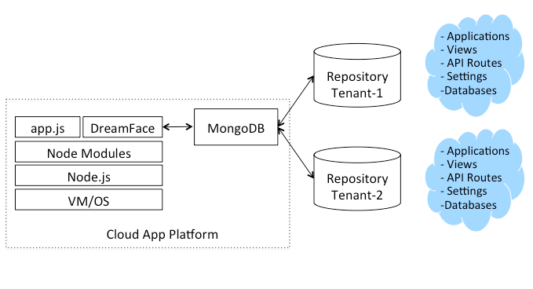

Understanding Multitenancy
==========================

Multitenancy refers to a principle in software architecture where a single instance of the software (i.e DreamFace) runs
on a server, serving multiple client-organizations (tenants). Multitenancy contrasts with multi-instance architectures
where separate software instances (or hardware systems) operate on behalf of different client organizations. To simplify,
many different clients-organizations can share the same mulitenant application and only one client-organization uses the
software instance application.

In DreamFace, you can use the multitenancy to suit your infrastructure needs. For example, a tenant can represent:

* An environment (ex: dev, test, prod)
* A business unit (ex: marketing, sales, finance)
* An organization (ex: acme, durant)
* An application domain (ex: demo, crm, portal)

In most cases, an on-premise installation will use multitenancy to refer to multiple environments.

|