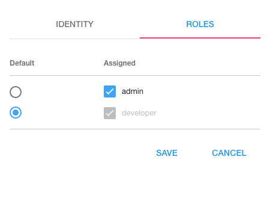

Adding Developers
=================

Adding developers to DreamFace is a straighforward task.

Developers are created at the Platform level (above applications). All parameters set at the Platform level are global.
This is normal since each developer can work on more than one application.

From the Platform / Developers menu click on Developers.

.. image:: ../images/devguide/dfx-studio-platform-menu.png

When adding developers for the first time after creating our app, there is already one existing developer which is *admin*,
the application administrator. This shouldn't be a surprise since we need one developer to start with to create the others.

.. figure:: ../images/devguide/dfx-dev-admin.png

   Figure : *admin is the only developer available at the beginning*

We are going to create a fictious demo developer called Jack Russel. Just fill in the fields. Login is the username that Jack
will use to Sign In.

.. figure:: ../images/devguide/dfx-dev-create-jrussel.png

   Figure : *Creating developer Jack Russel*

Now we can click on the Roles tab and set Jack's role to developer.

   Figure : *Giving developer Jack Russel developer role*..

When all fields have been filled in and Jack's role has been defined, click on Save to save the definition of our new developer.

|

.. figure:: ../images/devguide/dfx-dev-created-jrussel.png

   Figure : *Developr Jack Russel has been created createde*

Our new developer, Jack Russel, is ready to start.

|

Return to the `Documentation Home <http://localhost:63342/dfd/build/index.html>`_.

