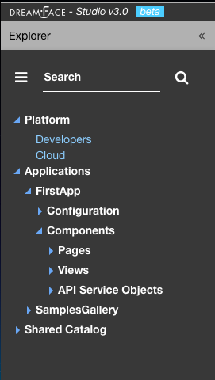

Components
==========

Application Components include:

* **Pages** a collection of Views layed out in a certain format.
* **Views** components which define the user interface and data interaction by calling API Service Objects to get the data.
* **API Service Objects** components that define the data access.

which are the main components of a DreamFace application.

|

DreamFace applications can be developped in a Top Down ( Pages -> Views -> API Service Objects) or a Bottom Up (API Service
Objects -> Views -> Pages) development process. Bottom Up is usually preferred by serious developers because it defines the
data access first.

In the Bottom Up approach the first thing to do is to connect DreamFace to the data and retrieve the data.

Once the data access is defined, the Views can be created to define a user interface for that specific data.

Once the Views exist, they can be added to Pages is a certain layout using a Page Template (header, footer, left /right
nav, ...), to create the application.

API Service Object
^^^^^^^^^^^^^^^^^^
The API Service and the way to access data is decomposed in several steps. This method to access the data is very powerful.

The first step is to define the API Source.

Views
^^^^^

Pages
^^^^^

|

Return to the `Documentation Home <http://localhost:63342/dfd/build/index.html>`_.
