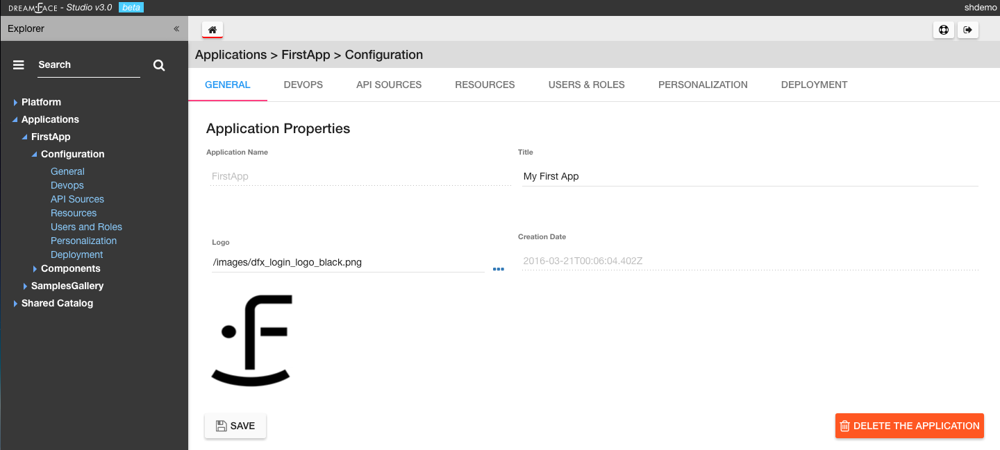
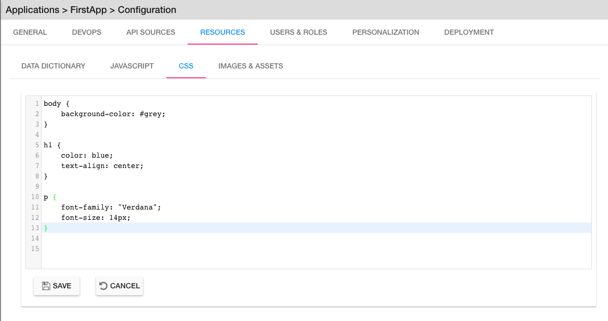
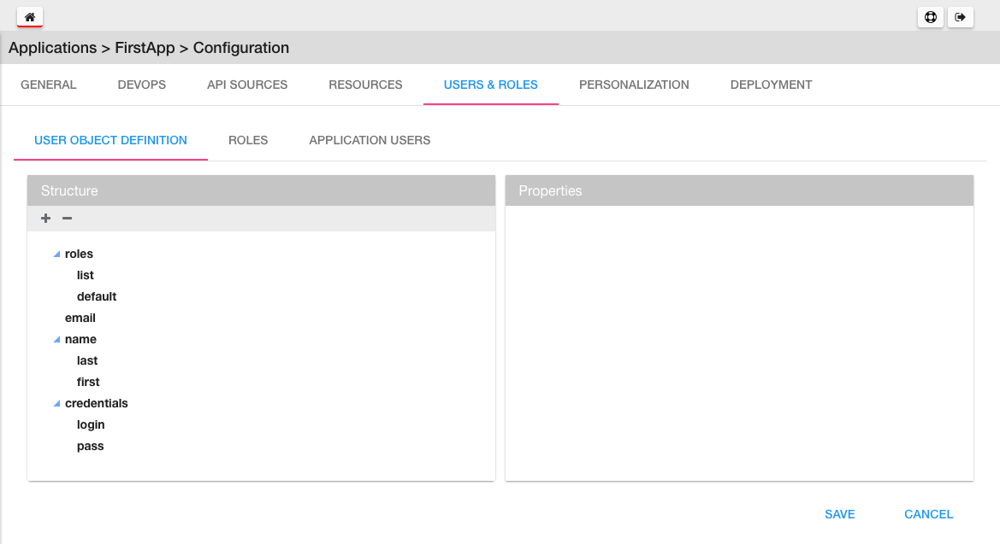
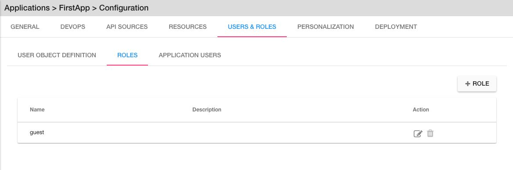
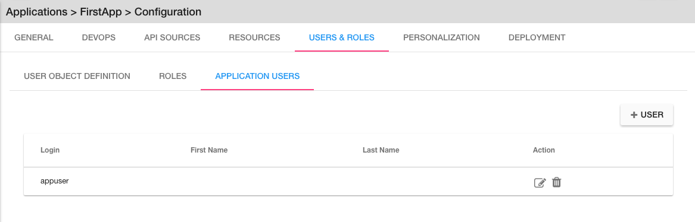

.. _app-config-label:

Configuration
=============

The Configuration menu allows us to set different Application Properties which determine application behavior internally
how the application interacts will external systems.

|

In the Explorer (left nav) under the Configuration menu, all of the settings options are listed.  When you click on one,
for example General, the GENERAL Tab is highlighted at the top of the panel to show that it is the current Tab. The different
options are discussed in more detail below. Clicking on any of the other menu options will have the same behavior.

|

General
^^^^^^^

|

.. image:: ../images/devguide/dfx-create-app.png

In GENERAL settings the mainApplication Properities are defined. These include Application Name, Application Title,
Logo and Creation Date. See :ref:`app-create-label` to see how to define General Application Properities and create an
application.

|

Devops
^^^^^^

Under the Devops settings there are three categories of settings:

* **Environments** - defines running application Environments
* **Collaboration** - defines team collaboration on Slack
* **Github** - defines a Github Repository for the application

**Environments**

Defines running application Environments.

**Collaboration**

.. image:: ../images/devguide/dfx-config-collaboration.png

Collaboration properties allows us to define a Slack Channel associated with the application so that every time there is
a View, Page or API Service Object that is created, updated or removed, DreamFace will send messages to that channel to
inform the team that a change has been made.

**Github**

.. image:: ../images/devguide/dfx-config-github.png

The Github properties allow to define a Github Repository for the application to connect to and all components that are local
to my application can be exported to the main repository and shared with other developers or if there is another DreamFace
instance somewhere those application components can be imported to the local repository of my application.

|

API Sources
^^^^^^^^^^^
API source defines which data source to access and how it is accessed and with what authenitcation protocol and which
developer credentials.

In practical terms, it answers the questions:

* Where is my data?
* How do I access it?
* Which authentication protocol is required?
* With which developer credentials?

|

.. image:: ../images/devguide/dfx-config-apisource.png

Click on the **+ API SOURCE** button to define a new API Source.

|

Resources
^^^^^^^^^
Under the Resources settings there are four categories of settings:

* **Data Dictionarys** - A way to define JSON structures that can be reused.
* **Javascript** - Create your own Javascript file or upload an existing Javascript file.
* **CSS** - defines team collaboration on Slac
* **Images and Assets** - defines a Github Repository for the application

**Data Dictionary**

A way to define JSON structures that can be reused.

|

**Javascript**

When a creating a View you may want to use some javascript code that is not local to the View or you may want to use the
code in several Views. Javascript files can be created here with the code editor or imported (dropped) into the Application
Resources. The library of javascript in resources can be used throughout the application.

|

.. image:: ../images/devguide/dfx-config-resources-js-create.png

To create a Javascript file, click on the **Create** button and give the file a name. In this example, the name is *MyLib*.
Click *Ok* to save the name and start editing the javascript code.

|

.. image:: ../images/devguide/dfx-config-resources-js-edit.png

A code editor opens up and you can start adding the javascript. When finished, click on *Save* to save the code.

|

.. image:: ../images/devguide/dfx-config-resources-js-file.png

The file will appear in the Javascript Resources with the name given during creation and the .js extension.

|

**CSS**

:term:`CSS` resources can be created here in the code editor or imported (dropped). Once a CSS file is part of the resources
it is added to the application environment and can be accessed throughout the application.

|

.. image:: ../images/devguide/dfx-config-resources-css-create.png

To create a CSS file, click on the **Create** button and give the file a name. In this example, the name is *MyStyles*.
Click *Ok* to save the name and start editing the CSS.

|

A code editor opens up and you can start adding the CSS. When finished, click on *Save* to save the file.

|

.. image:: ../images/devguide/dfx-config-resources-css-file.png

The file will appear in the CSS Resources with the name given during creation and the .css extension.

|

**Images & Assets**

Images and other assets can be imported (dropped) in the the Application Resources and added to the application environment.
As with Javascript and CSS files, they will be attached and accessible throughout the application.

|

Users and Roles
^^^^^^^^^^^^^^^

Application Users are the end users of the application and are different from developers. They need different access rights
and roles. These users and roles can be defined here.

By default there is one Application User defined when the application is created called *appuser* with a password of *12345*.
This user can be used for testing in Preview mode when creating and testing a View. Each time you enter Preview mode you
will be asked to authenticate. Use the *appuser* until other users are created.

There is also one defaut role created at the beginning, the *guest* role.

Users are defined by properties and roles.

**User Object Definition**

The User Object Definition specifies which information defines a User, for example, Name: First Name, Last Name, Login:
Username, and Password, etc. ...

New objects and properties can be added to the User Object, for example, we could add the new property *Depatment* to the
*credentials* object definition. Then, each time we define a new Application User, Department will be one of the properties
to define a user.

A API Service Object can limit itself to use by only certain user roles. When it is executed there is a verification that
is done. No View, API Service Object or application can be executed without authenticating with an existing Application
and Password. Everything is protected.

The Application User calls a View, the View calls an API Service, if the role of the Application User is not in the allowed
list of roles for that service, it won't be executed and an error will be triggered.

**Roles**

Roles define the different roles of a user can have. By default there is a *guest* role.

|

Other roles can be added by clicking on the *Create* button.

.. image:: ../images/devguide/dfx-config-roles-props.png

When creating a new role, the role properties need to be defined. The Role Name, for example *Admin* and the Role Description
are defined in Role Properties.

.. image:: ../images/devguide/dfx-config-roles-rights.png

User rights can be associated with the Role. By default *API Execution Rights* are granted. This means that the user can
exectute a query and access the data coming from API Routes defined in DreamFace.

**Application Users**

Once the User credentials and Roles are defined, the actual Application Users need to be defined. By default, *appuser*
is defined when the application is created.

|

Other Application Users can be added by clicking on the *Create* button.

|

.. image:: ../images/devguide/dfx-config-appuser-identity.png

When a new Application User is defined, user Identity, Properties and Roles need to be defined.

|

.. image:: ../images/devguide/dfx-config-appuser-roles.png

Choose the role that this Application User will have and click on *Save*. A user can have more than one role but only one
can be used as the Default role, in this case the default is the *guest* role.

|

Personalization
^^^^^^^^^^^^^^^
Personalization is used to define restrictions, pre-defined values for graphical controls or access rights to some pages
for each role. It will be available in a later release.

|

Deployment
^^^^^^^^^^
Once your application is finished and your are satisified with its functionality and behavior you can deploy it.

|

Deploying the application is a two step process, the first step is to build the application and the second step is to
deploy it to the cloud.

.. image:: ../images/devguide/dfx-config-build.png

DreamFace comes with three components:

* DreamFace for development
* DreamFace for deployment
* DreamFace Compiler

The Studio is part of DreamFace for development. DreamFace for development and DreamFace for deployment share the same
code base but they different usages. DreamFace for deployment does not contain the Studio and each application is running
on a separate port.

You use DreamFace for development to create your application. When your application is ready, you can click on **+BUILD NOW**
to call the DreamFace Compiler to compile and package your application. This will transform all of the components in the
repository into to code that can be executed. It will create a ZIP file which will be stored on the development server.

The next action needed is *Deploy this Build* to the deployment server, which means to send the zip file to the deployment
server. DreamFace for deployment will unzip the file and define it in its list of hosted applications. Once this is done, the
deployed application can be executed and log your users.

For more details on the DreamFace architecture See :ref:`platform-architecture-label`

|

Return to the `Documentation Home <http://localhost:63342/dfd/build/index.html>`_.
