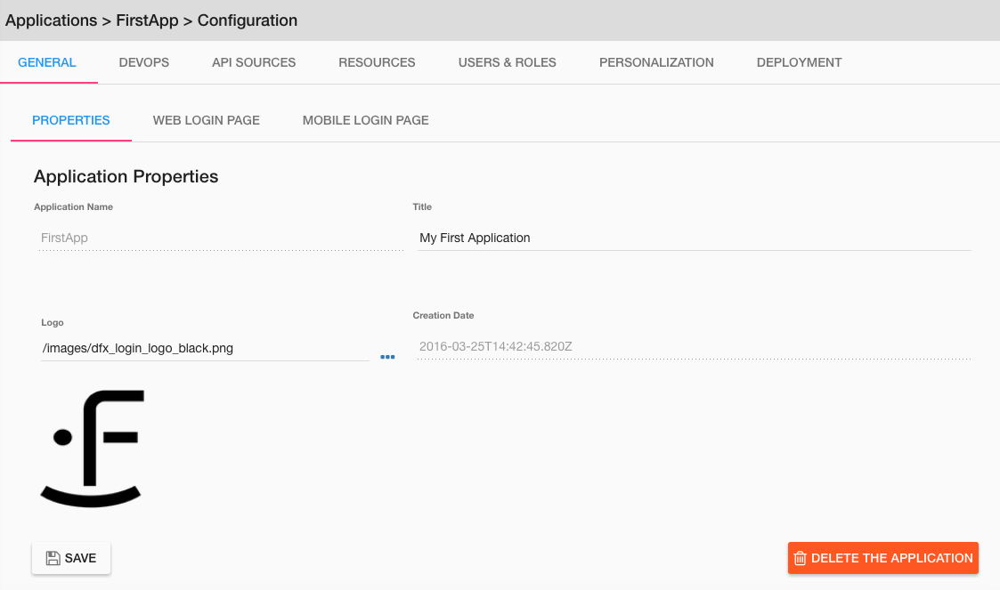

.. _app-create-label:

Creating an Application
=======================

When you arrive in the studio the first thing you will want to do is create an application.

To create an application you can either click on the gear icon next to *Application* in the Explorer (left nav) or click
on the **+ Create Application** button on the upper right hand side of the panel.

|

|

Once you click to create the application the **Create a new application** View is displayed.

|

Fill in the fields to define your application and click on **Save**. In this example:

* *Application Name* is **FirstApp**
* *Application Title* is **My First App**
* *Logo* is **/image/dfx_login_logo_black.png**. This is the default image, selected by clicking on the **...** to the right of the field.
* *Creation Date* is a timestamp generated automatically by DreamFace at the time of creation.

|

Once the fields are filled in and the main Application Properties are saved, the Application Configuration settings appear
in the Tabs at the top of the Panel with **GENERAL** displayed in blue and underlined in red, being the current Tab. GENERAL
refers to the main application properties as defined above: Name, Title, Logo, Creation Date.

Once the application is created, you won't be able to change the Application Name or the Creation Date but you can still modify
the Application Title and Logo.

Your application has been created. See the :ref:`app-config-label` settings to set other application parameters.

Return to the `Documentation Home <http://localhost:63342/dfd/build/index.html>`_.
