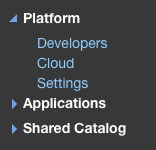
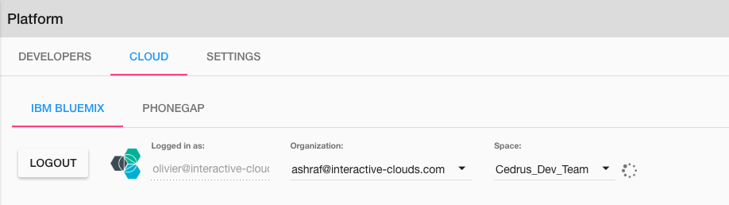

Platform
========

**Platform** allows for global parameter settings across applications like Developers and Cloud.

Under the Platform menu there are two options:

|

|

* **Developers** - Define all developers that have access to the platform.
* **Cloud** - Connect your DreamFace application to Bluemix and create an public IP address and port to access it.

|

Developers
^^^^^^^^^^

Because developers can work on more than one application, they to be added at the platform level.

**Adding Developers**

Adding developers to DreamFace is a straighforward task.

Developers are created at the Platform level (above applications). This is normal since each developer can work on more than
one application. All parameters set at the Platform level are global.

From the Platform / Developers menu click on Developers.

|

When adding developers for the first time after creating our app, there is already one existing developer which is *admin*,
the application administrator. Admin is created when the application is created and is needed to create the other developers.

|

.. figure:: ../images/devguide/dfx-dev-admin.png

   Figure : *admin is the only developer available at the beginning*
|

Lets create a developer called *Jack Russel*. Just fill in the fields. Login is the
username that Jack will use to Sign In.

.. figure:: ../images/devguide/dfx-dev-create-jrussel.png

   Figure : *Creating developer Jack Russel*

Now we can click on the Roles tab and set Jack's role to developer.

|

.. figure:: ../images/devguide/dfx-dev-role-jrussel.png

   Figure : *Giving developer Jack Russel developer role*..

When all fields have been filled in and Jack's role has been defined, click on Save to save the definition of our new developer.

|

.. figure:: ../images/devguide/dfx-dev-created-jrussel.png

   Figure : *Developr Jack Russel has been created createde*

Our new dveloper, Jack Russel, is ready to start. If you don't want Jack to be an admin just return to roles and uncheck
the admin checkbox.

|

Cloud
^^^^^

This Cloud option is a way to connect your application to Bluemix.

DreamFace is a Bluemix Service. When you are logged in to your Bluemix account and you select the DreamFace Service
and you are logged in automatically through your Bluemix account credentials and you arrive directly in the DreamFace Studio
on Bluemix.

Another way do use DreamFace on Bluemix is to say, DreamFace is used to create applications. I want my application to be
stored in my Bluemix environment.

|

Here you will login with your Bluemix account by clicking on the Login button. You will then select your organization and
space (defined by Bluemix). You can then create an image of your application. An image is a virtual container that
includes your application and all of the dependencies: DreamFace and its dependencies, and  NodeJS, AngularJS,
the operating system, etc, everything your application needs on the virtual machine to run is packaged together in the image.
Once the image on Bluemix you can select it and create a public url and port.

|

:width: 700px

Here we have the dfx-a1 image which is to a DreamFace application. Click on the image of the application. Then you can define
in which container you would like to install this image and run this application. You define the application name, public IP
address, listening port, etc. When everything is defined you click on **Create** and your application will be reachable through
that IP address and the port.

|

.. image:: ../images/devguide/dfx-bluemix-container-definition.png

It's a simple proces: you go to your DreamFace environment, you login to Bluemix, you create your image, you publish it
and its done and ready to use.

*Other Cloud environments to come*

Today there is only have one cloud platform available which is Bluemix. In the near future there will also be one for Docker.

Return to the `Documentation Home <http://localhost:63342/dfd/build/index.html>`_.

