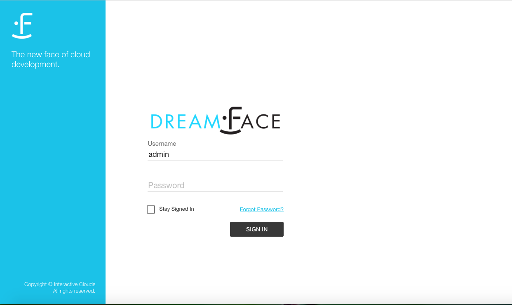
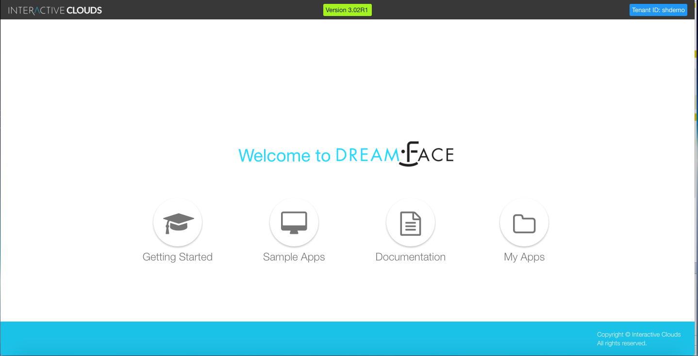
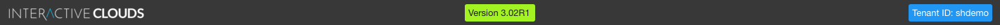
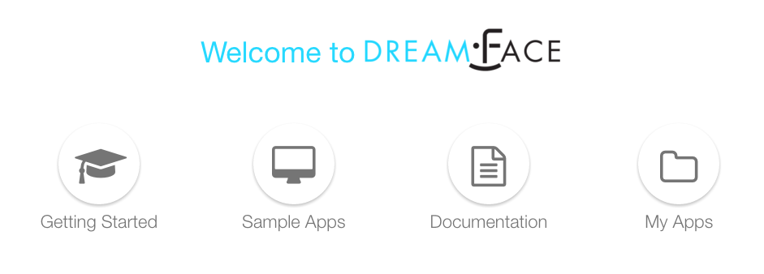
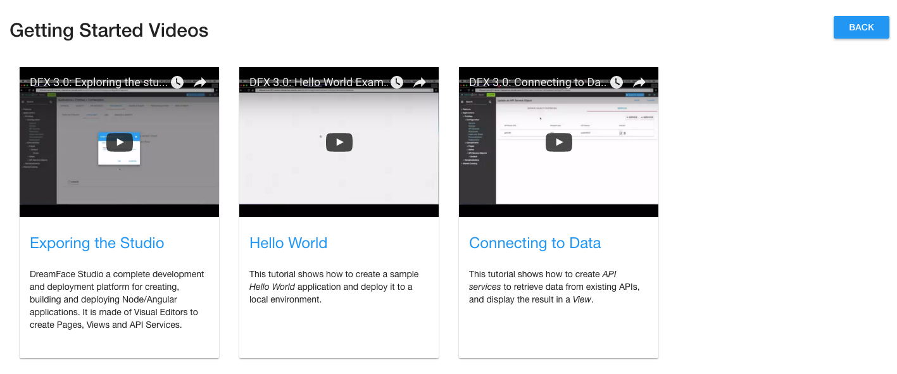
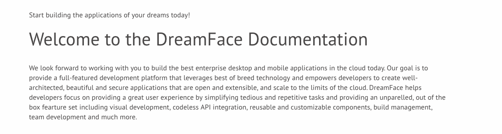
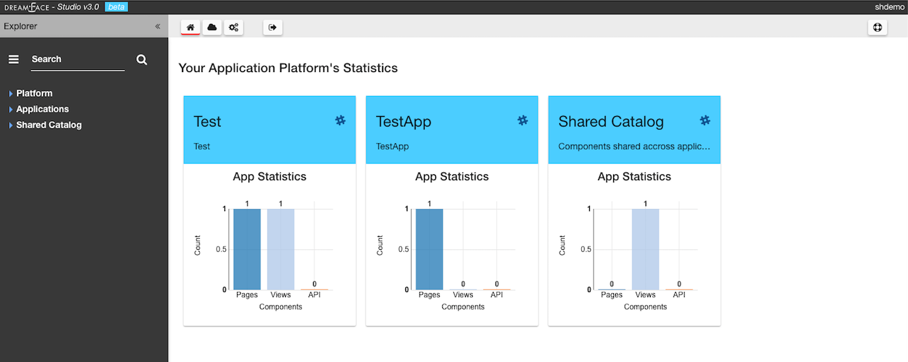

Signing In to The DreamFace Studio
==================================

The DreamFace Studio is the place where DreamFace developers create magic.

It is the complete development and deployment tool for creating, building and deploying DreamFace applications. You need
to sign in either directly from Bluemix or by entering the url of your environment and signing in from a login page.

|

Sign In Page
------------

When you enter the url for you DreamFace environment, you will arrive on the logn page.

   Figure : *DreamFace Login Page*

Enter your Username and Password and click on the *Sign In* button. If you would like to stay Signed In, check the box *Stay Signed In*

|

The Landing Page
----------------

After signing in the **Landing Page** is displayed.

   Figure : *DreamFace Landing Page*

Across the top of the page in the title bar is an active link to the Interactive Clouds website, the current version of
Dreamface and your Tenant ID.

|

The landing page presents four icons each corresponding to an option.

   Figure : *Landing Page Options*

Choose one of the options:

* **Getting Started** - Getting Started  is a Video Tutorial Series to help you get started building DreamFace Apps.
* **Samples Apps** - Sample Apps is a collection of applications that you can view, download from Github and use as examples.
* **Documentation** - A full set of written documentation, with hands-on examples, Samples Gallery and video tutorials.
* **My Apps** - This takes you to the DreamFace Studio where you build your applications.

|

Getting Started
---------------

Getting Started is a collection of video tutorials to get you up and running quickly.

   Figure : *Getting Started Videoss*

There are currently three videos available:

* Exploring the studio
* Hello World
* Connecting to Data

Stay tuned, more are on the way.

Documentation
-------------

Clicking on Documentation takes you into the DreamFace Documentation where you can navigate through the different guides,
search for certain terms and see step-by-step documentation of hands on examples.

   Figure : *DreamFace Documentation*

|

MyApps
------

Clicking on the MyApps Page icon takes you directly to the Home page of the DreamFace Studio, the first page of Your Application Platform.

|

   Figure : *DreamFace MyApps Page*

|

Return to the `Documentation Home <http://localhost:63342/dfd/build/index.html>`_.
