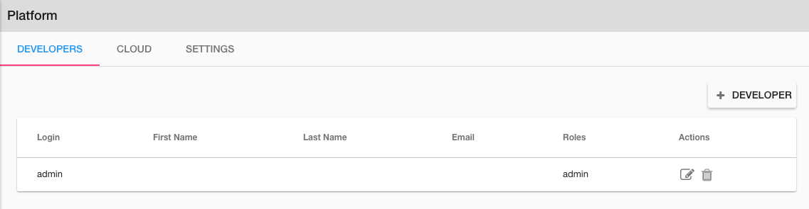
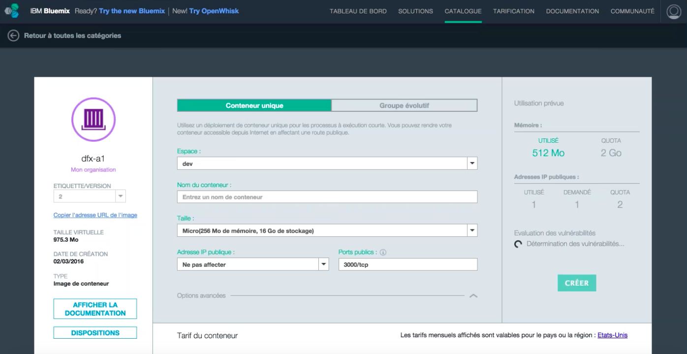
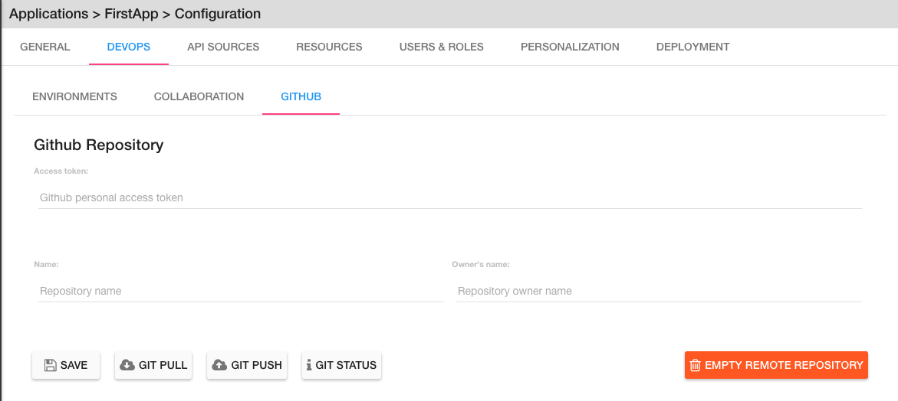

.. _dfx-studio-explorer-label:

The Explorer
============

The Application Explorer is presented with a TreeMenu control. The first level of the menu contains:

|

.. figure:: ../images/devguide/dfx-studio-1pg-leftnav.png

Platform, Applications, Shared Catalog Options

|

Platform
--------

**Platform** allows for global parameter settings across applications for Developers and Cloud settings.

Under the Platform menu there are two options:

|

.. image:: ../images/devguide/dfx-studio-platform-menu.png

|

* **Developers** - Define all developers that have access to the platform.
* **Cloud** - Defines parameters to connect your DreamFace application to Bluemix and create an public IP address and port to access it.

|

Developers
^^^^^^^^^^

Because developers can work on more than one application they to be added at the platform level.

**Adding Developers**

Adding developers to DreamFace is a straighforward task.

Developers are created at the Platform level (above applications). This is normal since each developer can work on more than
one application. All parameters set at the Platform level are global.

From the Platform / Developers menu click on Developers.

.. image:: ../images/devguide/dfx-studio-platform-menu.png

|

When adding developers for the first time after creating our app, there is already one existing developer which is *admin*,
the application administrator. Admin is created when the application is created and is needed to create the other developers.

|

   Figure : *admin is the only developer available at the beginning*
|

Lets create a developer called *Jack Russel*. Just fill in the fields. Login is the
username that Jack will use to Sign In.

   Figure : *Creating developer Jack Russel*

Now we can click on the Roles tab and set Jack's role to developer.

|

.. figure:: ../images/devguide/dfx-dev-role-jrussel.png

   Figure : *Giving developer Jack Russel developer role*..

When all fields have been filled in and Jack's role has been defined, click on Save to save the definition of our new developer.

|

   Figure : *Developr Jack Russel has been created createde*

Our new dveloper, Jack Russel, is ready to start. If you don't want Jack to be an admin just return to roles and uncheck
the admin checkbox.

|

Cloud
^^^^^

This Cloud option is a way to connect your application to Bluemix.

DreamFace is a Bluemix Service. When you are logged in to your Bluemix account and you select the DreamFace Service
and you are logged in automatically through your Bluemix account credentials and you arrive directly in the DreamFace Studio
on Bluemix.

Another way do use DreamFace on Bluemix is to say, DreamFace is used to create applications. I want my application to be
stored in my Bluemix environment.

|

.. image:: ../images/devguide/dfx-studio-platform-cloud.png

Here you will login with your Bluemix account by clicking on the Login button. You will then select your organization and
space (defined by Bluemix). You can then create an image of your application. An image is a virtual container that
includes your application and all of the dependencies: DreamFace and its dependencies, and  NodeJS, AngularJS,
the operating system, etc, everything your application needs on the virtual machine to run is packaged together in the image.
Once the image on Bluemix you can select it and create a public url and port.

|

.. image:: ../images/devguide/dfx-studio-platform-cloud.png
:width: 700px

Here we have the dfx-a1 image which is to a DreamFace application. Click on the image of the application. Then you can define
in which container you would like to install this image and run this application. You define the application name, public IP
address, listening port, etc. When everything is defined you click on **Create** and your application will be reachable through
that IP address and the port.

|

It's a simple proces: you go to your DreamFace environment, you login to Bluemix, you create your image, you publish it
and its done and ready to use.

*Other Cloud environments to come*

Today there is only have one cloud platform available which is Bluemix. In the near future there will also be one for Docker.

|

Applications
------------

An application is defined by two main parts:

* **Configuration** - The Configuration setting that determine the behavior of your application and how it interacts with other systems.
* **Components** - The Components section of the Studio gives provides editors to create the differnt components of your application.

|

Configuration
^^^^^^^^^^^^^

The Configuration menu allows us to set different Application Properties which determine application behavior internally
how the application interacts will external systems.

|

.. image:: ../images/devguide/dfx-configuration.png

In the Explorer (left nav) under the Configuration menu, all of the settings options are listed.  When you click on one,
for example General, the GENERAL Tab is highlighted at the top of the panel to show that it is the current Tab. The different
options are discussed in more detail below. Clicking on any of the other menu options will have the same behavior.

|

General
,,,,,,,

|

.. image:: ../images/devguide/dfx-create-app.png

In GENERAL settings the mainApplication Properities are defined. These include Application Name, Application Title,
Logo and Creation Date. See :ref:`app-create-label` to see how to define General Application Properities and create an
application.

|

Devops
,,,,,,

Under the Devops settings there are three categories of settings:

* **Environments** - defines running application Environments
* **Collaboration** - defines team collaboration on Slack
* **Github** - defines a Github Repository for the application

**Environments**

Defines running application Environments.

**Collaboration**

Collaboration properties allows us to define a Slack Channel associated with the application so that every time there is
a View, Page or API Service Object that is created, updated or removed, DreamFace will send messages to that channel to
inform the team that a change has been made.

**Github**

The Github properties allow to define a Github Repository for the application to connect to and all components that are local
to my application can be exported to the main repository and shared with other developers or if there is another DreamFace
instance somewhere those application components can be imported to the local repository of my application.

|

API Sources
,,,,,,,,,,,

Accessing backend APIs with DreamFace is done in a very powerful decoupled way. The first step is to define the source of
of the API, where this API is coming from and which authentication protocol and developer credentials are needed to access
it. The decoupling of the API Source from the API Service and Route definitions allows the developer to define API Source
access once and reuse it for every API Service coming from that source thus saving time and eliminating the potential for
error. In this sense, the API Source is an alias for the source definition.

In practical terms, it answers the questions:

* Where is my data coming from?
* How can I access it?
* Which authentication protocol is required?
* With which developer credentials?

|

Click on the **+ API SOURCE** button to define a new API Source.

|

The API Sources Provider Properties defines the following properties:

*Name* - The Name of the new API Source being created. In the example above the *Name* is

|

*API Provider* - The API Provider is the source of the API

Available API Providers are:

* REST
* StrongLoop
* Gmail
* Calendar
* Contacts
* Drive
* Facebook
* Google+
* Twitter

Once you choose the API Provider, an introspection takes place that determines if you will need authenication and to define
developer credentials.

Then you define your credentials and save. The API Source name can be used each time you want to access data coming from
this source.

If you change the environment from development to UAT you can use the same alias but now the API Source may access a
differnent server. The use of the API Source alias gives a lot of flexibility in defining our services and keeping them
independent from the source definition.

|

Resources
,,,,,,,,,

Under the Resources settings there are four categories of settings:

* **Data Dictionarys** - A way to define JSON structures that can be reused.
* **Javascript** - Create your own Javascript file or upload an existing Javascript file.
* **CSS** - defines team collaboration on Slac
* **Images and Assets** - defines a Github Repository for the application

**Data Dictionary**

The Data Dictionary offers a way to define JSON structures that can be reused. Here we can define a payload coming back
from a REST service. This will allow the Studio to introspect the data and map it to fields automatically.

|

|

The Data Dictionary Editor will allow use to define the business object data structure.

It is also possible to create a business object that does not relate to an API. In this data structure you can put fields
of totally unrelated or related data. By defining this object, I can then pass it between View that can consume it and use
the definitions to get some data mappings automatically.

From a javascript point of view it is a class with a name that can be used throughout the application.
|

**Javascript**

When a creating a View you may want to use some javascript code that is not local to the View or you may want to use the
code in several Views. Javascript files can be created here with the code editor or imported (dropped) into the Application
Resources. The library of javascript in resources can be used throughout the application.

|

.. image:: ../images/devguide/dfx-config-resources-js-create.png

To create a Javascript file, click on the **Create** button and give the file a name. In this example, the name is *MyLib*.
Click *Ok* to save the name and start editing the javascript code.

|

A code editor opens up and you can start adding the javascript. When finished, click on *Save* to save the code.

|

The file will appear in the Javascript Resources with the name given during creation and the .js extension.

|

**CSS**

:term:`CSS` resources can be created here in the code editor or imported (dropped). Once a CSS file is part of the resources
it is added to the application environment and can be accessed throughout the application.

|

To create a CSS file, click on the **Create** button and give the file a name. In this example, the name is *MyStyles*.
Click *Ok* to save the name and start editing the CSS.

|

.. image:: ../images/devguide/dfx-config-resources-css-edit.png

A code editor opens up and you can start adding the CSS. When finished, click on *Save* to save the file.

|

.. image:: ../images/devguide/dfx-config-resources-css-file.png

The file will appear in the CSS Resources with the name given during creation and the .css extension.

|

**Images & Assets**

Images and other assets can be imported (dropped) in the the Application Resources and added to the application environment.
As with Javascript and CSS files, they will be attached and accessible throughout the application.

|

Users and Roles
,,,,,,,,,,,,,,,

Application Users are the end users of the application and are different from developers. They need different access rights
and roles. These users and roles can be defined here.

By default there is one Application User defined when the application is created called *appuser* with a password of *12345*.
This user can be used for testing in Preview mode when creating and testing a View. Each time you enter Preview mode you
will be asked to authenticate. Use the *appuser* until other users are created.

There is also one defaut role created at the beginning, the *guest* role.

Users are defined by properties and roles.

**User Object Definition**

.. image:: ../images/devguide/dfx-config-users-object.png

The User Object Definition specifies which information defines a User, for example, Name: First Name, Last Name, Login:
Username, and Password, etc. ...

New objects and properties can be added to the User Object, for example, we could add the new property *Depatment* to the
*credentials* object definition. Then, each time we define a new Application User, Department will be one of the properties
to define a user.

A API Service Object can limit itself to use by only certain user roles. When it is executed there is a verification that
is done. No View, API Service Object or application can be executed without authenticating with an existing Application
and Password. Everything is protected.

The Application User calls a View, the View calls an API Service, if the role of the Application User is not in the allowed
list of roles for that service, it won't be executed and an error will be triggered.

**Roles**

Roles define the different roles of a user can have. By default there is a *guest* role.

.. image:: ../images/devguide/dfx-config-roles.png

|

Other roles can be added by clicking on the *Create* button.

When creating a new role, the role properties need to be defined. The Role Name, for example *Admin* and the Role Description
are defined in Role Properties.

User rights can be associated with the Role. By default *API Execution Rights* are granted. This means that the user can
exectute a query and access the data coming from API Routes defined in DreamFace.

**Application Users**

Once the User credentials and Roles are defined, the actual Application Users need to be defined. By default, *appuser*
is defined when the application is created.

|

.. image:: ../images/devguide/dfx-config-appuser.png

Other Application Users can be added by clicking on the *Create* button.

|

When a new Application User is defined, user Identity, Properties and Roles need to be defined.

|

Choose the role that this Application User will have and click on *Save*. A user can have more than one role but only one
can be used as the Default role, in this case the default is the *guest* role.

|

Personalization
,,,,,,,,,,,,,,,

Personalization is used to define restrictions, pre-defined values for graphical controls or access rights to some pages
for each role. It will be available in a later release.

|

Deployment
,,,,,,,,,,

Once your application is finished and your are satisified with its functionality and behavior you can deploy it.

|

Deploying the application is a two step process, the first step is to build the application and the second step is to
deploy it to the cloud.

DreamFace comes with three components:

* DreamFace for development
* DreamFace for deployment
* DreamFace Compiler

The Studio is part of DreamFace for development. DreamFace for development and DreamFace for deployment share the same
code base but they different usages. DreamFace for deployment does not contain the Studio and each application is running
on a separate port.

You use DreamFace for development to create your application. When your application is ready, you can click on **+BUILD NOW**
to call the DreamFace Compiler to compile and package your application. This will transform all of the components in the
repository into to code that can be executed. It will create a ZIP file which will be stored on the development server.

The next action needed is *Deploy this Build* to the deployment server, which means to send the zip file to the deployment
server. DreamFace for deployment will unzip the file and define it in its list of hosted applications. Once this is done, the
deployed application can be executed and log your users.

For more details on the DreamFace architecture See :ref:`platform-architecture-label`

|

Components
^^^^^^^^^^

Application Components include:

* **Pages** a composition of Views organized in a layout of on or more view cards.
* **Views** reusable user interface components which consume APIs Services to interact with back-end data.
* **API Service Objects** reusable components that define the data access.

|

.. image:: ../images/devguide/dfx-studio-1pg-leftnav.png

These are the main components of a DreamFace application.

DreamFace applications can be developped in a Top Down ( Pages -> Views -> API Service Objects) or a Bottom Up (API Service
Objects -> Views -> Pages) development process. The Bottom Up approach is usually preferred by serious developers because
it defines the data access first.

In the Bottom Up approach the first thing to do is to connect DreamFace to the data and retrieve the data.

Once the data access is defined, the Views can be created and bound to the API Services to collect, display and update the
specific data for that View.

Once the Views exist, they can be added to Pages in a certain layout using a Page Template (header, footer, left /right
nav, ...), to a page of the application. Cards and View Cards allow us to stay on the same page in a :ref:`SPA approach.

|
|

Pages
,,,,,

A Page is an assembly or composition of Views surrounded by a Page Template that determines how it will be presented.

An application can have more than one page and more than one page template.

Pages are created in the Page Editor. Within the Page Editor is a Template Editor to define Page Templates.

In the same sense that a View is nothing more than an Angular Module, a Page is a composition of Angular Modules (Views).
All Views that are combined on a Page can share the Page scope to pass data from View to View.

|

Views
,,,,,

A View is a user interface component. In the Angular sense a View is an Angular Module. In the View Editor in the script
the View is the definition of the Angular Module for the current View. The module has a controller that is the main function
of the View. All other functions and code defintions that define the behavior of the the View go inside this controller and
are for this View only. These functions can do any kind of manipulation or validation for the View. It can call the backend
for data, validate a form on the click of a Button, etc.

Views are created in the View Editor.

When the View is deployed it becomes an Angular Module.

|

API Service Object
,,,,,,,,,,,,,,,,,,

In DreamFace we build Views and Pages that can consume APIs.

Defining an API Service and the way to access data is decoupled into three parts:

1. Define the API Source - this defines how to access the API and the authentication needed to access it.
2. Define an API Service Object - this is a logical grouping of different API Services or endpoints into a logical object.
3. Define the actual API Service - this is the definition of the API route or endpoint.

This method to access the data is very powerful.

The API Source, for example, *publicREST* is a reusablle definition of the API source that can be used each we define that
type of API Service. This means that there is one place where we define access to this type API along with all of the
authentication / credentials requried to access it.

|

.. image:: ../images/devguide/dfx-studio-apisSO-news.png

An API Service Object is a way to group API Services together logically. Imagine that you want to build a News Service Object
that groups together News coming from different sources like CNN News, NY Times, Yahoo News, etc. using the concept of API
Service Object we can group the services together under the same logical API Service Object called NewsService.

|

Each one of the services defined in the logical object will be an API Service endpoint in DreamFace (in the Angular/Node
sense) that you can later bind to a the user interface View to access and modify the data.

The different API Services in the Service Object are methods.

Shared Catalog
--------------

The Shared Catalog is a special application that is created by default to allow the developers to reuse any application
component across multiple applications within the same tenant.

It is also possible to share Application Components across tenants by using export/import features through the Github
interface in DreamFace.

Return to the `Documentation Home <http://localhost:63342/dfd/build/index.html>`_.

