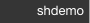
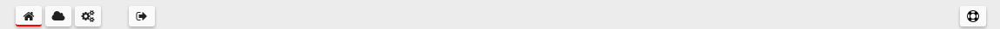
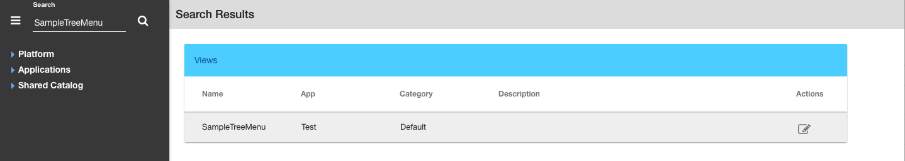
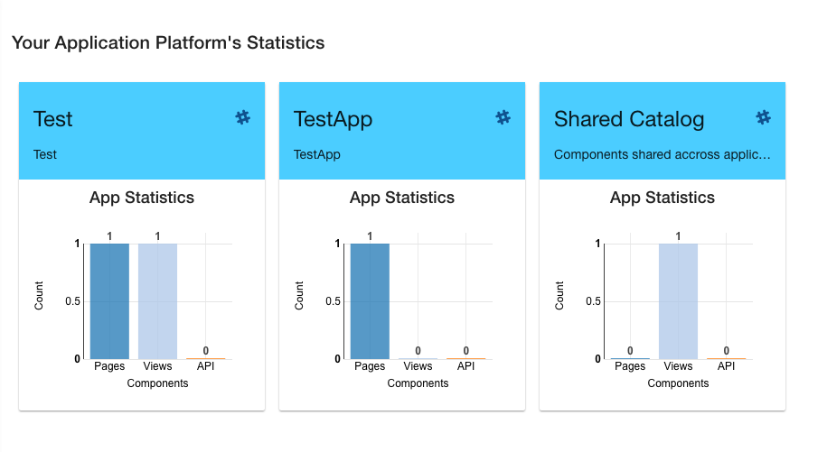

The DreamFace Studio
==============================

The DreamFace Studio is the place where DreamFace developers create magic.

It is the complete development and deployment tool for creating, building and deploying DreamFace applications. It corresponds
to the node application (DFX) and contains both development and runtime environments.

|

Sign In  Page
^^^^^^^^^^^^

When you enter the url for you DreamFace environment, you will arrive on the logn page.

|

.. figure:: ../images/devguide/dfx-login-page.png
   :width: 600px

   Figure : *DreamFace Login Page*

Enter your Username and Password and click on the *Sign In* button. If you would like to stay logged in in, check the box *Stay Signed In*

|

Landing Page
^^^^^^^^^^^^

The landing page of the Studio presents four icons in the middle of the page.

.. figure:: ../images/devguide/dfx-landing-page.png
   :width: 600px

   Figure : *DreamFace Landing Page*

Choose one of the options:

* **Getting Started** - Getting Started  is a Video Tutorial Series to help you get started building DreamFace Apps
* **Samples Apps** - Sample Apps is a collection of applications that you can view, download from Github and use as examples.
* **Documentation** - A full set of written documentation, with hands-on examples, Samples Gallery and video tutorials
* **MyApps** - These are your applications that you are creating in DreamFace

|

MyApps Page
^^^^^^^^^^

After clicking on MyApps Icon you arrive on the first page of Your Application Platform.

.. figure:: ../images/devguide/dfx-studio-firstpage.png

   Figure : *DreamFace MyApps Page*

In the upper left, above the Icon Bar, is the name and version of the platform.

.. image:: ../images/devguide/dfx-studio-1pg-version.png

On the upper right, above the Icon Bar, is the name of the your tenant.

At the top of the main part of the page is the Icon Bar.

Icons include:
* **Home** - Return to the Home or First page of the Studio
* **Dockerization** - Go to Dockerize the app
* **Settings** - App Settings (coming)
* **Sign Out** - Sign Out of the Studio
* **Help** - All the way to the left is the help icon.

On the left side of the page underneath the platform name is the Left Nav Application Explorer panel.

.. image:: ../images/devguide/dfx-studio-1pg-leftnav.png

The left nav Explorer can be collapsed to get more screen real estate by clicking on the

.. image:: ../images/devguide/dfx-studio-1pg-chevron.png

as seen collapsed here:

.. image:: ../images/devguide/dfx-studio-1pg-leftnav-closed.png
   :width: 600px

The Left Nav also contains a Search field to search for all components for a given name. Just enter the name of the component
you are searching for and click on the search Icon. All components with that name will be listed.

By default, the platform displays application statistcs for each app and information about components shared across
applications when no other action has been requested. Search, would be another action and it replaces the stats when it displays
the search results here. If your application statistics have been replaced by another action, just click on the *Home* icon
and they will be redisplayed.

The Stats give us a quick look at the application. In the example above the application called Test has 1 Page, 1 View and
no API Services. The application called TestApp has 1 Page, 0 Views and 0 API Services

The Explorer
^^^^^^^^^^^^

The Application Explorer is presented with a TreeMenu control. The firs level of the menu contains:

* **Platform**
* **Application**
* **Shared Catalog**

.. image:: ../images/devguide/dfx-studio-1pg-leftnav.png

**Platform** allows for global parameter settings across applications like Developers and Cloud.

Under the Platform menu there are two options:

.. image:: ../images/devguide/dfx-studio-platform-menu.png

* **Developers** - Define developers all developers that have access to the platform.
* **Cloud** - coming soon

