Exploring The Studio
====================

The DreamFace Studio is the place where DreamFace developers create beautiful, scalable, enterprise applications.

It is a complete platform for creating, building and deploying DreamFace applications. In the
DreamFace application architecture it corresponds to the node application (DFX) and contains both development and runtime
environments. For more information on the architecture see :ref:`platform-architecture-label`

In the tutorial below you will learn how to navigate and find your way around the Studio.

**Exploring the Studio Tutorial**

.. raw:: html

        <object width="480" height="385"><param name="movie"
        value="http://www.youtube.com/v/CejlR4SRXYU=en_US&fs=1&rel=0"></param><param
        name="allowFullScreen" value="true"></param><param
        name="allowscriptaccess" value="always"></param><embed
        src="http://www.youtube.com/v/CejlR4SRXYU&hl=en_US&fs=1&rel=0"
        type="application/x-shockwave-flash" allowscriptaccess="always"
        allowfullscreen="true" width="570"
        height="385"></embed></object>

Return to the :ref:`getting-started-label`

|

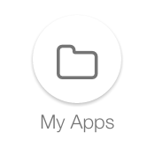

Clicking on the MyApps icon on the landing page displays the Home page of the DreamFace Studio. This is the  first page of
Your Application Platform.

Lets take a minute to explore the Home Page.

|

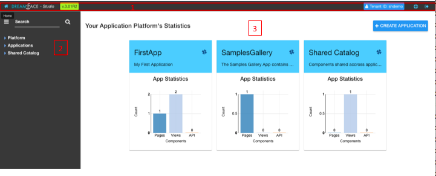

   Figure : *DreamFace Studio Home Page*

The Home page has three main sections:

1. The *Icon Bar* at the top of the page containing information about the application, action icons and buttons.
2. The *Explorer* in the leftnav for navigating through application configuration setting and components.
3. The *Canvas* area (white) where applications statistics are displayed. This is where all the action takes place:

    * Information is diplayed
    * Applications get created
    * Configuration setting are defined

|

The Icon Bar
------------

**Name and Version**

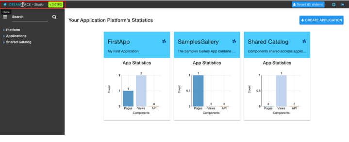

|

On the far left of the Icon Bar at the top of the page is the Home icon, the DreamFace logo and name *Studio* and highlighted
in bright green is the current version of the platform. Clicking on the current version will display this versions Release
Notes for in the canvas area.

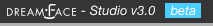

|

**Tenant Name**

On the right hand side of the iconbar is the ID of the your cloud tenant, a help icon and a *Sign Out* icon.

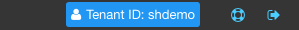

The help menu offers several options for getting help.

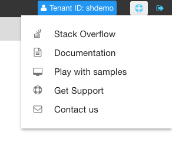

It includes :

* **Stack Overflow** - A direct connection to the Stack Overflow Forum.
* **Documentation** - Direct access to the the DreamFace Documentation.
* **Play with Samples** - A link to view and download Samples components and graphical controls from the Samples Gallery.
* **Get Support** - Direct access the DreamFace Service desk for Reporting Bugs, Feature Requests and Requesting Assistance
* **Contact Us** - If you don't have support or just want to send a quick message to support you can do it here.

More detail is provided below.

|

**Stack Overflow**

.. image:: ../images/devguide/dfx-help-stackoverflow.png

*Stack Overlow* displays an input field where the developer can enter keywords to search on in the Stack Overflow forum.
Pressing *GO* displays Stack Overflow and performs a search on the keywords.

|

**Documentation**

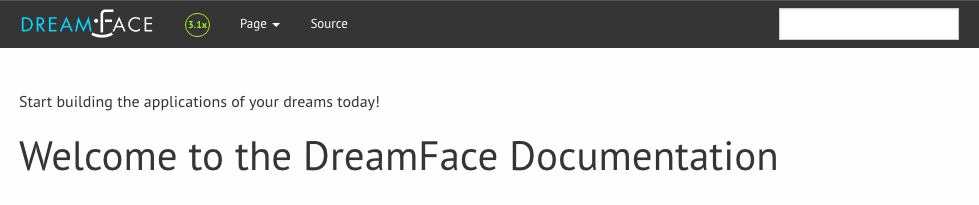

*Documentation* displays the DreamFace documentation home page where developer can consult different documentation guides.

|

**Play with Samples**

This diplays the Samples Gallery where developers can explore and download different examples of DreamFace components into
their own application environment.

|

**Get Support**

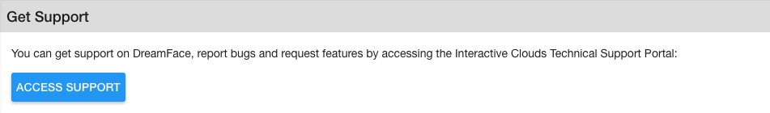

Login to the DreamFace Service Desk to Report a Bug, Request a New Feature or Request Assistance. You can view your active
support tickets and interact with them, adding comments, screenshots more precise information or replying to an answer from
support.

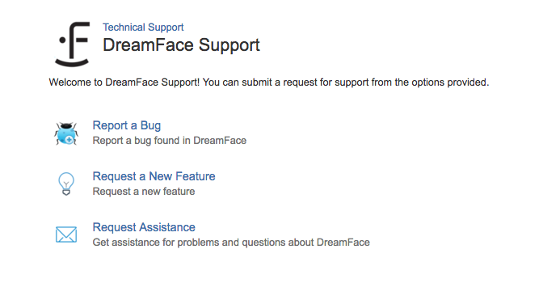

|

**Contact Us**

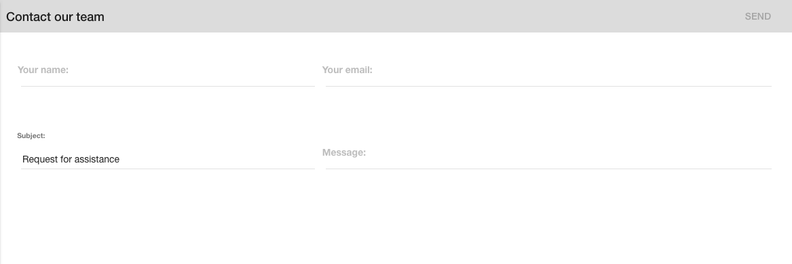

Send a message to the DreamFace Support Team.

|
|

The Explorer
------------

On the left side of the page underneath the platform name is the Explorer panel. The Explorer contains thre options: Platform,
Applications and Shared Catalogue. It is organized in a tree structure for easily navigating through the different setting
and components when creating your applications.

|

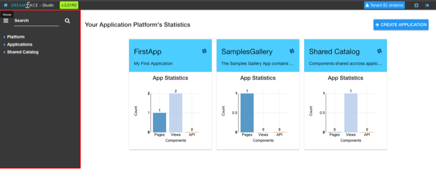

A platform can have one or more applications and each application has its own configuration and components. Shared Catalogue
contains components that can be used across different applications.

.. image:: ../images/devguide/dfx-studio-1pg-leftnav.png

The Explorer can be collapsed to get more screen real estate by clicking on the

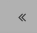

as seen collapsed here:

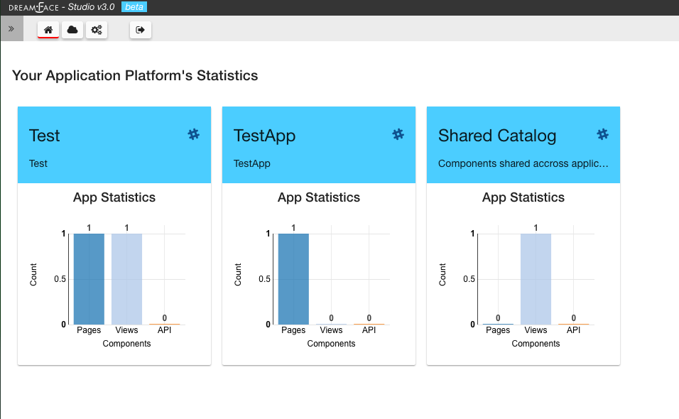

|

**Search**

The Explorer also contains a Search field to search for all components for a given name. Just enter the name of the component
you are searching for and click on the search Icon. All components with that name will be listed in the canvas area of the page.

|

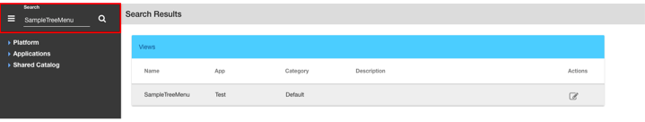

|

.. image:: ../images/devguide/dfx-studio-1pg-leftnav.png

|

The Canvas
----------

**Stats**

By default, the platform displays application statistcs for each app in the tenant as well as information about components
shared across applications. The main part of the screen or canvas is where results are displayed after some action is done.
For instance, when you search on a name, the results of the search are displayed in the canvas and replace the stats. To
redisplay your application statistics, just click on the *Home* icon.

|

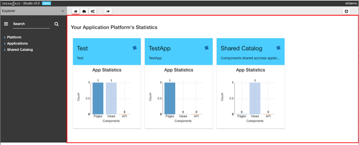

|

The Stats give us a quick look at the application. In the example above the application called Test has 1 Page, 1 View and
no API Services. The application called TestApp has 1 Page, 0 Views and 0 API Services

|

Return to the `Documentation Home <http://localhost:63342/dfd/build/index.html>`_.

