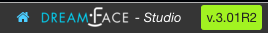

Exploring The Home Page
=======================

The DreamFace Studio is the place where DreamFace developers create magic.

It is the complete development and deployment tool for creating, building and deploying DreamFace applications. It corresponds
to the node application (DFX) and contains both development and runtime environments.

Clicking on the MyApps Page icon takes you directly to the Home page of the DreamFace Studio, the first page of Your Application Platform.

Lets take a minute to explore it and see what's possible.

|

.. figure:: ../images/devguide/dfx-studio-firstpage.png

   Figure : *DreamFace MyApps Page*

|

**Name and Version**

In the upper left, above the Icon Bar, is the name and version of the platform.

|

|

**Tenant Name**

On the upper right, above the Icon Bar, is the name of the your tenant.

|

.. image:: ../images/devguide/dfx-studio-1pg-tenant.png

|

**Iconbar**

At the top of the main part of the page is the Icon Bar.

.. image:: ../images/devguide/dfx-studio-1pg-iconbarx.png

|

.. image:: ../images/devguide/dfx-studio-1pg-iconbar.png

Icons include:

* **Home** - Return to the Home or First page of the Studio
* **Dockerization** - Go to Dockerize the app
* **Settings** - App Settings (coming)
* **Sign Out** - Sign Out of the Studio
* **Help** - All the way to the left is the help icon.

|

**Explorer**

On the left side of the page underneath the platform name is the Explorer panel.

|

.. image:: ../images/devguide/dfx-studio-1pg-leftnav.png

|

The Explorer can be collapsed to get more screen real estate by clicking on the

.. image:: ../images/devguide/dfx-studio-1pg-chevron.png

as seen collapsed here:

.. image:: ../images/devguide/dfx-studio-1pg-leftnav-closed.png
   :width: 600px

|

**Search**

The Explorer also contains a Search field to search for all components for a given name. Just enter the name of the component
you are searching for and click on the search Icon. All components with that name will be listed in the canvas area of the page.

|

.. image:: ../images/devguide/dfx-studio-1pg-searchx.png

|

.. image:: ../images/devguide/dfx-studio-1pg-leftnav.png

|

**Stats**

By default, the platform displays application statistcs for each app in the tenant as well as information about components
shared across applications. The main part of the screen or canvas is where results are displayed after some action is done.
For instance, when you search on a name, the results of the search are displayed in the canvas and replace the stats. To
redisplay your application statistics, just click on the *Home* icon.

|

|

The Stats give us a quick look at the application. In the example above the application called Test has 1 Page, 1 View and
no API Services. The application called TestApp has 1 Page, 0 Views and 0 API Services

|

Return to the `Documentation Home <http://localhost:63342/dfd/build/index.html>`_.

