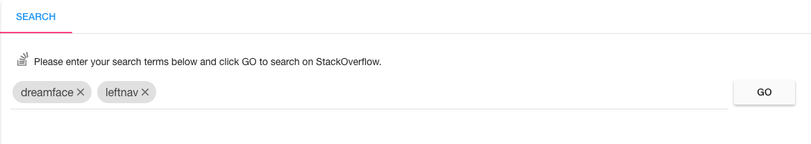

Exploring The Studio
====================

The DreamFace Studio is the place where DreamFace developers create beautiful, scalable, enterprise applications.

It is a complete platform for creating, building and deploying your applications. In the DreamFace application
architecture the DreamFace Studio corresponds to the node application (DFX) and contains both development and runtime
environments. Development is truly dev and devops. For more information on the architecture see :ref:`platform-architecture-label`

In the tutorial below you will learn how to navigate and find your way around the Studio.

**Exploring the Studio Tutorial**

.. raw:: html

        <object width="480" height="385"><param name="movie"
        value="http://www.youtube.com/v/CejlR4SRXYU=en_US&fs=1&rel=0"></param><param
        name="allowFullScreen" value="true"></param><param
        name="allowscriptaccess" value="always"></param><embed
        src="http://www.youtube.com/v/CejlR4SRXYU&hl=en_US&fs=1&rel=0"
        type="application/x-shockwave-flash" allowscriptaccess="always"
        allowfullscreen="true" width="570"
        height="385"></embed></object>

Return to the :ref:`getting-started-label`

|

.. image:: ../images/devguide/dfx-myapps-icon.png

Clicking on the MyApps icon on the landing page displays the Home page of the DreamFace Studio. This is the  first page of
Your Application Platform.

Lets take a minute to explore the Home Page.

|

   Figure : *DreamFace Studio Home Page*

The Home page has three main sections:

1. The *Icon Bar* at the top of the page containing information about the application, action icons and buttons.
2. The *Explorer* in the leftnav for navigating through application configuration setting, applications and application components.
3. The *Canvas* area (white) where applications statistics are displayed. This is where all the action takes place:

    * Information is diplayed
    * Applications get created
    * View, Pages and API service objets and services get created and modified
    * Configuration settings are defined
    * Application development workflow happens here. It is where we define, configure and compose our applications.

|

The Icon Bar
------------

**Name and Version**

.. image:: ../images/devguide/dfx-studio-1pg-versionx.png

|

.. image:: ../images/devguide/dfx-studio-hp-iconbar-left.png

On the the left side of the Icon Bar at the top of the page is

* the Home icon
* the DreamFace logo
* the application name *Studio* and
* the current version of the DreamFace platform highlighted in bright green

Clicking on the Home Icon will redisplay the the Application Platform Stats view or the initial view of the homepage.
It’s a refresh of the canvas to go back to the initial view and redisplays application stats for all applications. It
is very helpful when moving between apps and editing components.

Clicking on the bright green current version will display the Release Notes in the canvas area.

.. image:: ../images/devguide/dfx-studio-hp-rnotes.png
   :width: 400px

|

**Tenant ID, Help Menu and Sign Out**

On the right hand side of the iconbar is

* the ID of the your cloud tenant
* a *Help* icon in the form of a bouy and
* a *Sign Out* icon.

The tenant ID can be a name if you create the tenant yourself or on Bluemix, a unique ID assigned by Bluemix to designate
your unique tenant in the cloud. This tenant holds all of the your application settings, applications, application
components and application builds. On Bluemix you may have noticed that you didn’t install anything when creating your
DreamFace service. All development is cloud-based, so no installs are required, just create your tenant and start
building your applications.

The help menu offers several options for getting help.

.. image:: ../images/devguide/dfx-studio-hp-helpmenu.png

It includes :

* **Stack Overflow** - A direct connection to the Stack Overflow Forum with keyword search.
* **Documentation** - Direct access to the the DreamFace Documentation.
* **Play with Samples** - A link to view and download Samples Gallery sample components and graphical controls from github directly into your application.
* **Get Support** - Direct access the DreamFace Service desk for looking up an issue, Reporting Bugs, Feature Requests and Requesting Assistance.
* **Contact Us** - If you don't have support or just want to send a quick message to us, you can do it here.

|

**Stack Overflow**

*Stack Overlow* displays an input field where the developer can enter keywords to search on in the Stack Overflow forum.
Pressing *GO* displays Stack Overflow and performs a search on the keywords.

|

**Documentation**

.. image:: ../images/devguide/dfx-help-documentation.png
   :width: 600px

*Documentation* displays the DreamFace documentation documentation which is presented in a series of guides.

* The Getting Started Guide which provides tutorials for using the product.
* The Reference Guide, a hands on reference to the product and
* The Product Guide which gives a high level list of features and benefits, presents pricing and licensing.

The documentation is searchable and you can easily navigate from section to section.

|

**Play with Samples**

This diplays the download page where developers can explore and download different examples of DreamFace components from
the Samples Gallery via github into their own application environment.

|

**Get Support**

Login to the DreamFace Service Desk to Search issues on keywords, Report a Bug, Request a New Feature or Request Assistance.
You can also view your active support tickets and interact with them, adding comments, screenshots, more precise information
or replying to a question from the DreamFace support team.

.. image:: ../images/devguide/dfx-help-servicedesk.png
   :width: 600px

|

**Contact Us**

Send a message to the DreamFace Support Team.

|

The Explorer (Left Nav)
-----------------------

On the left side of the page is the Explorer. The Explorer contains thre options: Platform,
Applications and Shared Catalogue. It is organized in a tree structure for easily navigating through the different
settings and components when creating and modifying applications.

|

A platform can have one or more applications and each application has its own configuration, developer components and
builds and deployed versions. Shared Catalogue contains components that can be used across different applications.

In the example below we have two applications; *DemoApp* and *Hello World*. Each application has

* Configure - Configuration Settings for the application
* Develop - development components which include Pages, Views and API Objects
* Deploy  - option to manage builds and deploy the different versions of the application

|

**Search**

At the top of the leftnav is a Search field to search for all components for a given name. Just enter the name of the
component that you are searching for and click on the search Icon. All components with that name will be listed in the
canvas area of the page.

|

|

|

The Canvas
----------

**App Statistics**

By default, the platform displays application statistcs for each application in the tenant as well as information about
components shared across applications. The main part of the screen or canvas is where results are displayed after some
action is completed.

This is where all the action takes place:

    * Information is diplayed
    * Applications get created
    * View, Pages and API get created and modified
    * Configuration setting are defined
    * The Application development workflow happens here

For example, when you search on a name, the results of the search are displayed in the canvas and replace the stats.
The Stats give us a snapshot of our application. In the example below the application called Test has 1
Page, 1 View and no API Services. The application called TestApp has 1 Page, 0 Views and 0 API Services

.. image:: ../images/devguide/dfx-studio-1pg-statsx.png

To list the different components of an application click on the component type like *Pages*, *Views* or *APIs*. A list
of the existing components of that type will be displayed and you can choose the componenet to edit.

|

To redisplay your application statistics after navigating somewhere else just click on the *Home* icon on the left side
of the homepage iconbar.

|

Return to the `Documentation Home <http://localhost:63342/dfd/build/index.html>`_.

