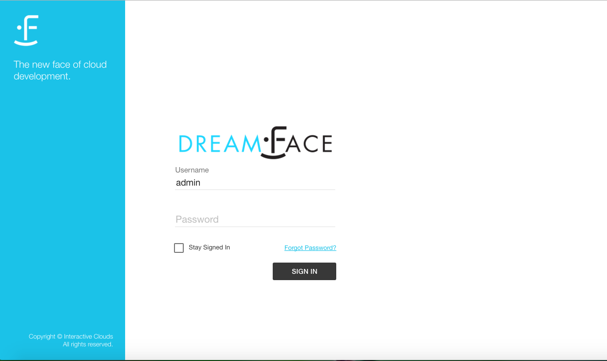

The DreamFace Studio
==============================

The DreamFace Studio is the place where DreamFace developers create magic.

It is the complete development and deployment tool for creating, building and deploying DreamFace applications. It corresponds
to the node application (DFX) and contains both development and runtime environments.

|

Sign In  Page
^^^^^^^^^^^^

When you enter the url for you DreamFace environment, you will arrive on the logn page.

|

   Figure : *DreamFace Login Page*

Enter your Username and Password and click on the *Sign In* button. If you would like to stay logged in in, check the box *Stay Signed In*

|

Landing Page
^^^^^^^^^^^^

The landing page of the Studio presents four icons in the middle of the page.

.. figure:: ../images/devguide/dfx-landing-page.png
   :width: 600px

   Figure : *DreamFace Landing Page*

Choose one of the options:

* **Getting Started** - Getting Started  is a Video Tutorial Series to help you get started building DreamFace Apps
* **Samples Apps** - Sample Apps is a collection of applications that you can view, download from Github and use as examples.
* **Documentation** - A full set of written documentation, with hands-on examples, Samples Gallery and video tutorials
* **MyApps** - These are your applications that you are creating in DreamFace

|

MyApps Page
^^^^^^^^^^

After clicking on MyApps Icon you arrive on the first page of Your Application Platform.

.. figure:: ../images/devguide/dfx-studio-firstpage.png

   Figure : *DreamFace MyApps Page*

In the upper left, above the Icon Bar, is the name and version of the platform.

.. image:: ../images/devguide/dfx-studio-1pg-version.png

On the upper right, above the Icon Bar, is the name of the your tenant.

.. image:: ../images/devguide/dfx-studio-1pg-tenant.png

At the top of the main part of the page is the Icon Bar.

.. image:: ../images/devguide/dfx-studio-1pg-iconbar.png

Icons include:
* **Home** - Return to the Home or First page of the Studio
* **Dockerization** - Go to Dockerize the app
* **Settings** - App Settings (coming)
* **Sign Out** - Sign Out of the Studio
* **Help** - All the way to the left is the help icon.

On the left side of the page underneath the platform name is the Left Nav Application Explorer panel.

.. image:: ../images/devguide/dfx-studio-1pg-leftnav.png

The left nav Explorer can be collapsed to get more screen real estate by clicking on the

as seen collapsed here:

The Left Nav also contains a Search field to search for all components for a given name. Just enter the name of the component
you are searching for and click on the search Icon. All components with that name will be listed.

By default, the platform displays application statistcs for each app and information about components shared across
applications when no other action has been requested. Search, would be another action and it replaces the stats when it displays
the search results here. If your application statistics have been replaced by another action, just click on the *Home* icon
and they will be redisplayed.

.. image:: ../images/devguide/dfx-studio-1pg-stats.png

The Stats give us a quick look at the application. In the example above the application called Test has 1 Page, 1 View and
no API Services. The application called TestApp has 1 Page, 0 Views and 0 API Services

The Explorer
^^^^^^^^^^^^

The Application Explorer is presented with a TreeMenu control. The firs level of the menu contains:

* **Platform**
* **Application**
* **Shared Catalog**

.. image:: ../images/devguide/dfx-studio-1pg-leftnav.png

**Platform** allows for global parameter settings across applications like Developers and Cloud.

Under the Platform menu there are two options:

.. image:: ../images/devguide/dfx-studio-platform-menu.png

* **Developers** - Define developers all developers that have access to the platform.
* **Cloud** - A way to connect your DreamFace to Bluemix

**Developers**

Because developers can work on more than one application, they to be added at the platform level.

**Adding Developers**

Adding developers to DreamFace is a straighforward task.

Developers are created at the Platform level (above applications). All parameters set at the Platform level are global.
This is normal since each developer can work on more than one application.

From the Platform / Developers menu click on Developers.

.. image:: ../images/devguide/dfx-studio-platform-menu.png

When adding developers for the first time after creating our app, there is already one existing developer which is *admin*,
the application administrator. This shouldn't be a surprise since we need one developer to start with to create the others.

.. figure:: ../images/devguide/dfx-dev-admin.png

   Figure : *admin is the only developer available at the beginning*

We are going to create a fictious demo developer called Jack Russel. Just fill in the fields. Login is the username that Jack
will use to Sign In.

.. figure:: ../images/devguide/dfx-dev-create-jrussel.png

   Figure : *Creating developer Jack Russel*

Now we can click on the Roles tab and set Jack's role to developer.

.. figure:: ../images/devguide/dfx-dev-role-jrussel.png

   Figure : *Giving developer Jack Russel developer role*..

When all fields have been filled in and Jack's role has been defined, click on Save to save the definition of our new developer.

|

.. figure:: ../images/devguide/dfx-dev-created-jrussel.png

   Figure : *Developr Jack Russel has been created createde*

Our new developer, Jack Russel, is ready to start.

**Cloud**

This Cloud option is a way to connect to Bluemix.

DreamFace is a Bluemix Service. When you are logged in to your Bluemix account you can say, I want the DreamFace Service
and you are logged in automatically through your Bluemix account credentials and arrive directly in the DreamFace Studio
on Bluemix.

Another way do this is to say, DreamFace is used to create applications. I want my application to be stored in my Bluemix
environment. This is where you define how to do that.

.. image:: ../images/devguide/dfx-studio-platform-cloud.png

Here you will login with your Bluemix account by clicking on the Login button. You will then select your organization and
space (defined by Bluemix itself) then you can create an image of your application. An image is a virtual container that
includes your application and all of the dependencies of your application: DreamFace, NodeJS, AngularJS, the operating system,
etc, everything your application needs on the virtual machine to run is all packaged together in the image. Once the image
is created and sent to Bluemix,

.. image:: ../images/devguide/dfx-studio-platform-cloud.png
   :width: 700px

Here we have the dfx-a1 image which corresponds to an application. Click on the image of the application. Then you can define
in which container you would like to install this image and run this application. You define the application name, public IP
address, listening port, etc. When everything is defined you click on Create and your application will be reachable through
that IP address and port.

.. image:: ../images/devguide/dfx-bluemix-container-definition.png
   :width: 700px

It's a simple proces, you go to your DreamFace environment, you login to Bluemix, you create your image, you publish it
and its done and ready to use.

*Other Cloud environments to come*

Today we only have one tab for Bluemix but we in the future there will also be one for Docker.

|

Return to the `Documentation Home <http://localhost:63342/dfd/build/index.html>`_.

