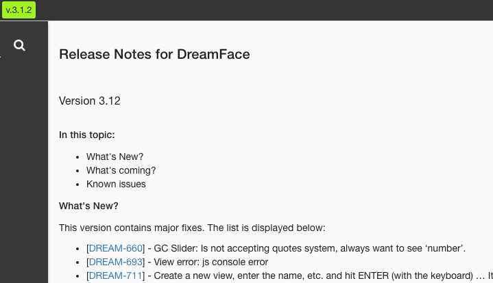
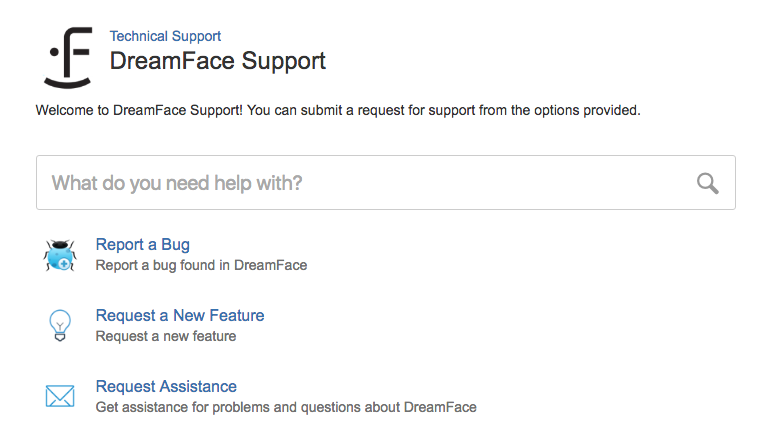

Exploring The Studio
====================

The DreamFace Studio is the place where DreamFace developers create beautiful, scalable, enterprise applications.

It is a complete platform for creating, building and deploying your applications. In the DreamFace application
architecture the DreamFace Studio corresponds to the node application (DFX) and contains both development and runtime
environments. Development is truly dev and devops. For more information on the architecture see :ref:`platform-architecture-label`

In the tutorial below you will learn how to navigate and find your way around the Studio.

**Exploring the Studio Tutorial**

.. raw:: html

        <object width="480" height="385"><param name="movie"
        value="http://www.youtube.com/v/CejlR4SRXYU=en_US&fs=1&rel=0"></param><param
        name="allowFullScreen" value="true"></param><param
        name="allowscriptaccess" value="always"></param><embed
        src="http://www.youtube.com/v/CejlR4SRXYU&hl=en_US&fs=1&rel=0"
        type="application/x-shockwave-flash" allowscriptaccess="always"
        allowfullscreen="true" width="570"
        height="385"></embed></object>

Return to the :ref:`getting-started-label`

|

Clicking on the MyApps icon on the landing page displays the Home page of the DreamFace Studio. This is the  first page of
Your Application Platform.

Lets take a minute to explore the Home Page.

|

.. figure:: ../images/devguide/dfx-studio-firstpage3x.png

   Figure : *DreamFace Studio Home Page*

The Home page has three main sections:

1. The *Icon Bar* at the top of the page containing information about the application, action icons and buttons.
2. The *Explorer* in the leftnav for navigating through application configuration setting, applications and application components.
3. The *Canvas* area (white) where applications statistics are displayed. This is where all the action takes place:

    * Information is diplayed
    * Applications get created
    * View, Pages and API get created and modified
    * Configuration setting are defined
    * Application workflow happens here

|

The Icon Bar
------------

**Name and Version**

.. image:: ../images/devguide/dfx-studio-1pg-versionx.png

|

On the far left of the Icon Bar at the top of the page is the Home icon, the DreamFace logo and name *Studio* and highlighted
in bright green is the current version of the platform.

Clicking on the current version will display Release Notes in the canvas area.

|

**Tenant ID**

On the right hand side of the iconbar is the ID of the your cloud tenant, a help icon and a *Sign Out* icon.

.. image:: ../images/devguide/dfx-studio-hp-iconbar-rt.png

The tenant ID is a unique ID provided by Bluemix. The tenant is a

The help menu offers several options for getting help.

It includes :

* **Stack Overflow** - A direct connection to the Stack Overflow Forum.
* **Documentation** - Direct access to the the DreamFace Documentation.
* **Play with Samples** - A link to view and download Samples Gallery sample components and graphical controls from github.
* **Get Support** - Direct access the DreamFace Service desk for Reporting Bugs, Feature Requests and Requesting Assistance
* **Contact Us** - If you don't have support or just want to send a quick message to support you can do it here.

More detail is provided below.

|

**Stack Overflow**

.. image:: ../images/devguide/dfx-help-stackoverflow.png

*Stack Overlow* displays an input field where the developer can enter keywords to search on in the Stack Overflow forum.
Pressing *GO* displays Stack Overflow and performs a search on the keywords.

|

**Documentation**

*Documentation* displays the DreamFace documentation home page where developer can consult different documentation guides.

|

**Play with Samples**

.. image:: ../images/devguide/dfx-help-playwithsamples.png
   :width: 600px

This diplays the download page where developers can explore and download different examples of DreamFace components from
the Samples Gallery via github into their own application environment.

|

**Get Support**

.. image:: ../images/devguide/dfx-help-getsupport.png

Login to the DreamFace Service Desk to Search issues on keywords, Report a Bug, Request a New Feature or Request Assistance.
You can also view your active support tickets and interact with them, adding comments, screenshots, more precise information
or replying to a question from the DreamFace support team.

|

**Contact Us**

.. image:: ../images/devguide/dfx-help-contactus.png
   :width: 600px

Send a message to the DreamFace Support Team.

|
|

The Left Nav
------------

On the left side of the page is the App Explorer. The App Explorer contains thre options: Platform,
Applications and Shared Catalogue. It is organized in a tree structure for easily navigating through the different setting
and components when creating and modifying your applications.

|

.. image:: ../images/devguide/dfx-studio-hp-explorer.png

A platform can have one or more applications and each application has its own configuration and components. Shared Catalogue
contains components that can be used across different applications.

.. image:: ../images/devguide/dfx-studio-hp-leftnav.png

|

**Search**

At the top of the leftnav is a Search field to search for all components for a given name. Just enter the name of the
component that you are searching for and click on the search Icon. All components with that name will be listed in the
canvas area of the page.

|

.. image:: ../images/devguide/dfx-studio-hp-search.png

|

.. image:: ../images/devguide/dfx-studio-hp-leftnav.png

|

**The Application Exporer**

A detailed look at the Application Explorer can be found here :ref:`dfx-studio-explorer-label`

The Canvas
----------

**App Statistics**

By default, the platform displays application statistcs for each application in the tenant as well as information about
components shared across applications. The main part of the screen or canvas is where results are displayed after some
action is completed.

This is where all the action takes place:

    * Information is diplayed
    * Applications get created
    * View, Pages and API get created and modified
    * Configuration setting are defined
    * The Application development workflow happens here

For example, when you search on a name, the results of the search are displayed in the canvas and replace the stats.
The Stats give us a snapshot of our application. In the example below the application called Test has 1
Page, 1 View and no API Services. The application called TestApp has 1 Page, 0 Views and 0 API Services

.. image:: ../images/devguide/dfx-studio-1pg-statsx.png
   :width: 600px

|

To redisplay your application statistics after navigating somewhere else just click on the *Home* icon on the left side
of the homepage iconbar.

.. image:: ../images/devguide/dfx-studio-hp-iconbar-home.png

|

Return to the `Documentation Home <http://localhost:63342/dfd/build/index.html>`_.

