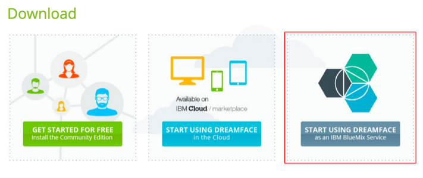

.. _bluemix-label:

Installation on IBM Bluemix
===========================

Getting DreamFace on Bluemix is easy. You can either get it from the Interactive Clouds download page or by signing into Bluemix
directly.

From Interactive Clouds Download Page
-------------------------------------

DreamFace is available as an service on IBM Bluemix. To install DreamFace you can either start from the Interactive Clouds
`Download Page <http://interactive-clouds.com/developercommunity.html#download>`_ and click on the option 'Start using
DreamFace as a Bluemix service:

You will see the image below.

   Figure : *Interactive Clouds Download Options - click on Start Using DreamFace as a BlueMix Service outlined in red above.*

and follow the instructions. You'll be taken directly to the DreamFace Page on Bluemix.

   Figure : *DreamFace Page on Bluemix - if you haven't logged in, log in now and choose the desired option for DreamFace.*

Once logged in you can get DreamFace and start building your applications right away.

From Bluemix
------------

Login to your BlueMix account and choose the DreamFace Service from the catalog.

DreamFace will automatically create a unique cloud tenant for DreamFace and you can start building applications in the
cloud immediately.

For instructions on how to install the DreamFace as a service on BlueMix, watch the video demonstration below :

|

.. raw:: html

        <object width="480" height="385"><param name="movie"
        value="http://www.youtube.com/v/h5QxOAxH5zM&hl=en_US&fs=1&rel=0"></param><param
        name="allowFullScreen" value="true"></param><param
        name="allowscriptaccess" value="always"></param><embed
        src="http://www.youtube.com/v/h5QxOAxH5zM&hl=en_US&fs=1&rel=0"
        type="application/x-shockwave-flash" allowscriptaccess="always"
        allowfullscreen="true" width="480"
        height="385"></embed></object>

|

Return to the :ref:`getting-started-label`

Return to the `Documentation Home <http://localhost:63342/dfd/build/index.html>`_.

|