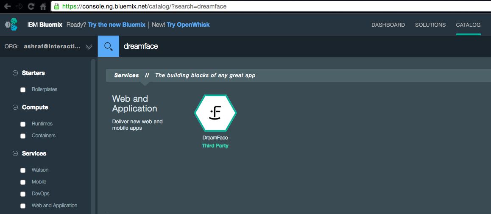

.. _bluemix2-label:

Getting DreamFace on IBM Bluemix
================================

DreamFace is available as a service on IBM Bluemix.

Getting DreamFace on Bluemix is easy. You can either get it :ref:`IC-install-label`  or :ref:`Bluemix-install-label` directly.

For instructions on how to install the DreamFace as a service on BlueMix, watch the tutorial below :

|

.. raw:: html

        <object width="480" height="385"><param name="movie"
        value="http://www.youtube.com/v/h5QxOAxH5zM=en_US&fs=1&rel=0"></param><param
        name="allowFullScreen" value="true"></param><param
        name="allowscriptaccess" value="always"></param><embed
        src="http://www.youtube.com/v/h5QxOAxH5zM&hl=en_US&fs=1&rel=0"
        type="application/x-shockwave-flash" allowscriptaccess="always"
        allowfullscreen="true" width="480"
        height="385"></embed></object>

|

.. _IC-install-label:

From Interactive Clouds Download Page
-------------------------------------

Go to the Interactive Clouds `Download Page <http://interactive-clouds.com/developercommunity.html#download>`_
and choose the option *Start Using DreamFace as a Bluemix Service*.

.. figure:: ../images/diagrams/dfx-ic-download.png

   Figure : *Interactive Clouds Download Options - click on Start Using DreamFace as a BlueMix Service outlined in red above.*

|

If you are not logged in to Bluemix, you will need to login:

|

When you are logged in you will be taken directly to the DreamFace Page on Bluemix.

   Figure : *DreamFace Page on Bluemix - choose one of the available plans and click on Create.*

From there you can choose a plan and start using DreamFace.

Interactive Clouds provides a a free version of DreamFace for one developer for evaluation and testing purposes.

|

Bluemix creates your DreamFace service and displays the dashboard.

   Click on *Open DreamFace Dashboard*

|

The following screen will be displayed:

   Allow message - *Click on Allow*

|

You will be taken directly to the DreamFace Landing Page where you can start developing your cloud application.

|

DreamFace will automatically create a unique cloud tenant for DreamFace and you can start building applications in the
cloud immediately.

|

|

.. _Bluemix-install-label:

From Bluemix
------------

Login to your BlueMix account and choose the DreamFace Service from the catalog.

   Figure - *Click on the DreamFace service*

|

The DreamFace Page on Bluemix will be displayed.

   Figure : *DreamFace Page on Bluemix - choose one of the available plans and click on Create.*

From there you can choose a plan and start using DreamFace.

Interactive Clouds provides a a free version of DreamFace for one developer for evaluation and testing purposes.

|

Bluemix creates your DreamFace service and displays the dashboard.

   Click on *Open DreamFace Dashboard*

|

The following screen will be displayed:

   Allow message - *Click on Allow*

|

You will be taken directly to the DreamFace Landing Page where you can start developing your cloud application.

|

DreamFace will automatically create a unique cloud tenant for DreamFace and you can start building applications in the
cloud immediately.

Return to the :ref:`getting-started-label`

Return to the `Documentation Home <http://localhost:63342/dfd/build/index.html>`_.

|