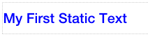

Statictext
===========

.. image:: ../images/icons/icon_web.png
   :class: pull-right

Static Text controls display text that does not require user input. They often serve as labels for other controls or to indentify
areas of the views. They also can be used to display icons that add context to the user interface.

|

|

Properties
^^^^^^^^^^

+------------------------+-------------------+--------------------------------------------------------------------------------------------+
| **Main Properties**    | Possible Values   | Description                                                                                |
+========================+===================+============================================================================================+
| Name                   | txtText1          | Name is a reference to the component's DOM element. It can be used to dynamically access   |
|                        |                   | and set component properties. DreamFace gives a default name of *txtText#* where #         |
|                        |                   | corresponds to the order in which it was created. If it's the second accordion created it  |
|                        |                   | will have a default Name of *txtText2*. Name is not required and can be removed if not     |
|                        |                   | needed.                                                                                    |
+------------------------+-------------------+--------------------------------------------------------------------------------------------+
| Text                   | Any text          | Text that will be displayed in the field. Text can also be an expression.                  |
+------------------------+-------------------+--------------------------------------------------------------------------------------------+
| Display                | *true* or *false* | *true* to display the field or *false* to hide it.                                         |
|                        |                   |                                                                                            |
+------------------------+-------------------+--------------------------------------------------------------------------------------------+

|

+------------------------+-------------------+--------------------------------------------------------------------------------------------+
| **Styling Attributes** | Possible Values   | Description                                                                                |
+========================+===================+============================================================================================+
| Style                  | CSS syles         | CSS style attribure(s) to use for this component, separated by semi-colons, for example:   |
|                        |                   | *color:red; background-color:lightgray*.                                                   |
+------------------------+-------------------+--------------------------------------------------------------------------------------------+
| Classes                | CSS class         | Name of CSS class to use for the HTMLcomponent.                                            |
+------------------------+-------------------+--------------------------------------------------------------------------------------------+
| Dynamic Classes        | CSS Class         | The Dynamic Class is a CSS class that will be added to the HTML control if an Angular      |
|                        |                   | Expression is verified. It is rendered as a ng-class attribute.                            |
+------------------------+-------------------+--------------------------------------------------------------------------------------------+

|

+------------------------+-------------------+--------------------------------------------------------------------------------------------+
| **Tooltip Properties** | Possible Values   | Description                                                                                |
+========================+===================+============================================================================================+
| Tooltip Text           |  Any text         | Tip to help the user know what to do. It will be displayed when mouse passes over this     |
|                        |                   | control. The Tooltip Text can also be an expression.                                       |
+------------------------+-------------------+--------------------------------------------------------------------------------------------+
| Tooltip Direction      | Left, Top, Bottom | A radio button is provided. Choose Left to display tooltip on left side of the component   |
+------------------------+-------------------+--------------------------------------------------------------------------------------------+

|

+------------------------+-------------------+--------------------------------------------------------------------------------------------+
| **Events**             | Possible Values   | Description                                                                                |
+========================+===================+============================================================================================+
| On Click               | function name     | Enter the name of the function that will be executed when the user clicks on the HTML      |
|                        |                   | control. The function should be defined in the controller in the script tab of the View    |
|                        |                   | Editor. Clicking on the ... opens a window to to select a function defined in the          |
|                        |                   | Controller.                                                                                |
+------------------------+-------------------+--------------------------------------------------------------------------------------------+

|

+------------------------+-------------------+--------------------------------------------------------------------------------------------+
| **Add Directive**      | Possible Values   | Description                                                                                |
+========================+===================+============================================================================================+
|  Extended Directives   | function name     |                                                                                            |
+------------------------+-------------------+--------------------------------------------------------------------------------------------+

|
|
