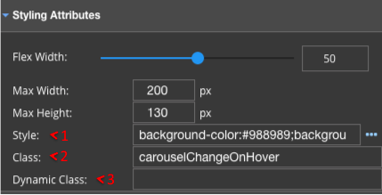
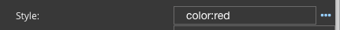
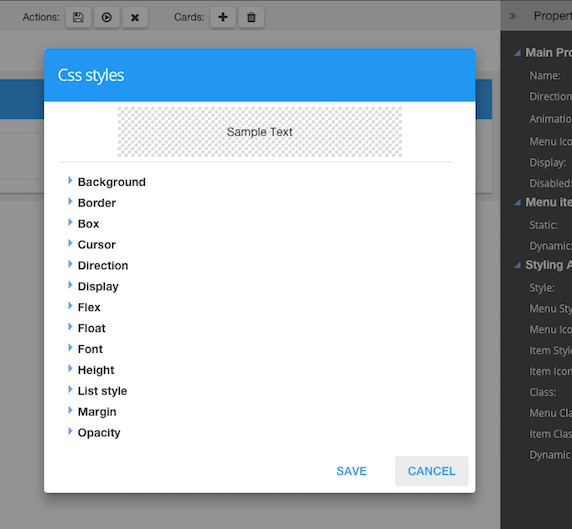
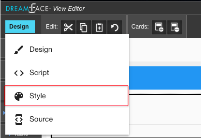
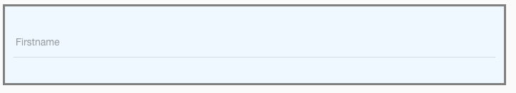
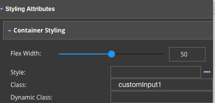

Styling Graphical Controls
==========================

DreamFace provides three options for Styling Graphical Controls:

* Style - Enter or Select styles from a Styles Help
* Class - Define a named CSS class in the Styles Editor (part of the View Editor)
* Dynamic Class - Define a Dynamic Class that is applied when a certain condition is true.

|

|

Defining Styles
^^^^^^^^^^^^^^^

The first option in Styling Attributes is Style. You can enter a CSS style directly like **color:red** or click on the three dots to the right

|

and open a CSS Styles help and let the help guide you to enter the styles. As you enter the CSS styles you will see them
take effect directly on the *Sample Text* at the top as in the example below for **Color - red**

|

Defining Classes in the Styles Editor
^^^^^^^^^^^^^^^^^^^^^^^^^^^^^^^^^^^^

CSS classes that can be used to style the graphical contols like buttons, text fields, inputs, etc. are defined in the
Styles Editor, inside the View Editor of the DreamFace Studio.

From the View Editor, click on the Design button in the upper left corner to open the menu and select *Style* to enter
the Styles Editor.

|

See it in Action
^^^^^^^^^^^^^^^

The Sytles Editor is where you define CSS classes that can be used to style the graphical controls in your Views. Below
are some Exampes of how to set default Graphical Control styles on Input controls by using classes.

|

GC Input Styles:
----------------

|

Input Style 1
'''''''''''''

An Input control with a light blue background and a solid grey border.

|

In the Style Editor, enter the following class:

.. code-block:: css

    .customInput1 {
	    background: #F0F8FF;
  	    padding: 10px;
    	    border: 5px solid grey;
    }

|

Then go to Design in the Studio, select the input control and put the class name in the Styling Attributes / Class
properties as see in below:

|
|

Input Style 2
'''''''''''''

.. code-block:: css

    .customInput2 md-input-container:not(.md-input-invalid) label, .customInput md-input-container:not(.md-input-invalid).md-input-has-value label  {
	    color: green;
	    text-transform: uppercase;
    }

|
|

Input Style 3
'''''''''''''

.. code-block:: css

    .customInput3 md-input-container:not(.md-input-invalid) .md-input {
	    color: green;
	    border-color: green;
	    border-bottom-width: 2px;
	    border-bottom-style: dashed;
    }

|
|

Input Style 4
'''''''''''''

.. code-block:: css

    .customInput4 md-input-container:not(.md-input-invalid).md-input-focused label {
	    color: lightgreen;
	    font-style: italic;
    }

|
|

Style 5
'''''''

.. code-block:: css

    .customInput5 md-input-container:not(.md-input-invalid).md-input-focused .md-input {
	    color: lightgreen;
	    border-color: lightgreen;
	    border-bottom-width: 3px;
	    border-bottom-style: dotted;
    }

|
|

Input Style 6
'''''''''''''

.. code-block:: css

    // Reducing paddings and height of input
    .customInput6 md-input-container .md-input {
        padding: 0;
        padding-left: 0px !important;
        height: 20px;
    }

|
|

GC Select Style:
----------------

Below is an Example of how to set default Graphical Control styles on a Select control by using classes.

.. code-block:: css

    .customSelect {
        border: 5px solid gold;
        background: #5bad83;
        padding: 10px 15px 20px;
    }
    .customSelect label {
	    color: green;
    }
    .customSelect.md-input-focused label {
	    color: lightgreen;
    }
    .customSelect .md-select-value {
        color: green;
 	    border-bottom-color: green;
  	    border-bottom-width: 2px;
  	    border-bottom-style: dotted;
    }
    .customSelect md-input-container md-select md-select-value span.md-select-icon {
	    color: green;
    }
    .customSelect md-select:not([disabled]):focus .md-select-value {
  	    color: lightgreen;
  	    border-bottom-color: lightgreen;
    }
    .customSelect md-select:not([disabled]):focus .md-select-value span.md-select-icon {
	   color: lightgreen;
    }
    md-select-menu.md-altTheme-theme md-content {
	   background: gold;
    }
    md-select-menu.md-altTheme-theme md-content md-option {
        color: green;
  	    background: forestgreen;
    }
    md-select-menu.md-altTheme-theme md-content md-option:not([disabled]):hover {
  	    background: greenyellow;
    }
    md-select-menu.md-altTheme-theme md-content md-option[selected], md-select-menu.md-altTheme-theme md-content md-option[selected]:focus {
        color: lightgreen;
  	    background: yellowgreen;
    }
    // Reducing paddings and height of md-select-value
    md-input-container.customSelect .md-select-value {
        padding: 0;
        padding-bottom: 0px !important;
        min-height: 15px;
        height: 15px;
    }

|
|

GC Button Style:
----------------

Below is an example of how to set default Graphical Control styles on Button control by using classes.

.. code-block:: css

    button.md-primary.dfx-core-gc-button.customButton.md-button {
        background: lightgreen;
        color: forestgreen;
        font-weight: 700;
        font-style: italic;
        border: 3px solid;
        border-radius: 15px;
        padding: 0 50px;
    }
    button.md-button.md-altTheme-theme.dfx-core-gc-button.customButton:not([disabled]):hover {
        background-color: yellowgreen;
    }
    button[disabled="disabled"].dfx-core-gc-button.md-button.customButton {
  	    background-color: green;
        color: lightgreen;
        cursor: not-allowed;
    }

|

Return to the `Documentation Home <http://localhost:63342/dfd/build/index.html>`_.

