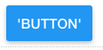

.. image:: ../../images/badges/badge_web.png
   :class: pull-right

Button
======

A button communicates an action to be performed when the user clicks on it. It consists of a label, an icon or both that
indicate the action to be performed when the button is clicked.

|

|

Features
--------
* Buttons can be styled with CSS (plain, classes or dynamic classes or angular material classes)
* Buttons can have a full set of actions associated with different events (click, mouse over, mouse enter, ...)
* Buttons can be visible or invisible, enabled or disabled.
* Buttons can have different shapes rectangular or fab and can have menu attached

|

See it in Action
----------------

Try the Sample Buttons

.. toctree::
   :maxdepth: 1

   ../../gsguide/samples/sample-buttons

|

Reference
---------

The Button control properties can be set for the following categories of properties:

* :ref:`webgc-button-main-label`
* :ref:`webgc-button-wait-label`
* :ref:`webgc-button-styling-label`
* :ref:`webgc-button-events-label`

|

.. _webgc-button-main-label:

.. include:: webgc-properties-main-button.rst

|

.. _webgc-button-wait-label:

Wait Properties
^^^^^^^^^^^^^^

+------------------------+-------------------+--------------------------------------------------------------------------------------------+
| **Menu Items**         | Possible Values   | Description                                                                                |
+========================+===================+============================================================================================+
| Binding                | Editor            | Beside the Static menu property is a **Edit** link to the Menu Editor. You define the Menu |
|                        |                   | in the Menu Editor. Once you are satisfied you save the menu that has been defined.        |
|                        |                   |                                                                                            |
+------------------------+-------------------+--------------------------------------------------------------------------------------------+
| Auto-Disabled          | *true* or *false* | This field takes the name of a Dynamic Menu                                                |
|                        | angular expression|                                                                                            |
+------------------------+-------------------+--------------------------------------------------------------------------------------------+
| Icon                   | Name              | This field takes the name of a Dynamic Menu                                                |
+------------------------+-------------------+--------------------------------------------------------------------------------------------+
| Icon Style             | Name              | This field takes the name of a Dynamic Menu                                                |
+------------------------+-------------------+--------------------------------------------------------------------------------------------+
| Icon Class             | Name              | This field takes the name of a Dynamic Menu                                                |
+------------------------+-------------------+--------------------------------------------------------------------------------------------+

|

.. _webgc-button-menu-label:

Menu Items
^^^^^^^^^

+------------------------+-------------------+--------------------------------------------------------------------------------------------+
| **Menu Items**         | Possible Values   | Description                                                                                |
+========================+===================+============================================================================================+
| Static                 | Editor            | Beside the Static menu property is a **Edit** link to the Menu Editor. You define the Menu |
|                        |                   | in the Menu Editor. Once you are satisfied you save the menu that has been defined.        |
|                        |                   |                                                                                            |
+------------------------+-------------------+--------------------------------------------------------------------------------------------+
| Dynamic                | Name              | This field takes the name of a Dynamic Menu                                                |
+------------------------+-------------------+--------------------------------------------------------------------------------------------+

|

.. _webgc-button-styling-label:

.. include:: webgc-styling-button.rst

|

.. _webgc-button-events-label:

.. include:: webgc-events.rst

Return to the `Documentation Home <http://localhost:63342/dfd/build/index.html>`_.

|

