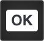

.. image:: ../../images/badges/badge_web.png
   :class: pull-right

Button
======

A button communicates an action to be performed when the user clicks on it. It consists of a label, an icon or both that
indicate the action to be performed when the button is clicked.

|

.. image:: ../../images/gcs/web/webgc-button.png

|

See it in Action
----------------

Try the Sample Buttons

.. toctree::
   :maxdepth: 1

   ../../gsguide/samples/sample-buttons

|

Button Reference
----------------

A Button can define the following properties:

|

Main Properties
^^^^^^^^^^^^^^^

Button Main Properties allow us to set the Button Label, Icon, Menu Items if the Button has a menu and whether the Button
is displayed and enabled.

.. toctree::
   :maxdepth: 1

   webgc-prop-main-id
   webgc-prop-main-template
   webgc-prop-main-name
   webgc-prop-main-label
   webgc-prop-main-icon
   webgc-prop-main-icon-type
   webgc-prop-main-icon-position
   webgc-prop-main-menuitems
   webgc-prop-main-disabled

|

Styling Attributes
^^^^^^^^^^^^^^^^^^
The Button Styling Attributes allow us to add styles, classes, dynamic classes to the Button container, label and menu items:

.. toctree::
   :maxdepth: 1

   webgc-styling-button

|

Wait Properties
^^^^^^^^^^^^^^^

.. toctree::
   :maxdepth: 1

   webgc-prop-wait

|

Events
^^^^^^

.. toctree::
   :maxdepth: 1

   webgc-events.rst

|

 Return to the `Documentation Home <http://localhost:63342/dfd/build/index.html>`_.

