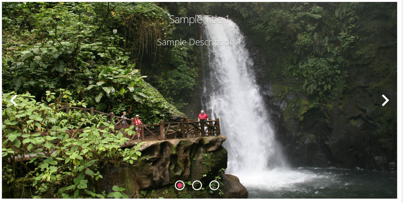

.. image:: ../../images/badges/badge_web.png
   :class: pull-right

Carousel
========

A Carousel is a graphical component that lets you scroll easily through a set of images or slides.

|

|

See it in Action
----------------

Try the Sample Carousel controls

.. toctree::
   :maxdepth: 1

   ../../gsguide/samples/sample-carousels

|

Reference
---------

The Carousel control properties can be set for the following property categories:

Button Main Properties allow us to set the Button Label, Icon, Menu Items if the Button has a menu and whether the Button
is displayed and enabled.

.. toctree::
   :maxdepth: 1

   webgc-prop-main-id
   webgc-prop-main-template
   webgc-prop-main-name
   webgc-prop-main-autoslide
   webgc-prop-main-display
   webgc-prop-main-options

|

.. _webgc-carousel-quickstart-label:

Carousel Quickstart
^^^^^^^^^^^^^^^^^^

In summary the Carousel has 5 properties itself and each slide (or Carousel option) has 5 properties:

The Carousel properties are :

* Options source (array). Can be static/dynamic. For static representation that array can be defined in the . For dynamic - need to put scope array name into field ‘Dynamic’ of Options section in Property panel.
* Autoplay (boolean). By default ‘false’.
* Slide Interval (millisecond). Dy default 3000.
* Max Width a number in pixels. The default is ‘1200px’.
* Max Height- a number in pixels. The default is ‘400px’.

**Note** Max Width and Max Height needs to be set for responsive design for calculating proportion sides of the Carousel.

Carousel Slide option properties:

Name - it is parameter for accessibility in static representation inside popup dialog (no need to set it in dynamic represenation).
Src - is the image url. In static representation it is expression. It is possible to put into src field image url without/within quotes and as a scope variable (like that 'src': 'scopeSrc'). In dynamic - it is just real image url.
Title - html content inside which it is possible to use scope variables. For static representation in popup dialog click ‘Edit’ button to open ‘Html Editor’ and edit it.
Description - the same as ‘Title’.
Onclick - is ‘ng-click’ event on Slide image.

A Slide Editor is avaiable to define the Slides and Slide options, to add or remove slides and to change the order of the slides.

Example
'''''''

Default static representation (pre-defined by default in the Slide Editor): ::

    "static": { "value": [
            {
              "name": "slide1",
              "title": "<h2>Sample Title 1</h2>",
              "description": "<h4>Sample Description 1</h4>",
              "src": "'https://www.travelexcellence.com/images/movil/La_Paz_Waterfall.jpg'",
              "onclick": ""
            },
            {
              "name": "slide2",
              "title": "<h2>Sample Title 2</h2>",
              "description": "<h4>Sample Description 2</h4>",
              "src": "'http://images.kuoni.co.uk/73/indonesia-34834203-1451484722-ImageGalleryLightbox.jpg'",
              "onclick": ""
            },
            {
              "name": "slide3",
              "title": "<h2>Sample Title 3</h2>",
              "description": "<h4>Sample Description 3</h4>",
              "src": "'https://www.travcoa.com/sites/default/files/styles/flexslider_full/public/tours/images/imperialvietnam-halong-bay-14214576.jpg'",
              "onclick": ""
    }]}

Example of dynamic representation (add this to the script of the View): ::

    $scope.carouselData = [
          {
            'src': '/_shared/assets/blue-abstract-background.jpg',
            'title': '<h2>{{myTitle}}</h2>',
            'description': '<h4>{{myDescription}}</h4>',
            'onclick': 'myFunction()
          },
        {
            'src': '/_shared/assets/login_logo.png',
            'title': '<h2>Slide Title 2</h2>',
            'description': '<h4>Slide Description <i>{{someVar}}</i></h4>',
            'onclick': 'otherFunction()'
        },
        {
            'src': 'scopeSrc',
            'title': '<h2>Title {{page}}</h2>',
            'description': '<h4>Description {{page}}</h4>',
            'onclick': ''
        }
    ];

    Where: ::

    {{myTitle}}, {{myDescription}}, {{someVar}} and {{page}} - are expressions with scope variables;

    myFunction() and otherFunction() - are scope functions.

This way of using scope variables and functions in the Carousel options (slides) is the same for static/dynamic representation.

|

.. _webgc-carousel-main-label:

Main Properties
^^^^^^^^^^^^^^^

|

+------------------------+--------------------+--------------------------------------------------------------------------------------------+
| **Main Properties**    | Possible Values    | Description                                                                                |
+========================+====================+============================================================================================+
| **Id**                 | nnnnn              | Id is a unique :term:`GC` identifier that is a string of 5 or more digits long. It is      |
|                        |                    | generated by DreamFace and can be used when refering to this field in script.              |
+------------------------+--------------------+--------------------------------------------------------------------------------------------+
| **Template**           | template name      | This is the chosen name of the :term:`GC` template to be used as the basis of the current  |
|                        |                    | :term:`GC`. It is set to 'default' by default. For more information on how to use Templates|
|                        |                    | see :ref:`dfx-templates-label`.                                                            |
+------------------------+--------------------+--------------------------------------------------------------------------------------------+
| **Name**               | crsCarousel#       | Name is a reference to the component's DOM element. It can be used to dynamically access   |
|                        |                    | and set component properties. DreamFace gives a default name that refers to the :term:`GC` |
|                        |                    | followed a number which cooresponds to the order in which the control was created. Name is |
|                        |                    | not required and can be removed if needed.                                                 |
|                        |                    | For a complete list see :ref:`style-gcnames-label`.
+------------------------+--------------------+--------------------------------------------------------------------------------------------+
| **Text**               | Any text in quotes | Any text that will be displayed in the field. It should be in quotes, otherwise it will be |
|                        |         or         | interpreted as a scope variable.                                                           |
|                        | angular expression |                                                                                            |
|                        |         or         | **Text can also be an angular expression** which will be evaluated at runtime.             |
|                        | scope variable     |                                                                                            |
|                        |                    | See more about how to define :ref:`angular-expression-label` here.                         |
|                        |                    |                                                                                            |
|                        |                    | **Note** - If your label doesn't appear in Preview mode, make sure the text is in quotes.  |
|                        |                    | If you have an angular expression that does not appear in Preview mode it means that their |
|                        |                    | most likely an error in your angular expression. Take a look at the sample angular         |
|                        |                    | expressions in the Samples Gallery. If your expression contains an apostrophe, use double  |
|                        |                    | quotes. For example "It's a button" would evaluate to: *It's a button* at runtime or in    |
|                        |                    | in Preview Mode when testing the View.                                                     |
|                        |                    |                                                                                            |
+------------------------+--------------------+--------------------------------------------------------------------------------------------+
| **Display**            | *true* or *false*  | This is a property to show or hide the :ter:`GC`.                                          |
|                        |        or          | The value can either be a literal *true* to display the field or *false* to hide it, or it |
|                        | boolean expression | can be a angular expression that evaulates to *true* or *false*, for example,              |
|                        |        or          | 5 > 2 would evaluate to *true* and 5 < 2 would evaluate to *false*. It is also possible    |
|                        |  scope variable    | to use a $scope variable that are already defined.                                         |
|                        |                    |                                                                                            |
|                        |                    | On the right hand side of the field you will see **...** indicating that help in defining  |
|                        |                    | expression is available. Click on the *...** and a Expression Editor will be displayed,    |
|                        |                    | indicating existing scope variables and functions. You can use scope variables as part of  |
|                        |                    | of your angular expression, for example, myVar == 5, would evaluate the expression using   |
|                        |                    | the value stored in the scope variable myVar, if equal to 5 the expression would evaluate  |
|                        |                    | to **true** and the text would be displayed.                                               |
|                        |                    |                                                                                            |
|                        |                    | See :ref:`angular-expression-label`  for more help on Angular Boolean Expressions          |
+------------------------+--------------------+--------------------------------------------------------------------------------------------+

+------------------------+-------------------+--------------------------------------------------------------------------------------------+
| **Main Properties**    | Possible Values   | Description                                                                                |
+========================+===================+============================================================================================+
| Id                     | nnnnn             | Id is a unique identifier that is 5 or more digits long. It is generated by DreamFace and  |
|                        |                   | can be used when refering to this field in script.                                         |
+------------------------+-------------------+--------------------------------------------------------------------------------------------+
| Name                   | crsCarousel#      | Name is a reference to the component's DOM element. It can be used to dynamically access   |
|                        |                   | and set component properties. DreamFace gives a default name of *crsCarousel#* where #     |
|                        |                   | corresponds to the order in which the control was created. The second button created       |
|                        |                   | will have a default Name of *crsCarousel2*. Name is not required and can be removed if not |
|                        |                   | needed.                                                                                    |
+------------------------+-------------------+--------------------------------------------------------------------------------------------+
+------------------------+-------------------+--------------------------------------------------------------------------------------------+
| Display                | expression        | The value can either be a literal *true* to display the field or *false* to hide it, or it |
|                        | *true* or *false* | be a angular expression that evaulates to *true* or *false*, for example,                  |
|                        |                   |                                                                                            |
|                        |                   | 5 > 2 would evaluate to *true* and 5 < 2 would evaluate to false                           |
|                        |                   |                                                                                            |
|                        |                   | See more about how to define :ref:`angular-expression-label` here.                         |
+------------------------+-------------------+--------------------------------------------------------------------------------------------+

|
.. _webgc-carousel_options-label:

Options Items
^^^^^^^^^^^^

+------------------------+-------------------+--------------------------------------------------------------------------------------------+
| **Options Items**      | Possible Values   | Description                                                                                |
+========================+===================+============================================================================================+
| Static                 | Defined in Slide  | Beside the Static menu property is an **Edit** link to the Slied Editor. Here you can      |
|                        | Editor            | you define the slides that will be displayed using an editor to guide the definition.      |
|                        |                   | Once you are satisfied you save the menu that has been defined.                            |
|                        |                   |                                                                                            |
+------------------------+-------------------+--------------------------------------------------------------------------------------------+
| Dynamic                | Name              | This field takes the name of a Dynamic Menu                                                |
+------------------------+-------------------+--------------------------------------------------------------------------------------------+

|

.. _webgc-carousel-styling-label:

Styling Attributes
^^^^^^^^^^^^^^^^^^

+------------------------+-------------------+--------------------------------------------------------------------------------------------+
| **Styling Attributes** | Possible Values   | Description                                                                                |
+========================+===================+============================================================================================+
| Flex Width             | number in %       | Width is defined with a slider. This number defines the width of the carousel within the   |
|                        |                   | row of the panel in %. The default is 100%.                                                |
|                        |                   |                                                                                            |
|                        |                   | **Note**                                                                                   |
|                        |                   | * The width is defined in the context of the row, column where the carousel is             |
|                        |                   | it is displayed in the panel.                                                              |
+------------------------+-------------------+--------------------------------------------------------------------------------------------+
| Max Width              | number in pixels  | This number represents the maximum width of the carousel in pixels. The default value is   |
|                        |                   | 1200px.                                                                                    |
|                        |                   |                                                                                            |
|                        |                   | **Note**                                                                                   |
|                        |                   | * Max Width and Max Height needs to be set for responsive design for calculating           |
|                        |                   | proportion sides of Carousel.                                                              |
|                        |                   |                                                                                            |
+------------------------+-------------------+--------------------------------------------------------------------------------------------+
| Max Width              | number in pixels  | This number represents the maximum height of the carousel in pixels. The default value is  |
|                        |                   | 600px.                                                                                     |
|                        |                   |                                                                                            |
|                        |                   | **Note**                                                                                   |
|                        |                   | * Max Width and Max Height needs to be set for responsive design for calculating           |
|                        |                   | proportion sides of Carousel.                                                              |
|                        |                   |                                                                                            |
+------------------------+-------------------+--------------------------------------------------------------------------------------------+
| Style                  | CSS syles         | CSS style attribure(s) to use for this component, separated by semi-colons, for example:   |
|                        |                   | *color:red; background-color:lightgray*. By clicking on the **...** on the right hand side |
|                        |                   | of the field, a window opens up proposing to change attributes for **font**, **color**,    |
|                        |                   | **padding** and **margin** presented in a tree. When clicking on the arrow to the left of  |
|                        |                   | the attribute type, the user is guide by placeholder to enter the correct settings         |
|                        |                   |                                                                                            |
|                        |                   |        .. image:: ../../images/gcs/dfx-icon-css.png                                        |
+------------------------+-------------------+--------------------------------------------------------------------------------------------+
| Classes                | CSS class         | Name of CSS class to use for the component.                                                |
+------------------------+-------------------+--------------------------------------------------------------------------------------------+
| Dynamic Classes        | CSS Class         | The Dynamic Class is a CSS class that will be added to the graphical control if an Angular |
|                        |                   | Expression is verified. It is rendered as a ng-class attribute.                            |
+------------------------+-------------------+--------------------------------------------------------------------------------------------+

|

Events
^^^^^^

.. toctree::
   :maxdepth: 1

   webgc-events-focus.rst

.. _webgc-tips-label:

Tips and Tricks
^^^^^^^^^^^^^^^

# Remember that values entered in the properties fields only take effect after they have been saved.

Return to the `Documentation Home <http://localhost:63342/dfd/build/index.html>`_.

|

