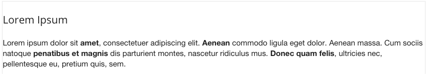

.. image:: ../../images/badges/badge_web.png
   :class: pull-right

HTML
====

.. image:: ../../images/icons/basic_html.png
    :width: 50px
    :height: 50px

The HTML graphical control allows a developer to add any custom HTML The contents of the HTML field is pure HTML. By
default the control contains a Lorem Ipsum text. This content can be edited to include any HTML content. For example,
if you find that one of the pre-defined graphical controls does not have the functionality that you need, you can add
your own in the HTML control.

|

|

See it in Action
----------------

Try the Sample HTML controls

.. toctree::
   :maxdepth: 1

   ../../gsguide/samples/sample-htmls

|

Reference
---------

The HTML control properties can be set for the following property categories:

Main Properties
^^^^^^^^^^^^^^

.. toctree::
   :maxdepth: 1

   webgc-prop-main-id
   webgc-prop-main-template
   webgc-prop-main-name
   webgc-prop-main-Binding
   webgc-prop-main-Content
   webgc-prop-main-display
   webgc-prop-main-disabled

|

Styling Attributes
^^^^^^^^^^^^^^^^^^

.. toctree::
   :maxdepth: 1

   webgc-prop-style-flexwidth
   webgc-prop-style-style
   webgc-prop-style-class
   webgc-prop-style-dynamic

|

Main Properties
^^^^^^^^^^^^^^^

|

+------------------------+-------------------+--------------------------------------------------------------------------------------------+
| **Main Properties**    | Possible Values   | Description                                                                                |
+========================+===================+============================================================================================+
| Binding                | Any text          | The HTML control can be bound to data coming from a service, for example a service that    |
|                        |                   | goes to a content management system. Text that will be displayed in the field.             |
|                        |                   |                                                                                            |
+------------------------+-------------------+--------------------------------------------------------------------------------------------+
| Content                | Any HTML text     | The content can be edited to enter any HTML text manually in a contextual script editor.   |
|                        |                   | The new content will be displayed as soon as it is saved.                                  |
|                        |                   |                                                                                            |
|                        |                   |        .. image:: ../../images/gcs/dfx-html-editor.png                                     |
+------------------------+-------------------+--------------------------------------------------------------------------------------------+
|

.. _webgc-html-render-label:

Rendering
^^^^^^^^^

This is the rendering section.

|

.. _webgc-html-styling-label:

.. include:: webgc-styling-slider.rst

|

Events
^^^^^^

.. toctree::
   :maxdepth: 1

   webgc-events.rst

Return to the `Documentation Home <http://localhost:63342/dfd/build/index.html>`_.

|

