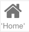

.. image:: ../../images/badges/badge_web.png
   :class: pull-right

Icon
====

An icon is a graphical image that conveys a message, for example an image of a telephone might indicate that the View is
about telephone numbers, a house might mean to fill in your home address in a form.

|

See it in Action
----------------

Try the Sample Iconss

.. toctree::
   :maxdepth: 1

   ../../gsguide/samples/sample-icons

|

Reference
---------

The Icon control properties can be set for the following property categories:

.Main Properties
^^^^^^^^^^^^^^^^

.. toctree::
   :maxdepth: 1

   webgc-prop-main-id
   webgc-prop-main-template
   webgc-prop-main-name
   webgc-prop-main-label
   webgc-prop-main-icon
   webgc-prop-main-display
   webgc-prop-main-disabled

|

Styling Attributes
^^^^^^^^^^^^^^^^^^

.. toctree::
   :maxdepth: 1

   webgc-prop-style-style
   webgc-prop-style-class
   webgc-prop-style-dynamic

|

.. _webgc-icon-render-label:

Rendering
^^^^^^^^^

This is the rendering section.

.. _webgc-icon-styling-label:

.. include:: webgc-styling.rst

|

Events
^^^^^^

.. toctree::
   :maxdepth: 1

   webgc-events.rst

Return to the `Documentation Home <http://localhost:63342/dfd/build/index.html>`_.

|